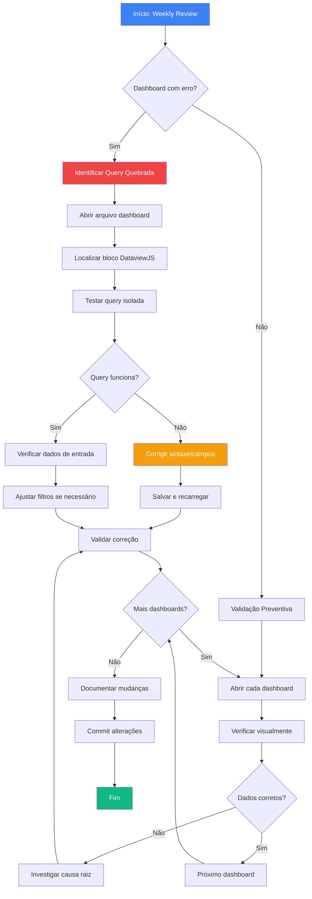

# 📊 PROCESSO — Atualização de Dashboards

> **Objetivo:** Garantir que todos os dashboards do sistema estejam funcionais, precisos e atualizados com as queries corretas.

---

## 🎯 QUANDO USAR ESTE PROCESSO

- **Frequência regular:** Sexta-feira, durante Weekly Review (30min)
- **Acionamento emergencial:** Quando dashboard apresentar erro
- **Após mudanças estruturais:** Nova pasta, novos campos frontmatter, novo template
- **Inclusão de novos dados:** Novo projeto, nova pessoa, novo tipo de conteúdo

---

## 📋 DASHBOARDS DO SISTEMA

| Dashboard | Arquivo | Responsável | Criticidade |
|-----------|---------|-------------|-------------|
| **Central** | `90-Views/Dashboard-EncaminhamentosV2.0.md` | PV | 🔴 ALTA |
| **Kaizens** | `90-Views/Dashboard-Kaizens.md` | PV | 🟡 MÉDIA |
| **Bloqueios** | `90-Views/Dashboard-Bloqueios.md` | PV | 🔴 ALTA |
| **Performance** | `60-Metrics/Dashboard-Performance-v2.md` | PV | 🟢 BAIXA |
| **Kanban** | `90-Views/Kanban-Teste.md` | PV | 🟢 BAIXA |

---

## 🔄 FLUXO DO PROCESSO



---

## ✅ CHECKLIST DE ATUALIZAÇÃO

### **1. Dashboard Central (EncaminhamentosV2.0)**

- [ ] Abrir `90-Views/Dashboard-EncaminhamentosV2.0.md`
- [ ] Verificar seção **Visão Executiva Expandida** (12 métricas)
  - [ ] Total reuniões está correto?
  - [ ] Total decisões confere com atas?
  - [ ] Total ações está preciso?
  - [ ] Total kaizens bate com Dashboard Kaizens?
  - [ ] NPS médio faz sentido?
- [ ] Verificar seção **Encaminhamentos Prioritários**
  - [ ] P1 (HIGH) mostra tasks urgentes?
  - [ ] P2 (MEDIUM) está correto?
  - [ ] P3 (LOW) inclui todas?
- [ ] Verificar **Agrupamento por Projeto**
  - [ ] Todos projetos ativos aparecem?
  - [ ] Counts estão corretos?
- [ ] Verificar **Distribuição por Pessoa**
  - [ ] Todas pessoas com tasks aparecem?
  - [ ] Carga de trabalho faz sentido?

**Problemas comuns:**
- Query não encontra tasks: verificar tag `#encaminhamento`
- Métricas zeradas: verificar campo `versao: 2.0` nas atas
- Projeto não aparece: verificar campo `projeto:` no frontmatter

---

### **2. Dashboard Kaizens**

- [ ] Abrir `90-Views/Dashboard-Kaizens.md`
- [ ] Verificar **Visão Executiva Kaizens** (6 métricas)
  - [ ] Total Kaizens confere?
  - [ ] Média por reunião está correta?
  - [ ] Últimos 30 dias preciso?
  - [ ] Taxa de adoção faz sentido?
- [ ] Verificar **Ranking por Projeto**
  - [ ] Projetos ordenados por total de kaizens?
  - [ ] Visualização (barras) aparecendo?
- [ ] Verificar **Linha do Tempo**
  - [ ] Todas atas com kaizens > 0 aparecem?
  - [ ] Ordenação DESC por data?
- [ ] Verificar **Últimos Kaizens Registrados** (conteúdo completo)
  - [ ] Carrega conteúdo real das atas?
  - [ ] Callouts expansíveis funcionam?

**Problemas comuns:**
- Total kaizens zerado: verificar campo `kaizens:` no frontmatter das atas
- Conteúdo não carrega: verificar seção `## 💡 KAIZENS IDENTIFICADOS` nas atas
- Projeto não categorizado: verificar campo `projeto:` nas atas

---

### **3. Dashboard Bloqueios**

- [ ] Abrir `90-Views/Dashboard-Bloqueios.md`
- [ ] Verificar **Alertas Críticos**
  - [ ] Status AGORA está atualizado?
  - [ ] Severidade correta?
- [ ] Verificar **Visão Executiva Bloqueios**
  - [ ] Bloqueios ativos vs resolvidos?
  - [ ] MTTR (Mean Time To Resolve) preciso?
- [ ] Verificar **Bloqueios Ativos por Prioridade**
  - [ ] P1 mostra bloqueios críticos?
  - [ ] Status correto (ativo vs resolvido)?
- [ ] Verificar **Distribuição por Projeto**
  - [ ] Projetos com bloqueios aparecem?

**Problemas comuns:**
- Bloqueios não aparecem: verificar tag `#bloqueio` nas tasks
- Status errado: verificar campo `status:` nas tasks bloqueio
- MTTR incorreto: verificar datas nas tasks

---

### **4. Dashboard Performance**

- [ ] Abrir `60-Metrics/Dashboard-Performance-v2.md`
- [ ] Verificar métricas individuais
  - [ ] Pessoas com dados aparecem?
  - [ ] OKRs carregando?
- [ ] Atualizar manualmente se necessário

**Problemas comuns:**
- Requer atualização manual mensal

---

### **5. Kanban Visual**

- [ ] Abrir `90-Views/Kanban-Teste.md`
- [ ] Verificar colunas (Backlog, Em Progresso, Concluído)
  - [ ] Projetos nas colunas corretas?
  - [ ] Status `ativo`, `em_andamento`, `concluido` estão mapeados?

**Problemas comuns:**
- Projeto na coluna errada: verificar campo `status:` no frontmatter do projeto

---

## 🔍 TROUBLESHOOTING — Problemas Frequentes

### **Problema 1: Dashboard mostra "No results found"**

**Causa raiz:**
- Query não está encontrando arquivos
- Filtro muito restritivo
- Campos frontmatter ausentes

**Solução:**
1. Abrir dashboard com erro
2. Localizar bloco DataviewJS
3. Copiar query
4. Abrir Developer Tools (Ctrl+Shift+I)
5. Console → testar query simplificada:
```javascript
dv.pages('"40-Reunioes"').length
// Se retornar 0: problema no caminho
// Se retornar número: problema no filtro
```
6. Ajustar filtro gradualmente até funcionar
7. Atualizar dashboard

---

### **Problema 2: Métricas zeradas ou incorretas**

**Causa raiz:**
- Campo frontmatter ausente ou com nome errado
- Tipo de dado incorreto (string vs number)
- Atas sem `versao: 2.0`

**Solução:**
1. Identificar qual métrica está errada
2. Verificar query que calcula essa métrica
3. Exemplo: Total decisões zerado
   - Abrir uma ata recente
   - Verificar se tem `decisoes: X` no frontmatter
   - Verificar se tem `versao: 2.0`
   - Se ausente: adicionar manualmente
4. Recarregar dashboard (Ctrl+R)

---

### **Problema 3: DataviewJS não executa (mostra código)**

**Causa raiz:**
- Plugin Dataview desativado
- Erro de sintaxe no bloco

**Solução:**
1. Settings → Community Plugins → Dataview → Enable
2. Verificar sintaxe:
```javascript
// CORRETO
```dataviewjs
dv.paragraph("teste");
\```

// ERRADO (falta linguagem)
\```
dv.paragraph("teste");
\```
```
3. Recarregar Obsidian (Ctrl+R)

---

### **Problema 4: Erro "Cannot read property of undefined"**

**Causa raiz:**
- Campo não existe em todos arquivos
- Acesso a propriedade sem validação

**Solução:**
1. Localizar linha do erro no código
2. Adicionar validação:
```javascript
// ANTES (quebra se campo ausente)
const total = p.decisoes;

// DEPOIS (seguro)
const total = p.decisoes || 0;
```
3. OU adicionar filtro:
```javascript
// Só processa se campo existe
.where(p => p.decisoes)
```

---

### **Problema 5: Performance lenta (dashboard demora a carregar)**

**Causa raiz:**
- Query muito complexa
- Muitos arquivos processados
- Loop infinito

**Solução:**
1. Simplificar query:
```javascript
// ANTES: processa TUDO
dv.pages()

// DEPOIS: filtra por pasta
dv.pages('"40-Reunioes"')
```
2. Adicionar limites:
```javascript
// Só últimos 10
.sort(p => p.data, 'desc')
.limit(10)
```
3. Cachear resultados se possível

---

## 📝 MANUTENÇÃO PREVENTIVA

### **Semanal (15min - Sexta)**

1. Abrir cada dashboard em sequência
2. Verificar visualmente se carrega sem erros
3. Spot-check: conferir 2-3 métricas por dashboard
4. Se tudo OK: marcar como validado

### **Mensal (30min - Fim do mês)**

1. Validação completa de todos dashboards
2. Verificar todos os números manualmente
3. Comparar com dados brutos (atas, tasks)
4. Atualizar queries se necessário
5. Commit: `docs: Validação mensal dashboards - [mês/ano]`

### **Após Mudanças Estruturais**

1. **Nova pasta criada:**
   - Atualizar filtros: `dv.pages('"nova-pasta"')`
2. **Novo campo frontmatter:**
   - Adicionar ao dashboard relevante
   - Documentar no README-Dashboards
3. **Novo template de ata:**
   - Validar compatibilidade com queries existentes
   - Testar com ata de exemplo

---

## 🛠️ FERRAMENTAS NECESSÁRIAS

- **Obsidian:** v1.4.0+ (suporte DataviewJS)
- **Plugin Dataview:** v0.5.0+
- **Plugin Tasks:** v4.0.0+ (opcional, mas recomendado)
- **Developer Tools:** Ctrl+Shift+I (para debug)

---

## 📊 MÉTRICAS DE QUALIDADE

| Métrica | Meta | Como Medir |
|---------|------|------------|
| **Uptime Dashboards** | > 95% | Dashboards sem erro na Weekly Review |
| **Tempo Correção** | < 30min | Desde detecção até correção |
| **Validações Preventivas** | 100% | Toda sexta-feira |
| **Commits de Correção** | < 2/mês | Git log `git log --grep="fix.*dashboard"` |

---

## 📚 REFERÊNCIAS

- [[90-Views/README-Dashboards]] — Documentação completa do sistema
- [[PLANO_VAULT]] — Estrutura padrão do vault
- [[_TEMPLATES/00 - ATA-REUNIÃO-TEMPLATE-R01]] — Template ata v2.0
- [Dataview Docs](https://blacksmithgu.github.io/obsidian-dataview/)

---

## 🔄 VERSIONAMENTO

| Versão | Data | Mudanças |
|--------|------|----------|
| 1.0 | 2025-11-20 | Versão inicial |

---

**Criado por:** [[Pedro Vitor Pagliarin]]
**Última revisão:** 2025-11-20
**Status:** ✅ Ativo
**Próxima revisão:** 2025-12-20
