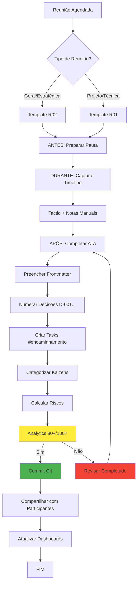

# PROCESSO — Criação e Publicação de ATAs

> **Objetivo**: Criar ATAs completas, rastreáveis e integradas aos dashboards em até 24h após reunião
> **Quando usar**: Após TODA reunião (geral, projeto, alinhamento, daily, retrospectiva)
> **Responsável**: [[Pedro Vitor Pagliarin]]

---

## 📋 Contexto e Decisão Histórica

### **Por que este processo existe**

ATAs são a **base de tudo** no vault empresarial:
- Decisões rastreáveis (ADRs)
- Encaminhamentos executáveis (aparecem no Dashboard)
- Kaizens para melhoria contínua
- Histórico completo do projeto
- Onboarding de novos membros

**Estatística crítica**: 80% das decisões estratégicas da UzzAI vêm de ATAs.

### **Quando NÃO usar**

- Conversas informais de < 5 minutos (registrar no Bullet Journal)
- Mensagens assíncronas no Slack (usar threads)
- Reuniões 100% canceladas (não criar ata vazia)

---

## 🔄 Fluxo Executável

### **Fluxograma Visual**



---

### **Checklist ANTES da Reunião** (24-48h antecedência)

- [ ] **Copiar template correto**
  - `_TEMPLATES/00 - ATA-REUNIÃO-TEMPLATE-R02.md` (Geral)
  - `_TEMPLATES/01-ATA-PROJETO-TEMPLATE-R01.md` (Projeto)
- [ ] **Renomear arquivo**: `AAAA-MM-DD-Titulo-Descritivo.md`
- [ ] **Preencher frontmatter básico**:
  - `data`, `inicio`, `projeto`, `sprint`, `participantes`
  - `tipo`, `subtipo` (sprint_planning, retrospectiva, etc.)
- [ ] **Criar pauta preliminar** (3-5 tópicos)
- [ ] **Enviar pauta** para participantes (24h antes)
- [ ] **Ativar Tactiq** (se Google Meet/Zoom)

---

### **Checklist DURANTE a Reunião**

- [ ] **Confirmar gravação/transcrição** (Tactiq)
- [ ] **Capturar timestamps** de cada tópico
  - Formato: `[HH:MM–HH:MM] — Nome do Tópico`
- [ ] **Registrar decisões em tempo real**
  - Numerar: D-001, D-002, D-003...
  - Contexto + Decisão + Alternativas rejeitadas
- [ ] **Anotar citações diretas** importantes
  - Formato: `"Fulano disse: '...citação...'""`
- [ ] **Capturar kaizens** quando mencionados
  - O que funcionou / não funcionou
  - Aprendizados técnicos
- [ ] **Documentar bloqueios** e riscos
- [ ] **Criar encaminhamentos** com formato completo
  - Responsável, prazo, tags, prioridade

---

### **Checklist APÓS a Reunião** (< 24h)

#### **1. Completar ATA (60-90 minutos)**

- [ ] **Revisar transcrição Tactiq**
  - Preencher timeline detalhada
  - Adicionar citações perdidas
- [ ] **Completar seção de Decisões**
  - Todas numeradas (D-001, D-002...)
  - Alternativas consideradas documentadas
  - Impacto (custo, prazo, qualidade) preenchido
- [ ] **Criar todas as tasks #encaminhamento**
  - Formato: `- [ ] **A-001: [Ação]** [[Responsável]] ⏫ 📅 AAAA-MM-DD 🏷️ project:CODIGO #encaminhamento sprint:Sprint-AAAA-WXX`
- [ ] **Categorizar Kaizens**
  - Técnicos / Processuais / Estratégicos
  - Mínimo 1 kaizen por reunião
- [ ] **Mapear riscos** com severidade
  - Probabilidade × Impacto = Severidade
  - Mitigação + Contingência definidas
- [ ] **Preencher custos** (se aplicável)
  - Tabela de custos discutidos
  - ROI estimado + Break-even
- [ ] **Completar encerramento**
  - Resultado alcançado (1-2 linhas)
  - Conquistas (3+)
  - O que funcionou / precisa melhorar

#### **2. Validar Qualidade (10 minutos)**

- [ ] **Atualizar contadores no frontmatter**
  - `decisoes_count`, `acoes_count`, `kaizens_count`, `bloqueios_count`
- [ ] **Verificar analytics** (DataviewJS)
  - Target: ≥ 80/100
  - Se < 80: revisar completude
- [ ] **Testar links** (todos `[[]]` funcionam)
- [ ] **Revisar ortografia** (nomes de pessoas/projetos)
- [ ] **Validar timestamp** `updated: AAAA-MM-DDTHH:MM`

#### **3. Publicar e Compartilhar (15 minutos)**

- [ ] **Git commit**
  ```bash
  git add "40-Reunioes/.../AAAA-MM-DD-*.md"
  git commit -m "feat: Adiciona ata [tipo] [projeto] DD/MM"
  git pull origin main
  git push origin main
  ```
- [ ] **Compartilhar com participantes**
  - Slack/WhatsApp: Link + principais decisões
  - Mencionar tasks de cada pessoa
- [ ] **Atualizar dashboards relacionados**
  - Dashboard do projeto
  - Dashboard de Encaminhamentos (automático)
  - Dashboard Central (se decisão estratégica)

---

## 🔗 Links e Referências

### **Templates**

- [[_TEMPLATES/00 - ATA-REUNIÃO-TEMPLATE-R02|Template R02 (Reunião Geral)]]
- [[_TEMPLATES/01-ATA-PROJETO-TEMPLATE-R01|Template R01 (Projeto)]]
- [[_TEMPLATES/README-TEMPLATES-ATUALIZACAO|Guia de Atualização dos Templates]]

### **ATAs Exemplares** (Score 10/10)

- [[40-Reunioes/23 - Reunião Luis -ChatBot - 19_11/2025-11-19-Reuniao-Alinhamento-Tecnico-Mobile|ATA Chatbot 19/11]] — 8 ADRs, 12 Kaizens, custos consolidados
- Características: Timeline detalhada, citações diretas, riscos calculados, ROI documentado

### **Dashboards Impactados**

- [[90-Views/Dashboard-EncaminhamentosV2.0|Dashboard de Encaminhamentos]] — Tasks com `#encaminhamento`
- [[90-Views/Dashboard-Kaizens|Dashboard de Kaizens]] — Melhorias identificadas
- [[20-Projetos/PROJECTS-DASHBOARD|Dashboard de Projetos]] — Status e decisões

### **Ferramentas**

- **Tactiq**: Transcrição automática (Google Meet/Zoom)
- **Obsidian Dataview**: Analytics automáticos
- **Git**: Versionamento de ATAs

---

## ⚠️ Troubleshooting

### **Problema 1: Frontmatter Quebrado (Analytics Não Funciona)**

**Sintomas:**
- Dashboard não lista a ATA
- Efetividade mostra NaN
- Contadores zerados

**Causa raiz:**
- Frontmatter YAML inválido (indentação errada, dois-pontos faltando)
- Contadores como string ao invés de número

**Solução:**
```yaml
# ❌ ERRADO
decisoes: "3"
acoes_count: nenhum

# ✅ CORRETO
decisoes_count: 3
acoes_count: 5
bloqueios_count: 0
```

**Validação:**
- Abrir ata no Obsidian
- Ver seção de Analytics
- Se erro: revisar frontmatter linha por linha

---

### **Problema 2: Tasks Não Aparecem no Dashboard de Encaminhamentos**

**Sintomas:**
- Task criada mas não aparece em `Dashboard-EncaminhamentosV2.0`
- Responsável não vê task no perfil

**Causa raiz:**
- Faltou tag `#encaminhamento`
- Formato do responsável incorreto (sem `[[]]`)
- Emoji de prioridade errado/faltando

**Solução:**
```markdown
# ❌ ERRADO
- [ ] Criar dashboard Luis 📅 2025-11-25 project:CHATBOT

# ✅ CORRETO
- [ ] **A-001: Criar dashboard chatbot** [[Luis Fernando Boff]] ⏫ 📅 2025-11-25 🏷️ project:CHATBOT #encaminhamento sprint:Sprint-2025-W47
```

**Validação:**
- Abrir Dashboard de Encaminhamentos
- Filtrar por projeto
- Task deve aparecer

---

### **Problema 3: Decisões Sem Rastreabilidade**

**Sintomas:**
- Decisões existem mas não têm ADR
- Impossível entender "por que" decidimos X

**Causa raiz:**
- Não documentou alternativas rejeitadas
- Faltou contexto e impacto

**Solução:**
```markdown
# ❌ RUIM
Decidimos usar Capacitor.

# ✅ BOM
> [!success] **D-002 — Estratégia Mobile: Capacitor (vs React Native/Nativo)**
>
> **Contexto:**
> Necessidade de apps iOS/Android para notificações push.
>
> **Decisão:**
> Usar Capacitor (mantém 90-100% do código atual)
>
> **Alternativas Consideradas:**
> 1. React Native — Rejeitada (reescrever tudo)
> 2. Nativo — Rejeitada (2x trabalho)
> 3. Capacitor — ✅ Escolhida (melhor custo-benefício)
>
> **Impacto:**
> - Custo: $150 USD inicial
> - Prazo: +2-3 semanas
> - Reversibilidade: Moderada
```

---

### **Problema 4: Reunião Longa (> 2h) — ATA Fica Gigante**

**Sintomas:**
- ATA com > 2000 linhas
- Difícil de navegar e revisar

**Solução:**
- **Opção A**: Quebrar em múltiplas ATAs
  - `2025-11-20-Reuniao-Parte-1-Estrategia.md`
  - `2025-11-20-Reuniao-Parte-2-Tecnico.md`
- **Opção B**: Usar collapses (Obsidian)
  ```markdown
  <details>
  <summary>Timeline Detalhada (clique para expandir)</summary>

  [Conteúdo longo...]

  </details>
  ```
- **Opção C**: Resumir timeline, manter apenas decisões completas

---

### **Problema 5: Kaizens Não São Aplicados**

**Sintomas:**
- Kaizens documentados mas mesmos erros se repetem
- Equipe não lê kaizens de ATAs antigas

**Causa raiz:**
- Kaizens não viram ação concreta
- Não há processo de revisão periódica

**Solução:**
1. **Transformar kaizen em ação**
   ```markdown
   ### K-001 — Commits Pequenos
   - [ ] **A-020: Criar guia Git com boas práticas** [[Pedro Vitor]] 📅 2025-11-25 #encaminhamento
   ```
2. **Revisar kaizens em retrospectiva**
   - A cada 2 semanas: revisar Top 3 kaizens
   - Decidir: adotar, testar, ou arquivar
3. **Criar Dashboard de Kaizens**
   - Lista todos kaizens de todas ATAs
   - Status: Proposto / Em Teste / Implementado

---

## 📊 Métricas de Sucesso

### **Indicadores Objetivos**

| Métrica | Target | Como Medir |
|---------|--------|------------|
| **Tempo de criação** | < 24h após reunião | `created` - data reunião |
| **Score de efetividade** | ≥ 80/100 | Analytics no final da ATA |
| **Decisões documentadas** | 100% (todas) | Revisão manual |
| **Tasks criadas** | ≥ 3 por reunião | Contadores frontmatter |
| **Kaizens capturados** | ≥ 1 por reunião | `kaizens_count` |
| **Links funcionando** | 100% | Teste manual (Obsidian) |

### **Qualidade da ATA (Rubrica)**

| Aspecto | 10/10 (Excelente) | 7/10 (Bom) | 4/10 (Precisa Melhorar) |
|---------|-------------------|------------|-------------------------|
| **Timeline** | Timestamps precisos, citações diretas | Timestamps genéricos | Apenas lista de tópicos |
| **Decisões** | ADRs completos com alternativas | Decisões sem alternativas | Apenas "decidimos X" |
| **Kaizens** | 3+ categorizados | 1-2 genéricos | Nenhum |
| **Tasks** | Todas formatadas, responsáveis claros | Algumas sem formato | Sem responsáveis |
| **Riscos** | Severidade calculada, mitigação | Lista de riscos sem severidade | Nenhum |

**Exemplo 10/10**: [[40-Reunioes/23 - Reunião Luis -ChatBot - 19_11/2025-11-19-Reuniao-Alinhamento-Tecnico-Mobile|ATA Chatbot 19/11]]

---

## 🔄 Melhoria Contínua

### **Histórico de Versões**

| Versão | Data | Mudança | Autor |
|--------|------|---------|-------|
| 1.0 | 2025-11-20 | Criação do processo baseado em plano twin-dev | Pedro Vitor Pagliarin |

### **Última Revisão**

- **Data**: 2025-11-20
- **Revisor**: Pedro Vitor Pagliarin
- **Próxima Revisão**: 2026-02-20 (3 meses) ou quando houver 3+ kaizens de melhoria

### **Kaizens Aplicados**

Nenhum ainda (processo novo).

### **Melhorias Futuras Planejadas**

- [ ] Automatizar criação de ata via script (copiar template + preencher frontmatter)
- [ ] Validador automático de qualidade (lint frontmatter, links quebrados)
- [ ] Dashboard de ATAs (lista todas, score, tempo de criação)
- [ ] Integração Tactiq → Obsidian (importar transcrição automaticamente)

---

## 📖 Guia Rápido (1 Página)

### **Passo a Passo Simplificado**

**ANTES (10 min):**
1. Copiar template (R02 ou R01)
2. Renomear: `AAAA-MM-DD-Titulo.md`
3. Preencher frontmatter básico
4. Criar pauta (3-5 tópicos)
5. Enviar para participantes

**DURANTE (em tempo real):**
1. Ativar Tactiq
2. Anotar timestamps
3. Registrar decisões (D-001, D-002...)
4. Capturar kaizens
5. Criar tasks com responsáveis

**DEPOIS (60-90 min):**
1. Revisar transcrição
2. Completar timeline
3. Finalizar decisões (alternativas + impacto)
4. Criar tasks formatadas
5. Categorizar kaizens
6. Calcular riscos
7. Verificar analytics (≥ 80/100)
8. Git commit + push
9. Compartilhar com participantes
10. Atualizar dashboards

**VALIDAÇÃO:**
- [ ] Analytics ≥ 80/100
- [ ] Todos links funcionam
- [ ] Tasks aparecem no Dashboard
- [ ] Compartilhado em < 24h

---

**📊 Última Atualização**: 2025-11-20
**👤 Owner**: [[Pedro Vitor Pagliarin]]
**🎯 Status**: Ativo
**⚡ Versão**: 1.0

---

*"ATAs de qualidade são a diferença entre decisões rastreáveis e conhecimento perdido."*
