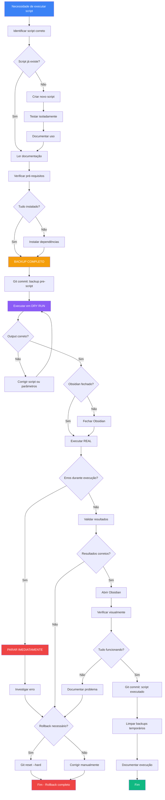

# 🤖 PROCESSO — Execução de Scripts de Automação

> **Objetivo:** Executar scripts de forma segura, com backup, validação e rollback quando necessário.

---

## 🎯 QUANDO USAR ESTE PROCESSO

**Use este processo SEMPRE que for executar:**
- Scripts de migração de dados (`migrate-frontmatter.js`)
- Scripts de geração de documentos (`gerar_ata_html_profissional_v2.py`)
- Scripts de transformação massiva (rename, move, delete)
- Scripts que modificam múltiplos arquivos
- Qualquer automação que altera conteúdo do vault

**NÃO use para:**
- Scripts read-only (queries, análises, relatórios)
- Scripts de um único arquivo (executar manualmente é mais seguro)
- Testes em ambiente isolado

---

## 📋 SCRIPTS DISPONÍVEIS

| Script | Linguagem | Propósito | Risco | Doc |
|--------|-----------|-----------|-------|-----|
| `migrate-frontmatter.js` | Node.js | Migrar frontmatter para padrão PLANO_VAULT | 🔴 ALTO | [[scripts/README-MIGRATION]] |
| `gerar_ata_html_profissional_v2.py` | Python | Gerar HTML de atas para apresentação | 🟢 BAIXO | (inline no arquivo) |
| (futuros) | — | — | — | — |

**Local:** `C:\Users\pedro\OneDrive\Área de Trabalho\Obsidian Empresa\scripts\`

---

## 🔄 FLUXO DO PROCESSO



---

## ✅ CHECKLIST DE EXECUÇÃO SEGURA

### **FASE 1: Preparação (5-10min)**

- [ ] **Identificar script necessário**
  - Nome do arquivo: `_____________________`
  - Localização: `scripts/_______________`
  - Documentação: existe? onde? ____________

- [ ] **Ler documentação completa**
  - [ ] README do script
  - [ ] Exemplos de uso
  - [ ] Problemas conhecidos
  - [ ] Referências: [[scripts/README-MIGRATION]], [[scripts/MIGRATION-FLOW]]

- [ ] **Verificar pré-requisitos**
  - [ ] Node.js instalado? `node --version` (se script .js)
  - [ ] Python instalado? `python --version` (se script .py)
  - [ ] Dependências instaladas? `npm install` ou `pip install -r requirements.txt`
  - [ ] Permissões de escrita? (testar com arquivo dummy)

---

### **FASE 2: Backup (CRÍTICO - 5min)**

> [!danger] **NUNCA pule esta fase. SEMPRE faça backup antes de scripts destrutivos.**

**Opção A: Git Commit (recomendado)**
```bash
cd "C:\Users\pedro\OneDrive\Área de Trabalho\Obsidian Empresa"
git add .
git commit -m "backup: Pre-script-execution snapshot - [nome-script]"
git log -1  # verificar commit criado
```

- [ ] Commit criado com sucesso
- [ ] Hash do commit anotado: `___________________`

**Opção B: Backup manual (se Git não disponível)**
```bash
# Copiar pasta inteira para local seguro
xcopy "C:\Users\pedro\OneDrive\Área de Trabalho\Obsidian Empresa" "D:\Backups\Obsidian-[data]" /E /I
```

- [ ] Backup criado em: `_________________________`
- [ ] Tamanho conferido (deve ser igual ao original)

---

### **FASE 3: Dry Run (10min)**

> [!info] **Dry Run = testar sem modificar arquivos reais**

**Para `migrate-frontmatter.js`:**
```bash
cd "C:\Users\pedro\OneDrive\Área de Trabalho\Obsidian Empresa"
node scripts/migrate-frontmatter.js --dry-run
```

**Para scripts Python:**
```bash
python scripts/script-nome.py --dry-run
# ou
python scripts/script-nome.py --test
```

- [ ] Script executou sem erros fatais
- [ ] Output mostra mudanças esperadas
- [ ] Quantidade de arquivos afetados faz sentido
- [ ] ANTES/DEPOIS está correto nos exemplos

**Salvar output para referência:**
```bash
node scripts/migrate-frontmatter.js --dry-run > dry-run-output.txt
```

- [ ] Output salvo em: `dry-run-output.txt`
- [ ] Revisado manualmente

---

### **FASE 4: Preparação Final (5min)**

- [ ] **Fechar Obsidian COMPLETAMENTE**
  - Fechar todas janelas
  - Verificar Task Manager: processo `Obsidian.exe` não existe
  - Motivo: evitar conflito de arquivo aberto

- [ ] **Validar parâmetros do script**
  - Caminho correto? `___________________`
  - Filtros corretos? `___________________`
  - Flags ativas? `___________________`

- [ ] **Confirmar execução**
  - [ ] Backup feito? ✅
  - [ ] Dry run validado? ✅
  - [ ] Obsidian fechado? ✅
  - [ ] Pronto para executar? ✅

---

### **FASE 5: Execução Real (5-15min)**

**Executar script SEM --dry-run:**

**Para `migrate-frontmatter.js`:**
```bash
node scripts/migrate-frontmatter.js
```

**Para scripts Python:**
```bash
python scripts/gerar_ata_html_profissional_v2.py caminho/para/ata.md
```

- [ ] Script iniciou execução
- [ ] Monitorar output em tempo real
- [ ] **Se aparecer ERRO:**
  - [ ] **PARAR SCRIPT IMEDIATAMENTE** (Ctrl+C)
  - [ ] Anotar erro: `_______________________`
  - [ ] Ir para FASE 7: Rollback

- [ ] Script concluiu sem erros
- [ ] Mensagem final: "Success" ou similar
- [ ] Arquivos `.backup` criados (se aplicável)

**Tempo de execução:** `_______ min`

---

### **FASE 6: Validação (10-15min)**

**Validação Automática (se script suportar):**
```bash
node scripts/migrate-frontmatter.js --validate
```

**Validação Manual:**

1. **Abrir Obsidian**
   - [ ] Obsidian abre sem erros
   - [ ] Não aparecem mensagens de erro ao carregar

2. **Verificar dashboards principais**
   - [ ] Abrir `90-Views/Dashboard-EncaminhamentosV2.0.md`
   - [ ] Queries carregam sem erro?
   - [ ] Métricas fazem sentido?
   - [ ] Abrir `90-Views/Dashboard-Kaizens.md`
   - [ ] Conteúdo carrega?

3. **Spot-check arquivos modificados**
   - [ ] Abrir 3-5 arquivos aleatórios
   - [ ] Frontmatter está correto?
   - [ ] Conteúdo não foi corrompido?
   - [ ] Links funcionam?

4. **Verificar quantidade de mudanças**
   ```bash
   git status
   git diff --stat
   ```
   - [ ] Número de arquivos modificados faz sentido?
   - [ ] Mudanças são esperadas?

5. **Teste de funcionalidade**
   - [ ] Criar nova task
   - [ ] Criar nova ata
   - [ ] Verificar se queries funcionam

**Resultado da validação:**
- [ ] ✅ TUDO CORRETO — continuar para commit
- [ ] ❌ PROBLEMAS DETECTADOS — ir para FASE 7: Rollback

---

### **FASE 7: Rollback (se necessário)**

> [!danger] **Use quando validação falhar ou script corromper dados**

**Opção A: Git Reset (recomendado)**
```bash
# Reverter TUDO para estado pré-script
git reset --hard <hash-do-commit-backup>

# Verificar
git status  # deve estar limpo
git log -1  # deve mostrar commit de backup
```

**Opção B: Restaurar backup manual**
```bash
# Deletar pasta atual
rmdir /s "C:\Users\pedro\OneDrive\Área de Trabalho\Obsidian Empresa"

# Copiar backup de volta
xcopy "D:\Backups\Obsidian-[data]" "C:\Users\pedro\OneDrive\Área de Trabalho\Obsidian Empresa" /E /I
```

**Após rollback:**
- [ ] Validar que arquivos voltaram ao estado original
- [ ] Documentar problema encontrado
- [ ] Investigar causa raiz
- [ ] Corrigir script ou parâmetros
- [ ] Recomeçar do FASE 1

---

### **FASE 8: Finalização (5min)**

**Se validação OK:**

1. **Commit das mudanças**
```bash
git add .
git commit -m "feat: Execute [nome-script] - [breve descrição]"
git push
```

2. **Limpar backups temporários** (se aplicável)
```bash
# Para migrate-frontmatter.js
node scripts/migrate-frontmatter.js --cleanup-backups

# Ou manualmente
Get-ChildItem -Recurse -Filter "*.backup" | Remove-Item
```

3. **Documentar execução**
   - Criar entry em log: `scripts/EXECUTION-LOG.md` (se existir)
   - Ou adicionar comentário no próprio script:
   ```javascript
   // Última execução: 2025-11-20 - PV
   // Resultado: Sucesso - 20 arquivos migrados
   ```

4. **Comunicar ao time** (se mudanças afetam outros)
   - Slack/WhatsApp: "Script X executado. Mudanças: [resumo]"
   - Se crítico: reunião rápida de alinhamento

- [ ] Commit realizado
- [ ] Backups limpos (se aplicável)
- [ ] Execução documentada
- [ ] Time comunicado (se necessário)

---

## 🔍 TROUBLESHOOTING — Problemas Comuns

### **Problema 1: "Permission denied" ao executar script**

**Causa:** Obsidian está aberto bloqueando arquivos

**Solução:**
1. Fechar Obsidian completamente
2. Verificar Task Manager: processo `Obsidian.exe` não existe
3. Executar novamente

---

### **Problema 2: "Module not found" ou "No module named X"**

**Causa:** Dependências não instaladas

**Solução Node.js:**
```bash
cd scripts
npm install
# ou instalar específico
npm install <nome-modulo>
```

**Solução Python:**
```bash
pip install -r requirements.txt
# ou instalar específico
pip install <nome-biblioteca>
```

---

### **Problema 3: "Directory not found" ou "Path not found"**

**Causa:** Caminho incorreto ou pasta não existe

**Solução:**
1. Verificar se você está no diretório correto:
```bash
pwd  # Linux/Mac
cd   # Windows
```
2. Navegar para diretório correto:
```bash
cd "C:\Users\pedro\OneDrive\Área de Trabalho\Obsidian Empresa"
```
3. Executar novamente

---

### **Problema 4: Script executou mas não modificou nada**

**Causa:** Filtros muito restritivos ou arquivos já no formato correto

**Solução:**
1. Verificar parâmetros do script
2. Executar com flag de verbose (se disponível):
```bash
node scripts/script.js --verbose
```
3. Verificar manualmente alguns arquivos:
   - Eles realmente precisam ser modificados?
   - Estão no formato esperado pelo script?

---

### **Problema 5: "Error: Cannot read property of undefined"**

**Causa:** Arquivo mal formatado quebra parsing

**Solução:**
1. Identificar qual arquivo causou erro (geralmente aparece no log)
2. Abrir arquivo manualmente
3. Corrigir formatação (frontmatter, YAML)
4. Executar script novamente
5. OU adicionar validação no script para pular arquivos mal formatados

---

### **Problema 6: Dry run OK, mas execução real falha**

**Causa:** Condição de corrida, arquivo bloqueado, ou bug no script

**Solução:**
1. Executar rollback imediatamente
2. Revisar diferença entre dry-run e execução real no código
3. Adicionar mais logging no script
4. Testar com subconjunto de arquivos:
```bash
# Exemplo: processar só 1 pasta
node scripts/migrate-frontmatter.js --path="10-Pessoas"
```
5. Reportar bug para mantenedor do script

---

## 📊 REGISTRO DE EXECUÇÕES

**Manter log em:** `scripts/EXECUTION-LOG.md` (criar se não existir)

**Formato:**
```markdown
## 2025-11-20 - migrate-frontmatter.js

**Executado por:** Pedro Vitor Pagliarin
**Motivo:** Migração frontmatter para padrão PLANO_VAULT
**Dry run:** ✅ Passou
**Resultado:** ✅ Sucesso
**Arquivos afetados:** 20 (15 pessoas, 5 projetos)
**Tempo:** 3min
**Problemas:** Nenhum
**Commit:** a1b2c3d4
```

---

## 🎓 BOAS PRÁTICAS

### **DO's:**
✅ SEMPRE fazer backup antes (Git ou manual)
✅ SEMPRE executar dry run primeiro
✅ SEMPRE fechar Obsidian antes de scripts destrutivos
✅ SEMPRE validar resultados manualmente
✅ Documentar cada execução
✅ Manter scripts versionados (Git)
✅ Adicionar logging no script (console.log, print)
✅ Criar scripts idempotentes (executar 2x = mesmo resultado)

### **DON'Ts:**
❌ Executar script sem ler documentação
❌ Pular dry run ("é rápido, vai dar certo")
❌ Executar sem backup ("é só um teste")
❌ Executar em produção sem testar em staging
❌ Modificar script sem entender o código
❌ Ignorar warnings do dry run
❌ Deixar Obsidian aberto durante execução

---

## 📚 REFERÊNCIAS

- [[scripts/README-MIGRATION]] — Guia de migração frontmatter
- [[scripts/MIGRATION-FLOW]] — Fluxo detalhado de migração
- [[PLANO_VAULT]] — Padrão do vault (destino das migrações)

---

## 📋 TEMPLATE DE NOVO SCRIPT

**Se criar script novo, incluir:**

```javascript
// migrate-exemplo.js
// Propósito: [descrição breve]
// Autor: [nome]
// Data: [YYYY-MM-DD]
// Uso: node migrate-exemplo.js [--dry-run]

const fs = require('fs');

// Configuração
const DRY_RUN = process.argv.includes('--dry-run');

// Validação de pré-requisitos
function validatePrerequisites() {
  console.log('🔍 Validating prerequisites...');
  // Verificar pastas, dependências, etc
}

// Função principal
function main() {
  if (DRY_RUN) {
    console.log('🧪 DRY RUN MODE - No files will be modified');
  }

  validatePrerequisites();

  // Processar arquivos
  // ...

  console.log('✅ Script completed successfully');
}

main();
```

**Documentação obrigatória no README:**
```markdown
# Script: migrate-exemplo.js

## Propósito
[O que faz]

## Pré-requisitos
- Node.js v16+
- [outras dependências]

## Uso
\`\`\`bash
# Dry run
node scripts/migrate-exemplo.js --dry-run

# Execução real
node scripts/migrate-exemplo.js
\`\`\`

## Output esperado
[exemplos]

## Problemas conhecidos
[lista]
```

---

**Criado por:** [[Pedro Vitor Pagliarin]]
**Última revisão:** 2025-11-20
**Status:** ✅ Ativo
**Próxima revisão:** 2025-12-20
