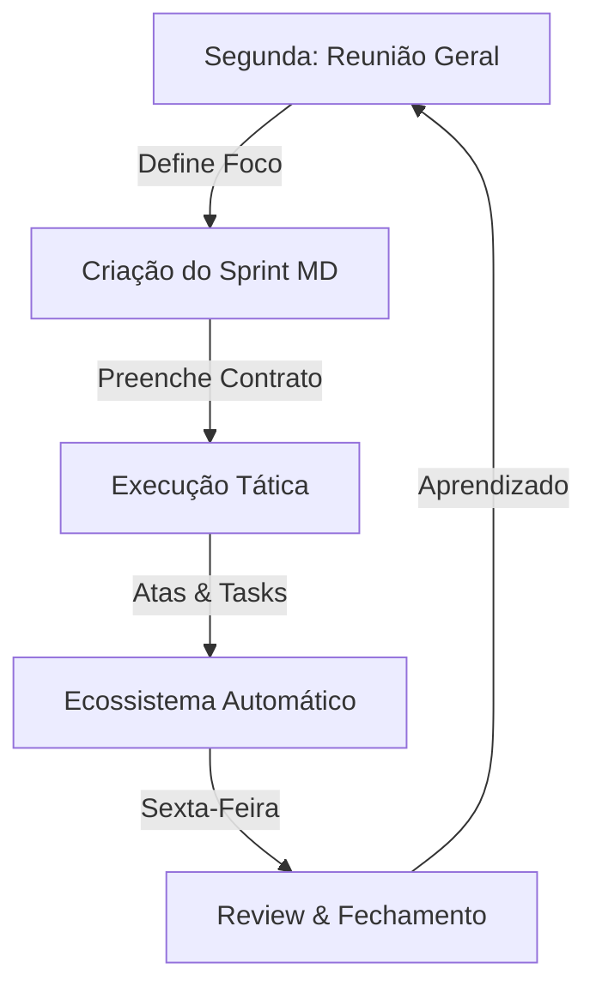

# 🔄 PROCESSO — Gestão de Sprints Ágil (Sistema UzzAI)

> **Objetivo:** Documentar o fluxo exato de como criamos, executamos e encerramos Sprints semanais usando o ecossistema Obsidian + Dataview.
> **Filosofia:** "O arquivo do Sprint é a verdade única da semana."

---

## 🎯 1. VISÃO GERAL DO CICLO (The Loop)

O nosso Sprint dura **1 semana** (Segunda a Domingo).



---

## 🛠️ 2. COMO CRIAR UM SPRINT (Passo a Passo)

### **Passo 1: Criar o Arquivo**
1. Vá na pasta `30-Sprints`.
2. Crie um novo arquivo com o nome: `Sprint-AAAA-WXX` (ex: `Sprint-2025-W48`).
3. Insira o template: **`05-SPRINT-SEMANAL-TEMPLATE-R00`**.

### **Passo 2: Preencher o Frontmatter**
No topo do arquivo, ajuste os metadados:

```yaml
sprint: "Sprint-2025-W48"       # ID único da semana
semana: "25-11 a 01-12"         # Intervalo de datas
status: "🟡 Em Execução"        # Começa assim
objetivo_principal: "..."       # O foco macro definido na Reunião Geral
acoes_planejadas: 5             # Quantos itens você colocou na tabela "Contrato"
```

### **Passo 3: O "Contrato de Sprint" (Manual)**
Esta é a única parte manual e a mais importante.
- **Vá na tabela "1. CONTRATO DE SPRINT".**
- Escreva de 3 a 5 entregas **inegociáveis** para a semana.
- Isso serve de *trava de segurança*: mesmo que o Dataview falhe, ou que tarefas sejam deletadas, o que foi prometido aqui fica escrito em pedra.

---

## 🔗 3. COMO CONECTAR O SISTEMA (A Mágica)

Para que as tarefas e reuniões apareçam sozinhas no arquivo do Sprint, você só precisa seguir **2 regras de ouro** durante a semana:

### **Regra A: Reuniões (Atas)**
Sempre que criar uma Ata (usando `00 - ATA-REUNIÃO-TEMPLATE-R01`), preencha o campo sprint:

```yaml
sprint: Sprint-2025-W48
```
*Resultado: A reunião aparece automaticamente na seção "Ecossistema do Sprint".*

### **Regra B: Tarefas (Tasks)**
Qualquer tarefa criada em qualquer lugar do Obsidian (Atas, Projetos, Daily Notes) deve ter a **Tag do Sprint** se for para ser feita nesta semana.

```markdown
- [ ] Fazer a landing page #sprint/Sprint-2025-W48 priority:high
```
*Resultado: A tarefa aparece automaticamente na seção "Execução Tática", agrupada por Pessoa e Projeto.*

---

## 📅 4. O RITUAL SEMANAL

### **🔵 SEGUNDA-FEIRA: Planning & Kick-off**
1. **Reunião Geral (19h30):** O time define o foco.
2. **Criação do Sprint:** O Scrum Master (PV) cria o arquivo `Sprint-AAAA-WXX`.
3. **Contrato:** Preenche a tabela manual com as "Big Rocks" da semana.

### **🟢 TERÇA A QUINTA: Execução**
1. **Trabalho:** Time foca nas tarefas.
2. **Updates:** Conforme tarefas são completadas (`- [x]`), elas somem da lista "A Fazer" e aparecem na lista "Performance & Entregas" do arquivo do Sprint.

### **🔴 SEXTA-FEIRA: Review & Retrospectiva**
1. **Contagem:**
   - Abra o arquivo do Sprint.
   - Veja na tabela "Contrato" quantos itens foram entregues (ex: 3 de 5).
   - Atualize o frontmatter: `acoes_concluidas: 3`.
2. **Análise:**
   - Preencha a seção "Retrospectiva" no final do arquivo.
   - *Por que não entregamos os outros 2? O que travou?*
3. **Fechamento:**
   - Mude o status para `#sprint/concluido`.
   - As lições aprendidas viram input para o Planning da próxima Segunda.

---

## 📊 5. ESTRUTURA DO ARQUIVO (Template R02)

| Seção | Função | Automático? |
|-------|--------|-------------|
| **1. Contrato** | Lista estática de promessas da semana. | **NÃO** (Manual) |
| **2. Ecossistema** | Lista todas as Atas e Decisões (ADRs) da semana. | ✅ Sim |
| **3. Performance** | Lista tudo que já foi concluído (`- [x]`). | ✅ Sim |
| **4. Por Pessoa** | Mostra quem está fazendo o quê (Load Balance). | ✅ Sim |
| **5. Por Projeto** | Mostra foco por área (Chatbot, Site, etc). | ✅ Sim |
| **6. Backlog** | Lista tudo pendente ordenado por prioridade. | ✅ Sim |
| **7. Retrospectiva** | Análise qualitativa do final da semana. | **NÃO** (Manual) |

---

## ❓ FAQ & TROUBLESHOOTING

**P: A reunião de segunda-feira não apareceu no Sprint.**
R: Verifique se a data da reunião está dentro da semana do Sprint ou se a tag `sprint: ...` está correta no frontmatter da Ata. O template R02 já busca reuniões do dia de início (Segunda) automaticamente.

**P: Minha tarefa não aparece na lista "Por Pessoa".**
R: A tarefa precisa ter um link wiki para o seu nome (ex: `[[Pedro Vitor]]`). Se for só texto, ela cai em "Sem Responsável".

**P: Esqueci de criar o arquivo do Sprint na segunda. E agora?**
R: Crie a qualquer momento. O Dataview é retroativo: assim que você criar o arquivo, ele vai varrer o cofre e puxar tudo que tem a tag `#sprint/Sprint-XXXX-WXX`, mesmo que as tarefas tenham sido criadas dias antes.

---

**Criado por:** [[Pedro Vitor Pagliarin]]
**Última revisão:** 22/11/2025
**Status:** ✅ Padrão Oficial
