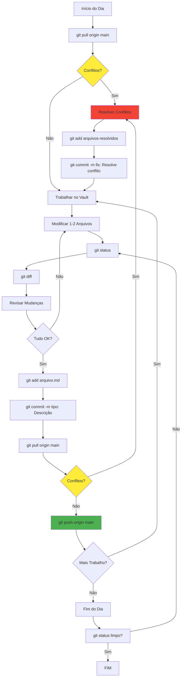

# PROCESSO — Git Workflow Colaborativo

> **Objetivo**: Trabalhar simultaneamente no vault sem conflitos, com commits rastreáveis e código sempre sincronizado
> **Quando usar**: DIARIAMENTE, ANTES e DEPOIS de trabalhar no vault
> **Responsável**: [[Pedro Vitor Pagliarin]] (owner do vault)

---

## 📋 Contexto e Decisão Histórica

### **Por que este processo existe**

Com 11 colaboradores trabalhando no mesmo vault Obsidian:
- **Sem processo Git**: Conflitos diários, trabalho perdido, caos
- **Com processo Git**: Trabalho paralelo eficiente, histórico rastreável, zero perda de dados

**Caso real** (ATA Chatbot 19/11):
> Luis: "Tu mudou 19 arquivos de uma vez: landing page, middleware, autenticação, APIs... Deu conflito em tudo. Tive que fazer merge arquivo por arquivo. Por isso: pequenos commits."

**Decisão**: Commits pequenos (1-2 arquivos), mensagens descritivas, comunicação diária.

### **Quando NÃO usar**

- Bullet Journal pessoal (cada um o seu, sem conflito)
- Arquivos temporários locais (não versionar)
- Testes/rascunhos que não vão para produção

---

## 🔄 Fluxo Executável

### **Fluxograma Visual**



---

### **Checklist DIÁRIA — Início do Trabalho**

```bash
# 1. Verificar status atual
git status

# 2. Sincronizar com repositório remoto
git pull origin main

# 3. Verificar se há conflitos
# Se aparecer "CONFLICT", resolver antes de continuar
# Se aparecer "Already up to date", pode trabalhar
```

**⏱ Tempo**: 1 minuto

---

### **Checklist DURANTE o Trabalho**

#### **1. Modificar Arquivos (trabalho normal)**

- Editar ATAs, dashboards, perfis de pessoas, etc.
- **REGRA**: Trabalhar em no máximo 1-2 arquivos relacionados por vez

#### **2. Ver o que mudou**

```bash
# Ver arquivos modificados
git status

# Ver mudanças detalhadas linha por linha
git diff

# Ver diferenças em arquivo específico
git diff caminho/do/arquivo.md
```

#### **3. Adicionar ao staging**

```bash
# Adicionar arquivo específico (RECOMENDADO)
git add "40-Reunioes/23 - Reunião/2025-11-20-Ata.md"

# Adicionar todos (CUIDADO: usar apenas se certeza)
git add .
```

#### **4. Commitar com mensagem descritiva**

```bash
# Formato: tipo: Descrição clara
git commit -m "feat: Adiciona ata reunião chatbot 20/11"
git commit -m "docs: Atualiza dashboard central com sprint W47"
git commit -m "fix: Corrige frontmatter ata 19/11"
git commit -m "chore: Reorganiza pasta 40-Reunioes"
```

**Tipos de commit**:
- `feat`: Nova funcionalidade, nova ata, novo dashboard
- `docs`: Atualização de documentação existente
- `fix`: Correção de erro, typo, frontmatter
- `chore`: Tarefas de manutenção, organização
- `refactor`: Reestruturação sem mudar funcionalidade
- `update`: Atualizações gerais de conteúdo

#### **5. Sincronizar e enviar**

```bash
# SEMPRE puxe antes de enviar
git pull origin main

# Envia suas mudanças
git push origin main
```

**⏱ Tempo por commit**: 2-3 minutos

---

### **Checklist FIM DO DIA**

```bash
# 1. Ver o que ainda não foi commitado
git status

# 2. Se houver mudanças, commitar
git add .
git commit -m "chore: Finaliza trabalho do dia - organização geral"

# 3. Sincronizar
git pull origin main
git push origin main

# 4. Verificar que está tudo limpo
git status
# Deve mostrar: "nothing to commit, working tree clean"
```

**⏱ Tempo**: 2-3 minutos

---

## 🎯 Convenções de Commits

### **Formato Padrão**

```
<tipo>: <descrição clara e concisa>

[corpo opcional com mais detalhes]
```

### **Exemplos de Commits Excelentes** ✅

```bash
git commit -m "feat: Cria ata 18-Reuniao-Geral-03-11 com 15 decisões"
git commit -m "docs: Atualiza dashboard chatbot - progresso 40% sprint W45"
git commit -m "fix: Corrige contagem de ações no frontmatter ata 17"
git commit -m "chore: Move atas antigas para pasta ARQUIVADOS"
git commit -m "update: Adiciona 3 novos encaminhamentos Guilherme Horstmann"
```

### **Exemplos de Commits Ruins** ❌

```bash
git commit -m "update"
git commit -m "fix stuff"
git commit -m "changes"
git commit -m "trabalho do dia"
git commit -m "asdfasdf"
```

### **Commit com Corpo (Mudanças Complexas)**

```bash
git commit -m "refactor: Reorganiza estrutura dashboards de projeto

- Move ADRs para pasta dedicada
- Atualiza links internos
- Adiciona seção de dependências
- Corrige frontmatter de 4 dashboards

Impacto: Melhora navegabilidade e manutenção futura"
```

---

## 🔗 Links e Referências

### **Documentação Relacionada**

- [[00-Config/GIT-BOAS-PRATICAS-COLABORATIVO|Guia Git Boas Práticas (Guilherme)]] — Guia completo criado para Guilherme Horstmann
- [[README|README.md]] — Guia mestre do vault
- [[_TEMPLATES/README-TEMPLATES-ATUALIZACAO|Guia de Templates]] — Como usar templates

### **Exemplos Reais**

#### **Caso de Sucesso: Trabalho Paralelo Web + Mobile**

**Contexto** (ATA Chatbot 19/11):
- Luis trabalha em `main` (web)
- PV trabalha em `feature/mobile` (mobile)
- **Estratégia**: Commits pequenos, merge a cada 1-2 dias, comunicação diária

**Arquivos exclusivos**:
- **Luis** (nunca tocar): `nodes/`, `components/`, `hooks/`
- **PV** (nunca tocar): `android/`, `ios/`, `capacitor.config.ts`

**Arquivos compartilhados** (avisar antes):
- `supabase/`, `package.json`, `pages/`

**Resultado**: Zero conflitos em 3 semanas de trabalho paralelo.

#### **Caso de Problema: Commit Gigante**

**O que aconteceu**:
- PV commitou 19 arquivos de uma vez (landing page, middleware, auth, APIs)
- Luis teve que fazer merge arquivo por arquivo
- 2h de trabalho perdido resolvendo conflitos

**Lição aprendida**: Commits pequenos (1-2 arquivos), várias vezes.

---

## ⚠️ Troubleshooting

### **Problema 1: Conflito ao Fazer Pull**

**Sintoma:**
```bash
git pull origin main

CONFLICT (content): Merge conflict in 20-Projetos/DASHBOARD.md
Automatic merge failed; fix conflicts and then commit the result.
```

**Solução passo a passo:**

#### **1. Identificar arquivos com conflito**
```bash
git status
# Lista arquivos com conflito em vermelho
```

#### **2. Abrir arquivo no editor**
Procure por:
```markdown
<<<<<<< HEAD
Seu conteúdo aqui
=======
Conteúdo do repositório remoto
>>>>>>> origin/main
```

#### **3. Decidir qual versão manter**

**Antes (com conflito):**
```markdown
<<<<<<< HEAD
- Progresso: 35%
=======
- Progresso: 40%
>>>>>>> origin/main
```

**Depois (resolvido):**
```markdown
- Progresso: 40%
```

**Delete completamente** as linhas:
- `<<<<<<< HEAD`
- `=======`
- `>>>>>>> origin/main`

#### **4. Salvar e commitar**
```bash
git add arquivo-resolvido.md
git commit -m "fix: Resolve conflito em dashboard central"
git push origin main
```

#### **5. Quando pedir ajuda**

Se conflito em:
- ❗ `README.md` → Chamar Pedro
- ❗ `DASHBOARD-UZZAI-CENTRAL.md` → Combinar com Pedro antes
- ❗ `_TEMPLATES/` → Chamar Pedro
- ❗ Views com DataviewJS (`90-Views/`) → Chamar Pedro

---

### **Problema 2: "Permission Denied" ao Fazer Push**

**Sintoma:**
```bash
git push origin main
Permission denied (publickey)
```

**Causa**: Credenciais inválidas

**Solução (Windows):**
```bash
# Reconfigurar credenciais GitHub
git config --global credential.helper wincred

# Fazer push novamente
git push origin main
# Vai pedir usuário e senha (usar Personal Access Token)
```

**Solução (Linux/Mac):**
```bash
git config --global credential.helper store
git push origin main
```

---

### **Problema 3: "Your Branch is Behind 'origin/main'"**

**Sintoma:**
```bash
git status
Your branch is behind 'origin/main' by 3 commits
```

**Causa**: Repositório remoto tem commits que você não tem

**Solução:**
```bash
git pull origin main
```

Se houver conflitos, resolver conforme Problema 1.

---

### **Problema 4: Commitou Arquivo Errado**

**Se NÃO fez push ainda:**
```bash
# Desfaz commit, mantém mudanças
git reset --soft HEAD~1

# Remove do staging
git reset HEAD arquivo-errado.md

# Adiciona arquivo correto
git add arquivo-correto.md
git commit -m "tipo: Mensagem correta"
```

**Se JÁ fez push:**
- Chamar Pedro Vitor (precisa reverter com cuidado)
- NÃO use `git push --force` (nunca!)

---

### **Problema 5: Obsidian Mostra "Arquivo Foi Modificado Externamente"**

**Causa**: Git atualizou arquivos enquanto Obsidian estava aberto

**Solução:**
1. Fechar Obsidian
2. `git pull origin main`
3. Abrir Obsidian novamente

---

### **Problema 6: Trabalho Não Salvo (Emergência)**

**Cenário**: Precisa mudar de branch mas tem trabalho não commitado

**Solução:**
```bash
# Salvar trabalho temporariamente
git stash

# Fazer o que precisa (ex: git pull)
git pull origin main

# Recuperar trabalho
git stash pop
```

**Ver lista de stashes:**
```bash
git stash list
```

---

## 📊 Boas Práticas

### **✅ FAZER**

#### **Git:**
- ✅ Sempre `git pull` antes de começar
- ✅ Commits pequenos (1-2 arquivos)
- ✅ Mensagens descritivas com tipo (`feat:`, `docs:`, etc.)
- ✅ Revisar `git status` e `git diff` antes de commit
- ✅ Testar mudanças no Obsidian antes de commitar
- ✅ Sincronizar 3-5 vezes ao dia

#### **Vault:**
- ✅ Usar templates da pasta `_TEMPLATES/`
- ✅ Manter frontmatter completo
- ✅ Linkar com `[[]]` (pessoas, projetos, ATAs)
- ✅ Atualizar dashboards após criar ATAs
- ✅ Registrar no seu Bullet Journal
- ✅ Manter nomenclatura padrão

#### **Colaboração:**
- ✅ Avisar Pedro antes de mudanças grandes
- ✅ Coordenar edições em Dashboard Central
- ✅ Cada um manter seu próprio Bullet Journal
- ✅ Comentar decisões importantes nas ATAs

---

### **❌ NÃO FAZER**

#### **Git:**
- ❌ Force push (`git push --force`) — **NUNCA**
- ❌ Commits gigantes (20+ arquivos)
- ❌ Mensagens vagas ("update", "fix", "changes")
- ❌ Commitar sem testar
- ❌ Push sem pull antes
- ❌ Ignorar conflitos

#### **Vault:**
- ❌ Deletar informações históricas
- ❌ Modificar ATAs finalizadas (criar nova se preciso)
- ❌ Mover templates de lugar
- ❌ Quebrar DataviewJS sem testar
- ❌ Criar arquivos fora da estrutura padrão
- ❌ Ignorar frontmatter obrigatório

#### **Colaboração:**
- ❌ Editar Bullet Journal de outra pessoa
- ❌ Modificar README sem avisar
- ❌ Deletar ATAs sem arquivar
- ❌ Alterar decisões de ATAs antigas
- ❌ Fazer mudanças estruturais sozinho

---

## 💻 Comandos Essenciais

### **Diários**

```bash
# Ver status atual
git status

# Ver mudanças detalhadas
git diff

# Sincronizar com remoto
git pull origin main

# Adicionar arquivos específicos
git add caminho/arquivo.md

# Adicionar tudo (use com cuidado!)
git add .

# Commitar com mensagem
git commit -m "tipo: Descrição"

# Enviar para repositório
git push origin main
```

---

### **Verificação**

```bash
# Ver histórico de commits
git log --oneline

# Ver últimos 5 commits
git log --oneline -5

# Ver quem modificou cada linha
git blame arquivo.md

# Ver mudanças de um commit específico
git show <hash-do-commit>

# Ver diferenças antes de adicionar
git diff

# Ver diferenças já adicionadas (staged)
git diff --cached
```

---

### **Desfazer**

```bash
# Desfazer mudanças NÃO commitadas em arquivo
git checkout -- arquivo.md

# Remover arquivo do staging (antes de commit)
git reset HEAD arquivo.md

# Desfazer último commit (mantém mudanças)
git reset --soft HEAD~1

# Descartar TODAS mudanças não commitadas (CUIDADO!)
git reset --hard HEAD
```

⚠️ **ATENÇÃO**: Comandos de desfazer podem perder trabalho. Use com cuidado!

---

### **Emergência**

```bash
# Salvar trabalho temporariamente sem commit
git stash

# Recuperar trabalho salvo
git stash pop

# Ver lista de stashes
git stash list

# Abortar merge com conflitos
git merge --abort

# Ver configuração atual
git config --list
```

---

## 📖 Cenários Reais

### **Cenário 1: Criar Nova ATA**

```bash
# 1. Sincronizar
git pull origin main

# 2. Criar ATA no Obsidian (usar template)
# Arquivo: 40-Reunioes/19 - Reuniao Nova/2025-11-20-Reuniao-Alinhamento.md

# 3. Verificar o que mudou
git status

# 4. Adicionar a ATA
git add "40-Reunioes/19 - Reuniao Nova/2025-11-20-Reuniao-Alinhamento.md"

# 5. Commitar
git commit -m "feat: Cria ata reunião alinhamento semanal 20/11"

# 6. Sincronizar e enviar
git pull origin main
git push origin main
```

---

### **Cenário 2: Atualizar Dashboard**

```bash
# 1. Sincronizar
git pull origin main

# 2. Editar dashboard no Obsidian
# Atualizar: status, progresso, gantt, etc.

# 3. Testar DataviewJS (abrir no Obsidian)

# 4. Verificar mudanças
git diff 20-Projetos/CHATBOT/CHATBOT-PROJECT-DASHBOARD.md

# 5. Adicionar e commitar
git add 20-Projetos/CHATBOT/CHATBOT-PROJECT-DASHBOARD.md
git commit -m "docs: Atualiza dashboard chatbot - sprint W47 concluída"

# 6. Enviar
git pull origin main
git push origin main
```

---

### **Cenário 3: Trabalho em Múltiplos Arquivos**

```bash
# 1. Sincronizar
git pull origin main

# 2. Trabalhar em vários arquivos
# - Criar ATA
# - Atualizar dashboard projeto
# - Atualizar dashboard central

# 3. Ver tudo que mudou
git status

# 4. Adicionar arquivos relacionados em grupos
# Grupo 1: ATA
git add "40-Reunioes/.../2025-11-20-*.md"
git commit -m "feat: Adiciona ata reunião chatbot 20/11"

# Grupo 2: Dashboard do projeto
git add 20-Projetos/CHATBOT/CHATBOT-PROJECT-DASHBOARD.md
git commit -m "docs: Atualiza dashboard chatbot com decisões ata 20/11"

# Grupo 3: Dashboard central
git add 20-Projetos/UzzAI/DASHBOARD-UZZAI-CENTRAL.md
git commit -m "update: Atualiza dashboard central - métricas W47"

# 5. Sincronizar e enviar
git pull origin main
git push origin main
```

---

### **Cenário 4: Resolver Conflito Simples**

```bash
# 1. Tentar fazer pull
git pull origin main

# ERRO: CONFLICT in 20-Projetos/DASHBOARD.md

# 2. Abrir arquivo no editor
# Buscar por: <<<<<<<, =======, >>>>>>>

# 3. Decidir qual versão manter
# Exemplo: manter versão remota (depois do =======)

# 4. Deletar marcadores de conflito
# Delete: <<<<<<< HEAD
# Delete: =======
# Delete: >>>>>>> origin/main

# 5. Salvar arquivo

# 6. Adicionar e commitar
git add 20-Projetos/DASHBOARD.md
git commit -m "fix: Resolve conflito em dashboard - aceita versão remota"

# 7. Enviar
git push origin main
```

---

## 📊 Métricas de Sucesso

### **Indicadores Objetivos**

| Métrica | Target | Como Medir |
|---------|--------|------------|
| **Commits diários** | 2-5 por pessoa | `git log --since="1 day ago" --author="Nome"` |
| **Arquivos por commit** | 1-3 (média) | Revisão manual |
| **Mensagens descritivas** | 100% | `git log --oneline` |
| **Conflitos** | < 1 por semana | Contagem manual |
| **Sincronizações diárias** | 3-5 por pessoa | `git reflog` |
| **Tempo de resolução de conflito** | < 10 minutos | Estimativa |

### **Indicadores de Excelência**

- 🏆 Repositório sempre sincronizado
- 🏆 Zero informação perdida
- 🏆 Histórico Git limpo e legível
- 🏆 Colaboração fluida (sem bloqueios)
- 🏆 Commits atômicos (1 mudança lógica por commit)

---

## 🔄 Melhoria Contínua

### **Histórico de Versões**

| Versão | Data | Mudança | Autor |
|--------|------|---------|-------|
| 1.0 | 2025-11-20 | Criação do processo baseado em plano twin-dev + experiência chatbot | Pedro Vitor Pagliarin |

### **Última Revisão**

- **Data**: 2025-11-20
- **Revisor**: Pedro Vitor Pagliarin
- **Próxima Revisão**: 2026-02-20 (3 meses) ou quando houver 3+ kaizens de melhoria

### **Kaizens Aplicados**

- **K-001** (ATA Chatbot 19/11): Commits pequenos são essenciais
  - Regra: Máximo 1-2 arquivos por commit
  - Resultado: Zero conflitos em 3 semanas de trabalho paralelo web+mobile

### **Melhorias Futuras Planejadas**

- [ ] Git hooks para validar mensagens de commit (formato correto)
- [ ] Script para verificar links quebrados antes de commit
- [ ] Dashboard de métricas Git (commits/dia, conflitos/semana)
- [ ] Guia visual de resolução de conflitos (screenshots)

---

## 🎯 Quick Reference Card

```
┌─────────────────────────────────────────────────┐
│           GIT COMANDOS ESSENCIAIS               │
├─────────────────────────────────────────────────┤
│ INÍCIO DO DIA                                   │
│ git pull origin main                            │
│                                                 │
│ DURANTE TRABALHO                                │
│ git status          # Ver o que mudou           │
│ git diff            # Ver mudanças detalhadas   │
│                                                 │
│ COMMITAR                                        │
│ git add arquivo.md  # Adicionar específico      │
│ git add .           # Adicionar tudo            │
│ git commit -m "tipo: Descrição"                 │
│                                                 │
│ ENVIAR                                          │
│ git pull origin main  # Sempre antes de push!   │
│ git push origin main                            │
│                                                 │
│ DESFAZER (antes de commit)                      │
│ git checkout -- arquivo.md                      │
│                                                 │
│ EMERGÊNCIA                                      │
│ git stash           # Salvar trabalho temporário│
│ git stash pop       # Recuperar                 │
└─────────────────────────────────────────────────┘
```

---

## ✅ Checklist Rápido (Imprimir/Colar na Parede)

**ANTES DE COMEÇAR:**
- [ ] `git pull origin main`
- [ ] Verificar Obsidian aberto

**AO CRIAR ATA:**
- [ ] Template correto
- [ ] Frontmatter completo
- [ ] Tasks formatadas
- [ ] Testado no Obsidian

**ANTES DE COMMIT:**
- [ ] `git status` revisado
- [ ] `git diff` revisado
- [ ] Mensagem descritiva
- [ ] Sem erros de digitação

**ANTES DE PUSH:**
- [ ] `git pull origin main`
- [ ] Conflitos resolvidos
- [ ] Testado no Obsidian

**FIM DO DIA:**
- [ ] Tudo commitado
- [ ] Tudo no remoto (`git push`)
- [ ] `git status` limpo

---

## 💬 Contato e Suporte

### **Dúvidas**

| Tipo | Urgência | Como Resolver |
|------|----------|---------------|
| Conflito Git complexo | 🔴 Alta | Chamar Pedro imediatamente |
| Dúvida sobre commit | 🟡 Média | Mensagem + Print da dúvida |
| Organização arquivo | 🟢 Baixa | Consultar README.md primeiro |
| DataviewJS quebrado | 🔴 Alta | NÃO commitar, chamar Pedro |
| Nomenclatura | 🟢 Baixa | Seguir convenções deste doc |

**Responsável**: [[Pedro Vitor Pagliarin]]
**Canais**: Slack, WhatsApp, 1-on-1

---

**📊 Última Atualização**: 2025-11-20
**👤 Owner**: [[Pedro Vitor Pagliarin]]
**🎯 Status**: Ativo
**⚡ Versão**: 1.0

---

**🎯 LEMBRE-SE:**

> **"Commit cedo, commit frequente, commit com mensagens claras."**
>
> **"Quando em dúvida, pergunte. Melhor perder 5 minutos perguntando do que 5 horas desfazendo."**
>
> **"Somos um time. Coordenação > Velocidade individual."**

---

*"Git bem usado é invisível. Git mal usado é caos."*
