# 🚀 TEMPLATE UNIVERSAL: PLANO DE NEGÓCIO INVESTMENT-READY

> **Versão:** R01 — Template Definitivo
> **Objetivo:** Criar planos de negócio no nível do R03 (nota 9.2/10)
> **Resultado:** Documento pronto para investidores, parceiros e decisores
> **Páginas Esperadas:** 50-80 páginas (2.500-3.000 linhas)

---

## 📖 ÍNDICE DO TEMPLATE

### **PARTE A: INSTRUÇÕES DE USO**
1. [Como Usar Este Template](#parte-a-como-usar-este-template)
2. [Guia de Diagramas Mermaid](#guia-de-diagramas-mermaid)
3. [Checklist de Qualidade](#checklist-de-qualidade)

### **PARTE B: ESTRUTURA DO PLANO**
1. [Frontmatter e Metadados](#1-frontmatter)
2. [Executive Summary](#2-executive-summary)
3. [Visão Executiva](#3-visão-executiva)
4. [TAM/SAM/SOM](#4-tamsamsomdetalhado)
5. [Roadmap e Timeline](#5-roadmap-e-timeline)
6. [Modelo de Negócio](#6-modelo-de-negócio)
7. [Unit Economics](#7-unit-economics)
8. [Projeções Financeiras](#8-projeções-financeiras)
9. [Scenario Analysis](#9-scenario-analysis)
10. [Cash Flow Statement](#10-cash-flow-statement)
11. [Estratégia Comercial](#11-estratégia-comercial)
12. [Marketing e Aquisição](#12-marketing-e-aquisição)
13. [Análise Competitiva](#13-análise-competitiva)
14. [Jurídico e Compliance](#14-jurídico-e-compliance)
15. [Riscos e Mitigação](#15-riscos-e-mitigação)
16. [Customer Success](#16-customer-success)
17. [KPIs e Métricas](#17-kpis-e-métricas)
18. [Resumo Executivo Final](#18-resumo-executivo-final)

---

# PARTE A: COMO USAR ESTE TEMPLATE

## 📋 Instruções Gerais

### Passo 1: Preparação (2-4 horas)
```
1. Leia o template completo antes de começar
2. Reúna todos os dados necessários:
   - Métricas atuais do negócio
   - Pesquisa de mercado
   - Análise de concorrentes (mínimo 10)
   - Projeções financeiras
   - Informações do time
3. Defina o objetivo do documento:
   - [ ] Captação de investimento
   - [ ] Alinhamento interno
   - [ ] Parceria estratégica
   - [ ] Decisão de expansão
```

### Passo 2: Preenchimento (8-16 horas)
```
1. Preencha TODAS as seções marcadas com [PREENCHER]
2. Substitua todos os valores entre colchetes [X]
3. Crie os diagramas Mermaid seguindo os exemplos
4. Valide cada número e cálculo
5. Revise citações e fontes
```

### Passo 3: Revisão (2-4 horas)
```
1. Use o Checklist de Qualidade no final
2. Peça revisão de pelo menos 2 pessoas
3. Teste todos os diagramas Mermaid
4. Valide a coerência dos números
5. Ajuste formatação e visual
```

---

## 🎨 GUIA DE DIAGRAMAS MERMAID

> **IMPORTANTE:** Este guia ensina a criar cada tipo de diagrama usado no R03.

### 1. GRAPH TB/LR (Fluxogramas e Hierarquias)

**Uso:** Estruturas hierárquicas, processos, organogramas

**Sintaxe Básica:**
```
graph TB           → Top to Bottom (vertical)
graph LR           → Left to Right (horizontal)
graph TD           → Top Down (igual TB)
graph RL           → Right to Left
```

**Exemplo - Dashboard de Status:**
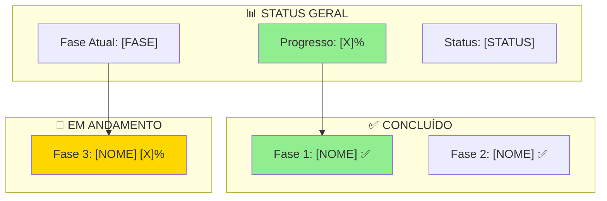

**Elementos:**
- `subgraph "TÍTULO"` → Agrupa elementos
- `A["Texto"]` → Nó com texto
- `A --> B` → Seta de A para B
- `style A fill:#COR` → Cor do nó

**Cores Padrão:**
```
#90EE90 → Verde claro (sucesso, concluído)
#FFD700 → Amarelo/Dourado (destaque, alerta)
#FF6B6B → Vermelho claro (crítico, bloqueado)
#4ECDC4 → Turquesa (neutro, informação)
#95E1D3 → Verde água (processo)
#FFD93D → Amarelo (atenção)
```

---

### 2. FLOWCHART (Fluxos com Decisões)

**Uso:** Processos com pontos de decisão, funis

**Sintaxe:**
```
flowchart TD       → Igual graph TD mas com mais opções
flowchart LR       → Horizontal
```

**Exemplo - Funil de Vendas:**
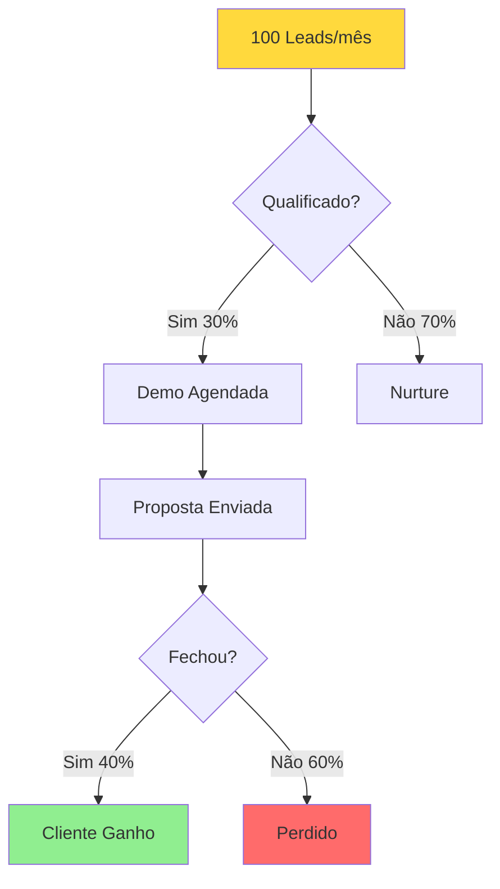

**Elementos Especiais:**
- `{Texto}` → Losango (decisão)
- `([Texto])` → Estádio (início/fim)
- `[[Texto]]` → Subrotina
- `((Texto))` → Círculo
- `-->|Label|` → Seta com texto

---

### 3. GANTT (Cronogramas)

**Uso:** Timelines, roadmaps, distribuição de tarefas

**Sintaxe Básica:**
```
gantt
    title [TÍTULO DO GANTT]
    dateFormat YYYY-MM-DD
    axisFormat %d/%m
    excludes weekends        → Opcional: exclui fins de semana
    
    section [SEÇÃO 1]
    [Tarefa 1]    :status, id, data_inicio, duracao_ou_data_fim
```

**Status Possíveis:**
```
done      → Concluído (cinza)
active    → Em andamento (azul)
crit      → Crítico (vermelho)
milestone → Marco (diamante)
(nada)    → Pendente (padrão)
```

**Exemplo - Roadmap:**
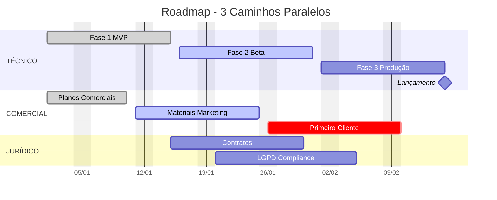

**Dicas:**
- Use `0d` para milestones
- Durações: `7d` (dias), `2w` (semanas), `1M` (mês)
- Dependências: `after t1` após tarefa t1

---

### 4. QUADRANT CHART (Posicionamento)

**Uso:** Análise competitiva, priorização, posicionamento de mercado

**Sintaxe:**
```mermaid
quadrantChart
    title [TÍTULO]
    x-axis [Label Esquerda] --> [Label Direita]
    y-axis [Label Baixo] --> [Label Cima]
    quadrant-1 [Nome Q1 - Superior Direito]
    quadrant-2 [Nome Q2 - Superior Esquerdo]
    quadrant-3 [Nome Q3 - Inferior Esquerdo]
    quadrant-4 [Nome Q4 - Inferior Direito]
    [Item 1]: [x, y]    → x e y entre 0 e 1
```

**Exemplo - Posicionamento:**
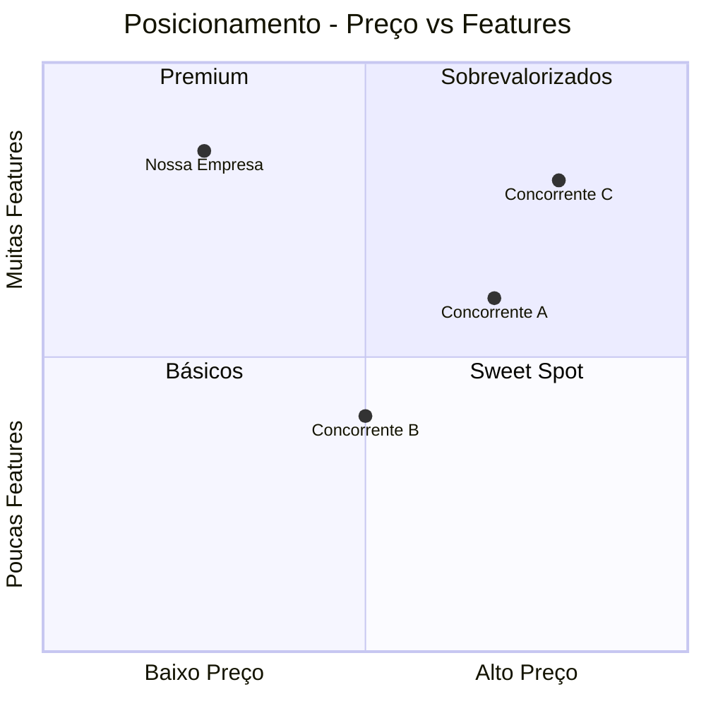

**Posições:**
- `[0, 0]` → Canto inferior esquerdo
- `[1, 1]` → Canto superior direito
- `[0.5, 0.5]` → Centro

---

### 5. TIMELINE (Marcos Temporais)

**Uso:** Histórico, marcos importantes, evolução

**Sintaxe:**
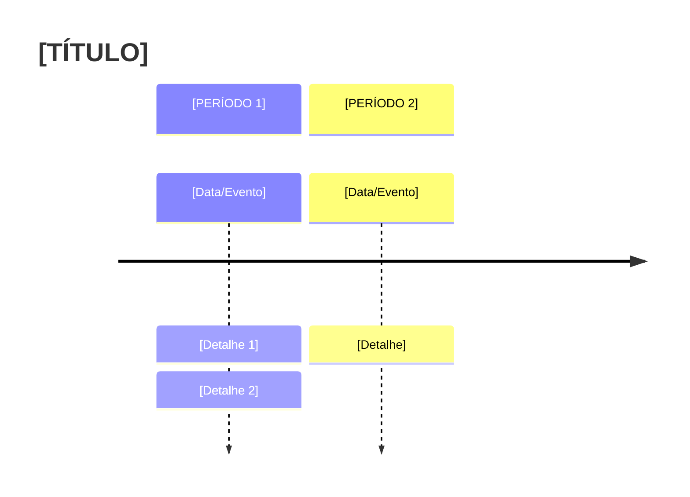

**Exemplo:**
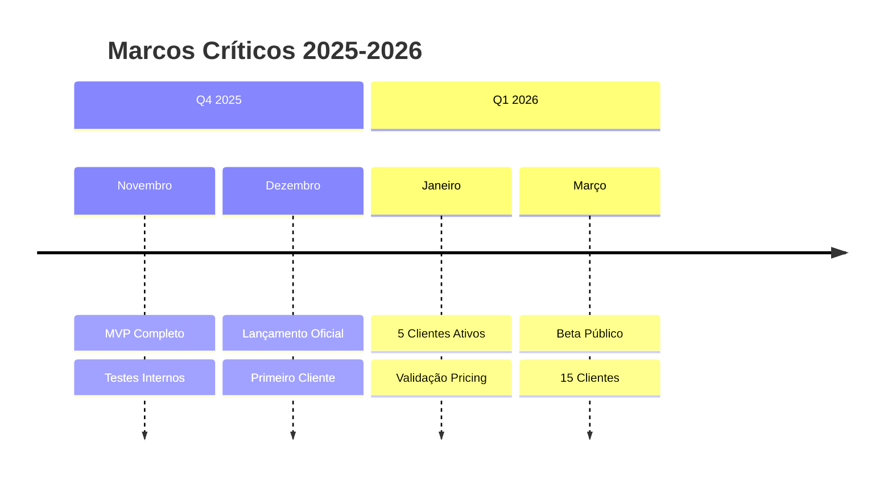

---

### 6. MINDMAP (Mapas Mentais)

**Uso:** Visão geral, brainstorming, estrutura de ideias

**Sintaxe:**
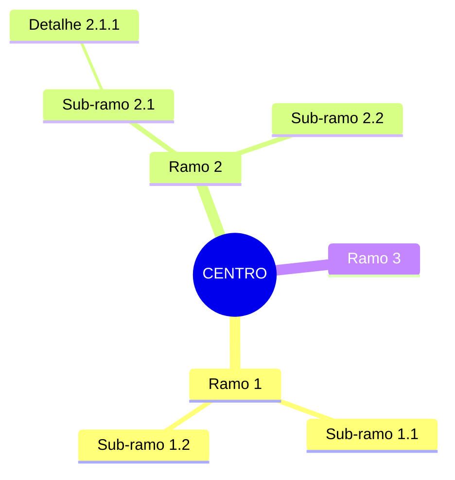

**Exemplo - Visão do Produto:**
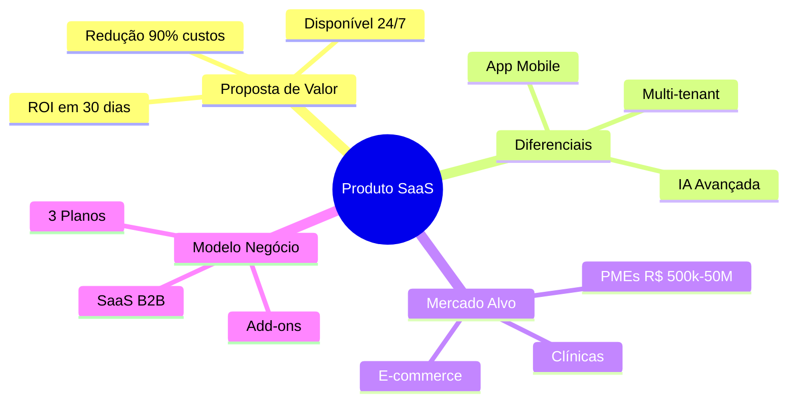

---

### 7. PIE CHART (Gráfico de Pizza)

**Uso:** Distribuição percentual, composição

**Sintaxe:**


**Exemplo:**
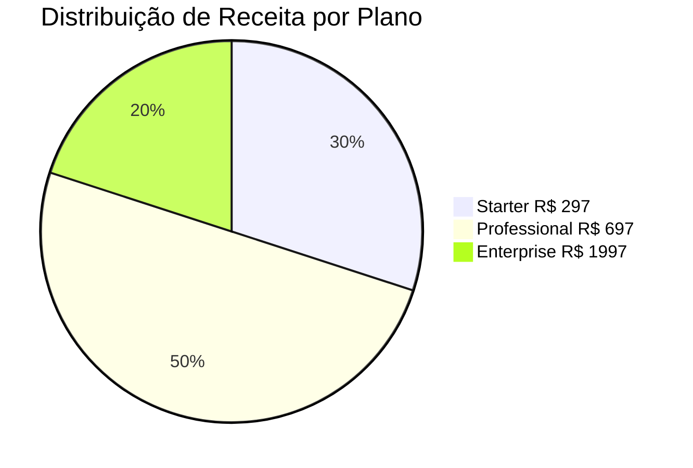

---

### 8. JOURNEY (Jornada do Cliente)

**Uso:** Customer journey, experiência do usuário

**Sintaxe:**
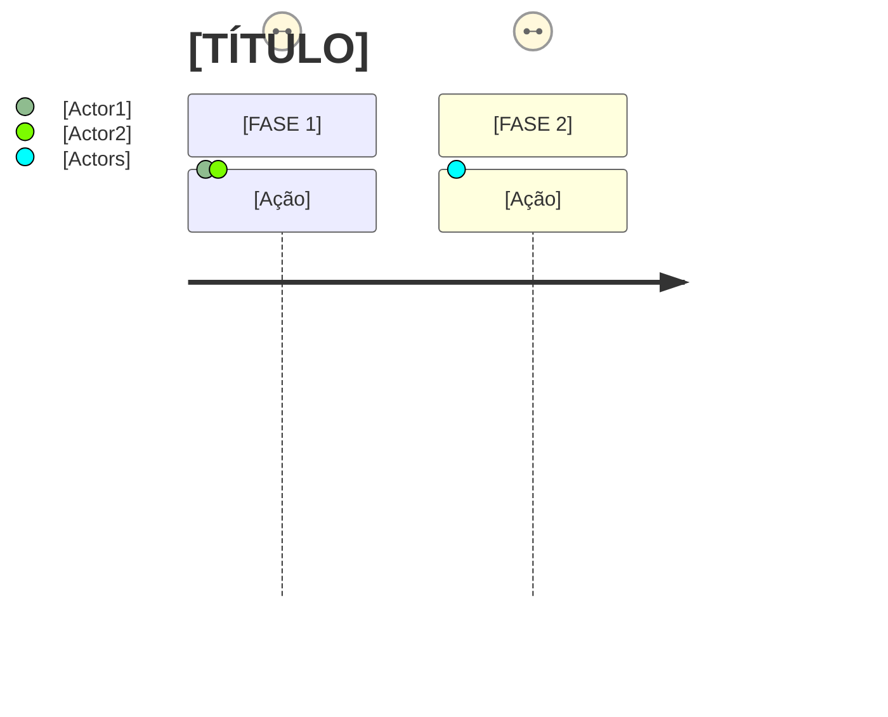

**Exemplo:**
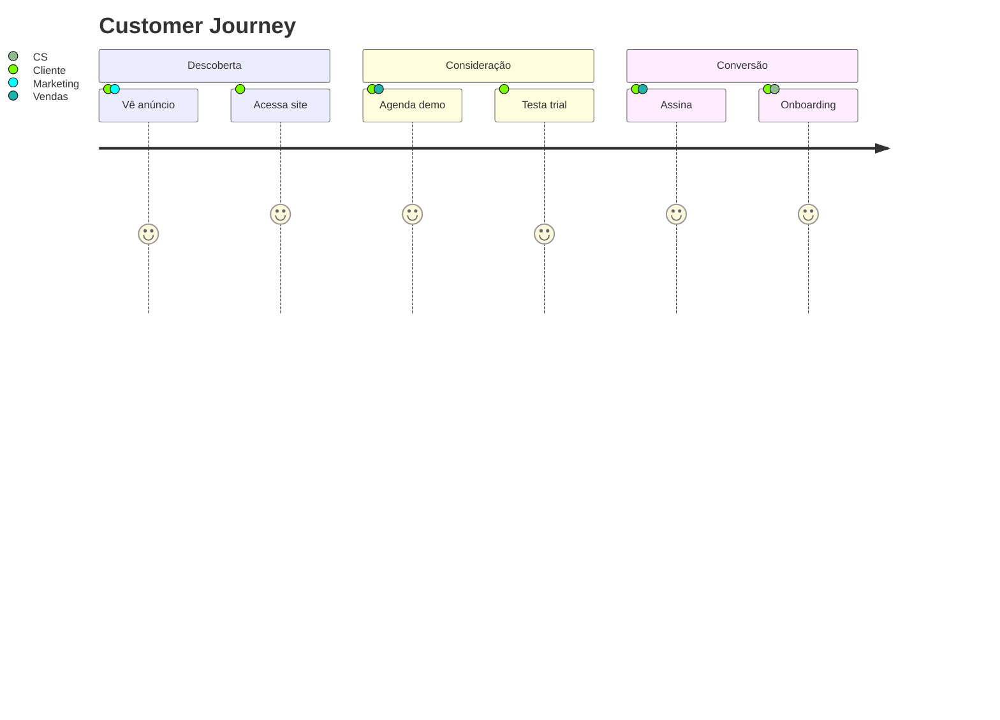

---

## 📊 TABELAS PADRÃO

### Formato de Tabelas Markdown

**Tabela Simples:**
```markdown
| Coluna 1 | Coluna 2 | Coluna 3 |
|----------|----------|----------|
| Dado 1   | Dado 2   | Dado 3   |
| Dado 4   | Dado 5   | Dado 6   |
```

**Tabela com Alinhamento:**
```markdown
| Esquerda | Centro | Direita |
|:---------|:------:|--------:|
| texto    | texto  | R$ 100  |
```

**Tabela com Emojis e Formatação:**
```markdown
| Métrica | Valor | Status |
|---------|-------|--------|
| **MRR** | R$ 10.000 | ✅ Meta atingida |
| **Churn** | 3% | 🟢 Abaixo do target |
| **CAC** | R$ 500 | ⚠️ Acima do ideal |
```

---

## ✅ CHECKLIST DE QUALIDADE

### Antes de Finalizar, Verifique:

**Completude (todas devem ser ✅):**
- [ ] Executive Summary no INÍCIO (não no final)
- [ ] TAM/SAM/SOM com CÁLCULOS detalhados
- [ ] Unit Economics COMPLETO (LTV, CAC, Payback)
- [ ] Cash Flow 36 meses (mensal Y1, trimestral Y2-3)
- [ ] Scenario Analysis (Best/Base/Worst)
- [ ] Customer Success Framework
- [ ] Mínimo 10 concorrentes analisados
- [ ] Riscos com mitigações específicas

**Qualidade Visual:**
- [ ] Todos os diagramas Mermaid funcionando
- [ ] Cores consistentes (verde=bom, vermelho=crítico, amarelo=atenção)
- [ ] Tabelas formatadas corretamente
- [ ] Emojis usados consistentemente
- [ ] Índice atualizado com âncoras funcionando

**Números e Métricas:**
- [ ] Todos os [X] substituídos por valores reais
- [ ] Cálculos de TAM/SAM/SOM validados
- [ ] Unit economics matematicamente corretos
- [ ] Projeções coerentes entre seções
- [ ] Fontes citadas para dados de mercado

**Investment Readiness:**
- [ ] Value proposition clara em 2 frases
- [ ] Problema e solução bem definidos
- [ ] Vantagens competitivas defensáveis
- [ ] Time apresentado com credenciais
- [ ] Ask/Use of funds especificado (se aplicável)

---

# PARTE B: ESTRUTURA DO PLANO DE NEGÓCIO

---

## 1. FRONTMATTER

```yaml
---
created: [YYYY-MM-DDTHH:MM]
updated: [YYYY-MM-DDTHH:MM]
type: plano-negocio
projeto: [CÓDIGO-PROJETO]
status: [ativo|draft|review|final]
versao: [1|2|3]
revisao: [R00|R01|R02|R03]
baseado_em:
  - [documento1.md]
  - [documento2.md]
  - [fonte-externa]
confidencialidade: [público|interno|confidencial]
autor: "[[Nome do Autor]]"
revisores:
  - "[[Revisor 1]]"
  - "[[Revisor 2]]"
---
```

---

## 2. EXECUTIVE SUMMARY

> [!TIP] **⭐ SEÇÃO CRÍTICA — LEIA PRIMEIRO**
> 
> Este resumo executivo contém tudo que um investidor precisa saber em 5 minutos.

### 2.1 The Opportunity (30 Segundos)

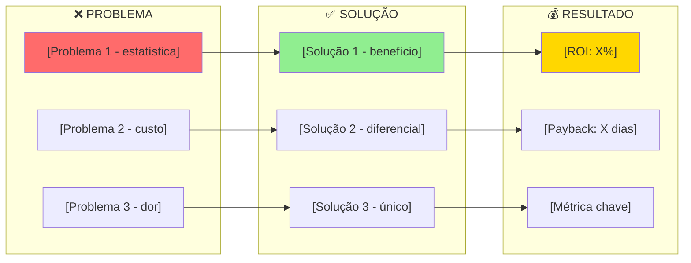

### Two-Sentence Pitch (Método Wharton)

> **"[Ajudamos QUEM a RESULTADO via COMO, custando X% menos que ALTERNATIVA]."**
> 
> **"[Somos os únicos com DIFERENCIAL 1, DIFERENCIAL 2, e GARANTIA]."**

### 2.2 Oportunidade de Mercado

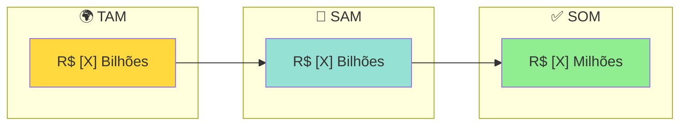

| Métrica | Valor | Fonte/Cálculo |
|---------|-------|---------------|
| **TAM** | R$ [X]B | [Descrição do mercado total] |
| **SAM** | R$ [X]B | [Segmento endereçável] |
| **SOM (3 anos)** | R$ [X]M | [Meta de captura] |
| **Meta Ano 1** | R$ [X] | [X] clientes ativos |
| **Meta Ano 3** | R$ [X]M ARR | [X] clientes ativos |

### 2.3 Financial Highlights

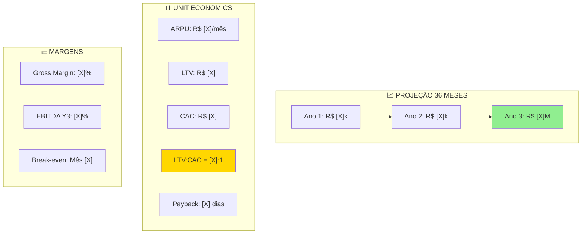

| Cenário | Ano 1 | Ano 2 | Ano 3 | Total 3 Anos |
|---------|-------|-------|-------|--------------|
| **Pessimista** | R$ [X] | R$ [X] | R$ [X] | R$ [X] |
| **Realista** | R$ [X] | R$ [X] | R$ [X] | **R$ [X]** |
| **Otimista** | R$ [X] | R$ [X] | R$ [X] | R$ [X] |

### 2.4 Team (Why We Win)

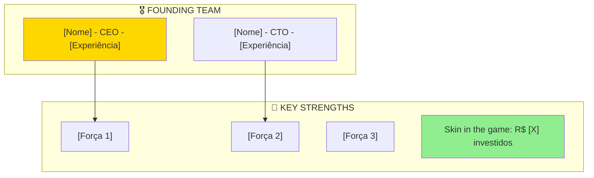

### 2.5 Competitive Advantage (Moat)

| Diferencial | Nós | Concorrentes | Defensibilidade |
|-------------|-----|--------------|-----------------|
| **[Diferencial 1]** | [Nosso valor] | [Valor deles] | [Alta/Média/Baixa] |
| **[Diferencial 2]** | [Nosso valor] | [Valor deles] | [Alta/Média/Baixa] |
| **[Diferencial 3]** | [Nosso valor] | [Valor deles] | [Alta/Média/Baixa] |

### 2.6 Ask / Use of Funds

> [!NOTE] **[STATUS ATUAL DE FUNDING]**
> 
> [Descreva situação atual: bootstrapped, buscando investimento, etc.]

| Fase | Funding | Use | Timeline |
|------|---------|-----|----------|
| **Atual** | R$ [X] | [Uso] | [Data] |
| **Próxima** | R$ [X] | [Uso] | [Data] |
| **Escala** | A avaliar | [Uso] | [Data] |

---

## 3. VISÃO EXECUTIVA

### 3.1 Status Executivo Atual

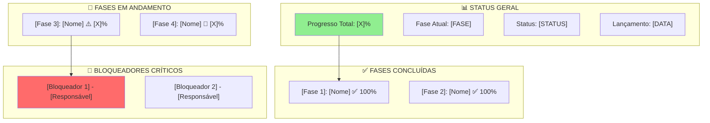

### 3.2 Métricas Atuais

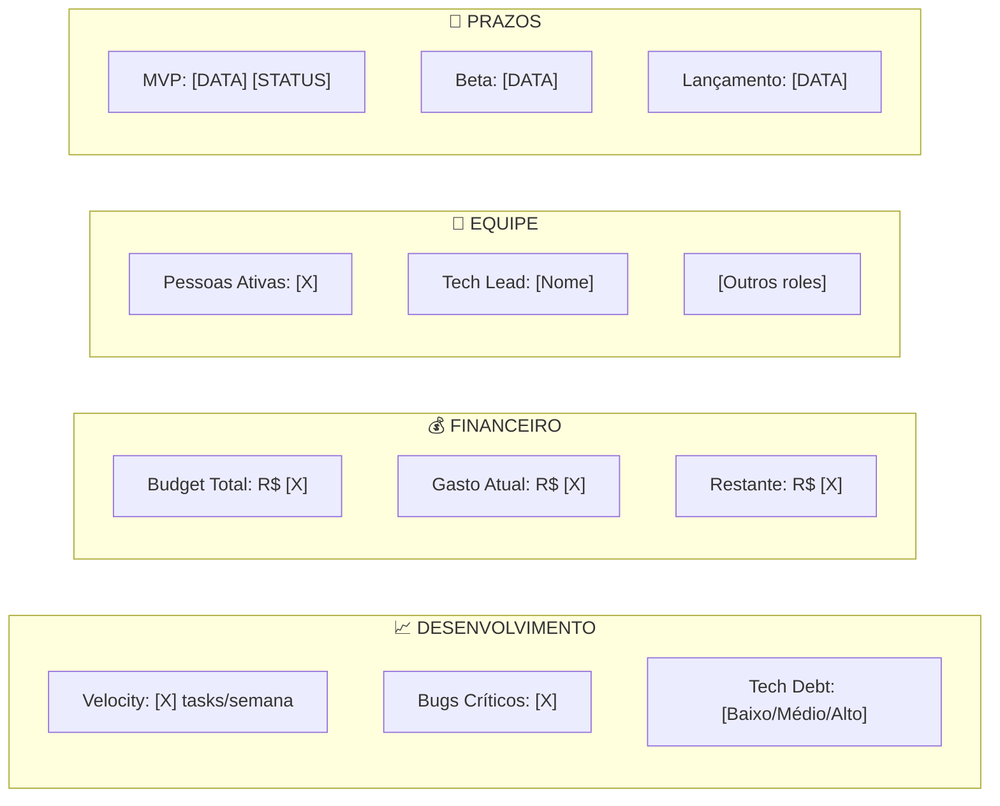

### 3.3 Posicionamento Estratégico

```mermaid
mindmap
  root(([NOME DO PRODUTO]))
    Proposta de Valor
      [Benefício 1]
      [Benefício 2]
      [Benefício 3]
    Diferenciais
      [Diferencial 1]
      [Diferencial 2]
      [Diferencial 3]
    Mercado Alvo
      [Segmento 1]
      [Segmento 2]
      [Segmento 3]
    Modelo de Negócio
      [Tipo: SaaS B2B/B2C]
      [Planos: X-Y-Z]
      [Add-ons]
```

### 3.4 Público-Alvo Detalhado

```mermaid
graph TB
    subgraph "🎯 ICP - IDEAL CUSTOMER PROFILE"
        ICP1["Faturamento: R$ [X] - R$ [X]/ano"]
        ICP2["Funcionários: [X]-[X]"]
        ICP3["Volume: [métrica específica]"]
        ICP4["Budget: R$ [X] - R$ [X]/mês"]
        ICP5["Decision Time: [X] semanas"]
    end
    
    subgraph "✅ CARACTERÍSTICAS IDEAIS"
        C1["[Característica 1]"]
        C2["[Característica 2]"]
        C3["[Característica 3]"]
    end
    
    subgraph "❌ NÃO IDEAL"
        N1["[Perfil 1] → [Alternativa]"]
        N2["[Perfil 2] → [Alternativa]"]
    end
    
    subgraph "📊 SEGMENTOS PRIORITÁRIOS"
        S1["1º [Segmento]"]
        S2["2º [Segmento]"]
        S3["3º [Segmento]"]
    end
    
    ICP1 --> C1 --> S1
    
    style ICP1 fill:#90EE90
    style S1 fill:#FFD700
    style N1 fill:#FF6B6B
```

---

## 4. TAM/SAM/SOM DETALHADO

> [!INFO] **Metodologia de Cálculo**
> 
> TAM/SAM/SOM calculados usando metodologia top-down (relatórios de mercado) validada por bottom-up (contagem de empresas × ARPU).

### 4.1 Cálculo TAM (Total Addressable Market)

```mermaid
graph TB
    subgraph "🌍 TAM - R$ [X] Bilhões"
        T1["Mercado Global [Setor] 2025: US$ [X]B"]
        T2["Brasil = [X]% mercado LATAM"]
        T3["LATAM = [X]% mercado global"]
        T4["TAM Brasil = US$ [X]B = R$ [X]B"]
    end
    
    subgraph "📊 FONTES"
        F1["[Fonte 1] - [Ano]"]
        F2["[Fonte 2] - [Ano]"]
        F3["[Fonte 3] - [Ano]"]
    end
    
    T1 --> T2 --> T3 --> T4
    F1 --> T1
    
    style T4 fill:#FFD700
```

**Cálculo Top-Down:**
- Mercado Global [Setor] 2025: US$ [X]B ([Fonte])
- LATAM share: [X]% = US$ [X]B
- Brasil share em LATAM: [X]% = US$ [X]B
- Ajuste: × [X] = **US$ [X]B = R$ [X]B**

### 4.2 Cálculo SAM (Serviceable Available Market)

```mermaid
graph TB
    subgraph "🎯 SAM - R$ [X] Bilhões"
        S1["TAM: R$ [X]B"]
        S2["Filtro 1: [Critério] = [X]%"]
        S3["Filtro 2: [Critério] = [X]%"]
        S4["Filtro 3: [Critério] = [X]%"]
        S5["SAM = R$ [X]B"]
    end
    
    subgraph "📋 VALIDAÇÃO BOTTOM-UP"
        V1["[X]M empresas Brasil"]
        V2["[X]% [critério]"]
        V3["[X]% têm budget"]
        V4["= [X]k empresas potenciais"]
        V5["× ARPU R$ [X] × 12 = R$ [X]B"]
    end
    
    S1 --> S2 --> S3 --> S4 --> S5
    V1 --> V2 --> V3 --> V4 --> V5
    
    style S5 fill:#95E1D3
    style V5 fill:#90EE90
```

### 4.3 Cálculo SOM (Serviceable Obtainable Market)

```mermaid
graph LR
    subgraph "✅ SOM 3 ANOS - R$ [X] Milhões"
        SO1["SAM: R$ [X]B"]
        SO2["Meta penetração 3 anos: [X]%"]
        SO3["SOM = R$ [X]M"]
    end
    
    subgraph "📅 TIMELINE"
        TL1["Ano 1: [X]% = R$ [X]"]
        TL2["Ano 2: [X]% = R$ [X]"]
        TL3["Ano 3: [X]% = R$ [X]"]
    end
    
    subgraph "🎯 META CLIENTES"
        MC1["Ano 1: [X] clientes"]
        MC2["Ano 2: [X] clientes"]
        MC3["Ano 3: [X] clientes"]
    end
    
    SO1 --> SO2 --> SO3
    
    style SO3 fill:#90EE90
```

### 4.4 Resumo TAM/SAM/SOM

| Métrica | Valor | % do Anterior | Clientes Equiv. |
|---------|-------|---------------|-----------------|
| **TAM** | R$ [X]B | 100% | [X]M empresas |
| **SAM** | R$ [X]B | [X]% TAM | [X]k empresas |
| **SOM (3 anos)** | R$ [X]M | [X]% SAM | [X] clientes |
| **Meta Realista** | R$ [X]M | [X]% SOM | [X] clientes |

---

## 5. ROADMAP E TIMELINE

### 5.1 Roadmap Multi-Dimensional

```mermaid
gantt
    title Roadmap - 3 Caminhos Paralelos
    dateFormat YYYY-MM-DD
    axisFormat %d/%m
    excludes weekends

    section TÉCNICO
    [Fase/Tarefa 1]          :done, t1, [DATA], [DURAÇÃO]
    [Fase/Tarefa 2]          :active, t2, [DATA], [DURAÇÃO]
    [Fase/Tarefa 3]          :t3, [DATA], [DURAÇÃO]
    [Marco Técnico]          :milestone, t4, [DATA], 0d

    section COMERCIAL
    [Tarefa Comercial 1]     :done, c1, [DATA], [DURAÇÃO]
    [Tarefa Comercial 2]     :active, c2, [DATA], [DURAÇÃO]
    [Primeiro Cliente]       :crit, c3, [DATA], [DURAÇÃO]
    [Lançamento]             :milestone, c4, [DATA], 0d

    section JURÍDICO
    [Tarefa Jurídica 1]      :j1, [DATA], [DURAÇÃO]
    [Tarefa Jurídica 2]      :j2, [DATA], [DURAÇÃO]
```

### 5.2 Timeline de Marcos

```mermaid
timeline
    title Marcos Críticos
    
    section [MÊS 1]
    [Data] : [Marco 1]
           : [Marco 2]
    
    section [MÊS 2]
    [Data] : [Marco 3]
           : [Marco 4]
    
    section [MÊS 3]
    [Data] : LANÇAMENTO
           : [Marco]
```

### 5.3 Distribuição de Tarefas

```mermaid
graph TB
    subgraph "👥 EQUIPE"
        P1["[Nome 1] - [Cargo]"]
        P2["[Nome 2] - [Cargo]"]
        P3["[Nome 3] - [Cargo]"]
    end
    
    subgraph "🔧 FRENTE [ÁREA 1]"
        T1["[Tarefa 1] - [Responsável]"]
        T2["[Tarefa 2] - [Responsável]"]
    end
    
    subgraph "💼 FRENTE [ÁREA 2]"
        B1["[Tarefa 1] - [Responsável]"]
        B2["[Tarefa 2] - [Responsável]"]
    end
    
    P1 --> T1
    P2 --> B1
    
    style P1 fill:#FFD700
```

---

## 6. MODELO DE NEGÓCIO

### 6.1 Estrutura de Planos

```mermaid
graph TB
    subgraph "💰 MODELO DE RECEITA"
        Plans["[X] Planos Base"]
        Addons["Add-ons"]
        Custom["Customizações"]
    end

    subgraph "🌱 [PLANO 1] - R$ [X]/mês"
        S1["[Limite 1]"]
        S2["[Limite 2]"]
        S3["[Feature 1]"]
        S4["[Feature 2]"]
    end

    subgraph "🚀 [PLANO 2] - R$ [X]/mês - MAIS POPULAR"
        P1["[Limite 1]"]
        P2["[Limite 2]"]
        P3["[Feature extra 1]"]
        P4["[Feature extra 2]"]
    end

    subgraph "🏢 [PLANO 3] - R$ [X]/mês"
        E1["[Limites expandidos]"]
        E2["[Features premium]"]
        E3["[SLA]"]
    end

    subgraph "➕ RECEITA ADICIONAL"
        A1["[Add-on 1]: R$ [X]"]
        A2["[Add-on 2]: R$ [X]"]
    end

    Plans --> S1
    Plans --> P1
    Plans --> E1
    Addons --> A1

    style P1 fill:#FFD700
```

### 6.2 Tabela de Planos

| Feature | [Plano 1] R$ [X] | [Plano 2] R$ [X] | [Plano 3] R$ [X] |
|---------|------------------|------------------|------------------|
| **[Limite 1]** | [X] | [X] | Ilimitado |
| **[Limite 2]** | [X] | [X] | [X] |
| **[Feature 1]** | ✅ | ✅ | ✅ |
| **[Feature 2]** | ❌ | ✅ | ✅ |
| **[Feature 3]** | ❌ | ❌ | ✅ |
| **Suporte** | Email | Chat | 24/7 |

### 6.3 Comparativo de Valor/ROI

```mermaid
graph LR
    subgraph "📊 ROI POR PLANO"
        ROI1["[PLANO 1] R$ [X] - ROI [X]%"]
        ROI2["[PLANO 2] R$ [X] - ROI [X]%"]
        ROI3["[PLANO 3] R$ [X] - ROI [X]%"]
    end
    
    subgraph "⏱️ PAYBACK"
        PB1["[PLANO 1]: [X] dias"]
        PB2["[PLANO 2]: [X] dias"]
        PB3["[PLANO 3]: [X] dias"]
    end
    
    ROI1 --> PB1
    ROI2 --> PB2
    ROI3 --> PB3
    
    style ROI2 fill:#90EE90
```

---

## 7. UNIT ECONOMICS

> [!SUCCESS] **MÉTRICAS CRÍTICAS PARA INVESTIDORES**
> 
> Unit economics demonstra a viabilidade do modelo de negócio em escala.

### 7.1 Dashboard Unit Economics

```mermaid
graph TB
    subgraph "💰 RECEITA"
        R1["ARPU Mensal: R$ [X]"]
        R2["ARPU Anual: R$ [X]"]
        R3["Churn Target: [X]%/mês"]
        R4["Lifetime: [X] meses"]
    end
    
    subgraph "📊 LTV CALCULATION"
        L1["LTV = ARPU × Gross Margin ÷ Churn"]
        L2["LTV = R$ [X] × [X]% ÷ [X]%"]
        L3["LTV = R$ [X]"]
    end
    
    subgraph "💵 CAC CALCULATION"
        C1["Marketing Cost: R$ [X]/lead"]
        C2["Sales Cost: R$ [X]/lead"]
        C3["Conversion Rate: [X]%"]
        C4["CAC = R$ [X]"]
    end
    
    subgraph "🎯 RATIOS"
        RA1["LTV:CAC = [X]:1 vs 3:1 mínimo"]
        RA2["Payback = [X] dias vs 12 meses benchmark"]
        RA3["Gross Margin = [X]% vs 70% SaaS médio"]
    end
    
    R1 --> L1
    R3 --> L1
    L3 --> RA1
    C4 --> RA1
    
    style L3 fill:#FFD700
    style RA1 fill:#90EE90
```

### 7.2 Tabela Unit Economics por Plano

| Métrica | [Plano 1] | [Plano 2] | [Plano 3] | Blended |
|---------|-----------|-----------|-----------|---------|
| **Preço Mensal** | R$ [X] | R$ [X] | R$ [X] | R$ [X] |
| **Custo Variável** | R$ [X] | R$ [X] | R$ [X] | R$ [X] |
| **Gross Margin** | [X]% | [X]% | [X]% | **[X]%** |
| **Churn Estimado** | [X]% | [X]% | [X]% | **[X]%** |
| **Lifetime (meses)** | [X] | [X] | [X] | **[X]** |
| **LTV** | R$ [X] | R$ [X] | R$ [X] | **R$ [X]** |
| **CAC** | R$ [X] | R$ [X] | R$ [X] | **R$ [X]** |
| **LTV:CAC** | [X]:1 | [X]:1 | [X]:1 | **[X]:1** |
| **Payback** | [X] dias | [X] dias | [X] dias | **[X] dias** |

### 7.3 Comparativo com Benchmarks

| Métrica | Nosso Valor | Benchmark SaaS | Status |
|---------|-------------|----------------|--------|
| **LTV:CAC** | [X]:1 | ≥ 3:1 | ✅/⚠️/❌ |
| **Gross Margin** | [X]% | ≥ 70% | ✅/⚠️/❌ |
| **CAC Payback** | [X] dias | ≤ 12 meses | ✅/⚠️/❌ |
| **Churn** | [X]% | ≤ 7% | ✅/⚠️/❌ |

---

## 8. PROJEÇÕES FINANCEIRAS

### 8.1 Cenários de Receita Ano 1

```mermaid
graph LR
    subgraph "📊 CENÁRIO PESSIMISTA"
        P1["Mês 1-3: [X] clientes = R$ [X]"]
        P2["Mês 4-6: [X] clientes = R$ [X]"]
        P3["Mês 7-12: [X] clientes = R$ [X]"]
        P4["Total Ano: R$ [X]"]
    end
    
    subgraph "📊 CENÁRIO REALISTA"
        R1["Mês 1-3: [X] clientes = R$ [X]"]
        R2["Mês 4-6: [X] clientes = R$ [X]"]
        R3["Mês 7-12: [X] clientes = R$ [X]"]
        R4["Total Ano: R$ [X]"]
    end
    
    subgraph "📊 CENÁRIO OTIMISTA"
        O1["Mês 1-3: [X] clientes = R$ [X]"]
        O2["Mês 4-6: [X] clientes = R$ [X]"]
        O3["Mês 7-12: [X] clientes = R$ [X]"]
        O4["Total Ano: R$ [X]"]
    end
    
    style P4 fill:#FFD93D
    style R4 fill:#90EE90
    style O4 fill:#4ECDC4
```

### 8.2 Tabela de Projeção Mensal

| Mês | [Plano 1] | [Plano 2] | [Plano 3] | Total Mensal | Acumulado |
|-----|-----------|-----------|-----------|--------------|-----------|
| Mês 1 | [X] (R$ [X]) | [X] (R$ [X]) | [X] | R$ [X] | R$ [X] |
| Mês 2 | [X] (R$ [X]) | [X] (R$ [X]) | [X] | R$ [X] | R$ [X] |
| Mês 3 | [X] (R$ [X]) | [X] (R$ [X]) | [X] | R$ [X] | R$ [X] |
| ... | ... | ... | ... | ... | ... |
| Mês 12 | [X] (R$ [X]) | [X] (R$ [X]) | [X] | R$ [X] | R$ [X] |
| **Total Y1** | **[X]** | **[X]** | **[X]** | **R$ [X]** | - |

---

## 9. SCENARIO ANALYSIS

> [!WARNING] **ANÁLISE DE CENÁRIOS OBRIGATÓRIA**
> 
> Investidores exigem projeções em múltiplos cenários.

### 9.1 Premissas por Cenário

```mermaid
graph TB
    subgraph "📊 CENÁRIO PESSIMISTA"
        P1["Crescimento MRR: [X]%/mês"]
        P2["Churn: [X]%/mês"]
        P3["CAC: R$ [X]"]
        P4["Conversão: [X]%"]
        P5["Clientes Y1: [X]"]
    end
    
    subgraph "📊 CENÁRIO BASE"
        B1["Crescimento MRR: [X]%/mês"]
        B2["Churn: [X]%/mês"]
        B3["CAC: R$ [X]"]
        B4["Conversão: [X]%"]
        B5["Clientes Y1: [X]"]
    end
    
    subgraph "📊 CENÁRIO OTIMISTA"
        O1["Crescimento MRR: [X]%/mês"]
        O2["Churn: [X]%/mês"]
        O3["CAC: R$ [X]"]
        O4["Conversão: [X]%"]
        O5["Clientes Y1: [X]"]
    end
    
    style P5 fill:#FFD93D
    style B5 fill:#90EE90
    style O5 fill:#4ECDC4
```

### 9.2 Projeção 36 Meses por Cenário

| Período | Pessimista | Base | Otimista |
|---------|------------|------|----------|
| **Mês 6** | R$ [X] | R$ [X] | R$ [X] |
| **Mês 12** | R$ [X] | R$ [X] | R$ [X] |
| **Mês 18** | R$ [X] | R$ [X] | R$ [X] |
| **Mês 24** | R$ [X] | R$ [X] | R$ [X] |
| **Mês 30** | R$ [X] | R$ [X] | R$ [X] |
| **Mês 36** | R$ [X] | R$ [X] | R$ [X] |
| **ARR Y3** | R$ [X] | R$ [X] | R$ [X] |
| **Clientes Y3** | [X] | [X] | [X] |

### 9.3 Break-Even Analysis

| Cenário | Break-Even | MRR Necessário | Clientes Necessários |
|---------|------------|----------------|----------------------|
| **Pessimista** | Mês [X] | R$ [X] | [X] |
| **Base** | Mês [X] | R$ [X] | [X] |
| **Otimista** | Mês [X] | R$ [X] | [X] |

---

## 10. CASH FLOW STATEMENT

### 10.1 Cash Flow Ano 1 (Mensal)

| Mês | Receita | Custos Var. | Custos Fix. | CF Operac. | Saldo Acum. |
|-----|---------|-------------|-------------|------------|-------------|
| Mês 1 | R$ [X] | R$ [X] | R$ [X] | R$ [X] | R$ [X] |
| Mês 2 | R$ [X] | R$ [X] | R$ [X] | R$ [X] | R$ [X] |
| ... | ... | ... | ... | ... | ... |
| Mês 12 | R$ [X] | R$ [X] | R$ [X] | R$ [X] | R$ [X] |
| **Total Y1** | **R$ [X]** | **R$ [X]** | **R$ [X]** | **R$ [X]** | - |

### 10.2 Cash Flow Anos 2-3 (Trimestral)

| Período | Receita | Custos | CF Operacional | Saldo Acumulado |
|---------|---------|--------|----------------|-----------------|
| Q1 Y2 | R$ [X] | R$ [X] | R$ [X] | R$ [X] |
| Q2 Y2 | R$ [X] | R$ [X] | R$ [X] | R$ [X] |
| Q3 Y2 | R$ [X] | R$ [X] | R$ [X] | R$ [X] |
| Q4 Y2 | R$ [X] | R$ [X] | R$ [X] | R$ [X] |
| **Total Y2** | **R$ [X]** | **R$ [X]** | **R$ [X]** | - |
| Q1-Q4 Y3 | ... | ... | ... | ... |
| **Total Y3** | **R$ [X]** | **R$ [X]** | **R$ [X]** | - |

### 10.3 Visualização Cash Flow

```mermaid
graph LR
    subgraph "📉 BURN PHASE"
        BP1["Mês 1-[X]: Burn mensal"]
        BP2["Investimento inicial: R$ [X]"]
        BP3["Runway: [X] meses"]
    end
    
    subgraph "⚖️ BREAK-EVEN"
        BE1["Mês [X]: Break-even"]
        BE2["MRR necessário: R$ [X]"]
        BE3["Clientes: [X]"]
    end
    
    subgraph "📈 GROWTH PHASE"
        GP1["Mês [X]+: Cash positive"]
        GP2["Y1 End: R$ [X] caixa"]
        GP3["Y3 End: R$ [X] caixa"]
    end
    
    BP1 --> BE1 --> GP1
    
    style BP1 fill:#FF6B6B
    style BE1 fill:#FFD93D
    style GP1 fill:#90EE90
```

---

## 11. ESTRATÉGIA COMERCIAL

### 11.1 Funil de Vendas

```mermaid
flowchart TD
    Start["[X] Leads/mês"] --> Qualify{"Qualificado?"}
    
    Qualify -->|[X]%| Discovery["Descoberta"]
    Qualify -->|[X]%| Nurture["Nurture"]
    
    Discovery --> Demo["Demo"]
    Demo --> Proposal["Proposta"]
    Proposal --> Close{"Fechou?"}
    
    Close -->|[X]%| Won["Cliente Ganho"]
    Close -->|[X]%| Lost["Perdido"]
    
    Won --> Onboard["Onboarding"]
    
    style Start fill:#FFD93D
    style Won fill:#90EE90
```

### 11.2 Processo de Vendas

```mermaid
flowchart TB
    subgraph "ETAPA 1: QUALIFICAÇÃO"
        Q1["Lead Entra"]
        Q2["BANT Check"]
        Q3{"Score >= 3/4?"}
    end
    
    subgraph "ETAPA 2: DESCOBERTA"
        D1["Call SPIN"]
        D2["Identificar Dores"]
    end
    
    subgraph "ETAPA 3: DEMO"
        DE1["Demo Personalizada"]
        DE2["ROI Calculado"]
    end
    
    subgraph "ETAPA 4: PROPOSTA"
        P1["Enviar em [X]h"]
        P2["Follow-up"]
    end
    
    subgraph "ETAPA 5: FECHAMENTO"
        F1["Tratar Objeções"]
        F2["Close"]
    end
    
    Q1 --> Q2 --> Q3
    Q3 -->|Sim| D1
    D1 --> D2 --> DE1 --> DE2 --> P1 --> P2 --> F1 --> F2
    
    style F2 fill:#90EE90
```

### 11.3 Framework BANT

```mermaid
graph TB
    subgraph "B - BUDGET"
        B1["R$ [X]+/mês = ✅ FIT"]
        B2["R$ [X]-[X]/mês = ⚠️"]
        B3["< R$ [X]/mês = ❌"]
    end
    
    subgraph "A - AUTHORITY"
        A1["Decisor = ✅"]
        A2["Comitê pequeno = ⚠️"]
        A3["Muitas pessoas = ❌"]
    end
    
    subgraph "N - NEED"
        N1["Urgente = ✅"]
        N2["Seria bom = ⚠️"]
        N3["Curiosidade = ❌"]
    end
    
    subgraph "T - TIMELINE"
        T1["[X] semanas = ✅"]
        T2["[X] meses = ⚠️"]
        T3["Indefinido = ❌"]
    end
    
    style B1 fill:#90EE90
    style B3 fill:#FF6B6B
```

---

## 12. MARKETING E AQUISIÇÃO

### 12.1 Funil de Marketing

```mermaid
flowchart TB
    subgraph "🎯 AWARENESS"
        A1["SEO/Blog"]
        A2["Ads"]
        A3["Social Media"]
    end

    subgraph "🔍 CONSIDERATION"
        C1["Landing Page"]
        C2["Webinar"]
        C3["Case Studies"]
    end

    subgraph "💼 DECISION"
        D1["Demo"]
        D2["Trial"]
        D3["Proposta"]
    end

    subgraph "✅ CONVERSÃO"
        CV1["Assinatura"]
        CV2["Onboarding"]
    end

    A1 --> C1 --> D1 --> CV1
    A2 --> C1
    A3 --> C2 --> D2 --> CV1
    
    style CV1 fill:#90EE90
```

### 12.2 Priorização de Canais

```mermaid
quadrantChart
    title Canais - Esforço vs Resultado
    x-axis Baixo Esforço --> Alto Esforço
    y-axis Baixo Resultado --> Alto Resultado
    quadrant-1 Focar Agora
    quadrant-2 Investir Depois
    quadrant-3 Evitar
    quadrant-4 Manter
    Referrals: [0.2, 0.85]
    LinkedIn Orgânico: [0.3, 0.75]
    Email Marketing: [0.4, 0.8]
    SEO: [0.6, 0.85]
    Google Ads: [0.8, 0.6]
```

---

## 13. ANÁLISE COMPETITIVA

### 13.1 Comparação Side-by-Side

```mermaid
graph TB
    subgraph "💰 PREÇO"
        P1["Nós: R$ [X]-[X]/mês"]
        P2["[Concorrente A]: R$ [X]/mês"]
        P3["[Concorrente B]: R$ [X]/mês"]
    end
    
    subgraph "🔧 FEATURES"
        F1["Nós: [Feature diferencial]"]
        F2["[Concorrente A]: [Limitação]"]
        F3["[Concorrente B]: [Limitação]"]
    end
    
    subgraph "⏱️ IMPLEMENTAÇÃO"
        I1["Nós: [X] dias"]
        I2["[Concorrente A]: [X] dias"]
        I3["[Concorrente B]: [X] dias"]
    end
    
    style P1 fill:#90EE90
    style F1 fill:#90EE90
    style I1 fill:#90EE90
```

### 13.2 Tabela Competitiva

| Critério | Nós | [Conc. A] | [Conc. B] | [Conc. C] |
|----------|-----|-----------|-----------|-----------|
| **Preço** | R$ [X] | R$ [X] | R$ [X] | R$ [X] |
| **[Feature 1]** | ✅ | ❌ | ✅ | ❌ |
| **[Feature 2]** | ✅ | ✅ | ❌ | ❌ |
| **Implementação** | [X] dias | [X] dias | [X] dias | [X] dias |
| **Suporte** | [Nível] | [Nível] | [Nível] | [Nível] |

### 13.3 Posicionamento

```mermaid
quadrantChart
    title Posicionamento - Preço vs Features
    x-axis Baixo Preço --> Alto Preço
    y-axis Poucas Features --> Muitas Features
    quadrant-1 Sobrevalorizados
    quadrant-2 Premium
    quadrant-3 Básicos
    quadrant-4 Sweet Spot
    Nossa Empresa: [0.25, 0.85]
    Concorrente A: [0.7, 0.6]
    Concorrente B: [0.5, 0.4]
```

---

## 14. JURÍDICO E COMPLIANCE

### 14.1 Roadmap Jurídico

```mermaid
flowchart TD
    Start(["Necessidades Jurídicas"]) --> Priority{Prioridade}
    
    Priority -->|🔴 CRÍTICO| Crit1["[Doc 1]"]
    Priority -->|🔴 CRÍTICO| Crit2["[Doc 2]"]
    
    Crit1 --> Draft1["Draft - [Responsável] - [Data]"]
    Crit2 --> Draft2["Draft - [Responsável] - [Data]"]
    
    Draft1 --> Review1{"Aprovação?"}
    Draft2 --> Review2{"Aprovação?"}
    
    Review1 -->|Sim| Publish1["Publicar"]
    Review2 -->|Sim| Publish2["Publicar"]
    
    Priority -->|🟡 IMPORTANTE| Imp1["[Doc 3]"]
    Priority -->|🟢 FUTURO| Fut1["[Doc 4]"]
    
    style Crit1 fill:#FF6B6B
    style Publish1 fill:#90EE90
```

### 14.2 Checklist Compliance

| Requisito | Status | Responsável | Deadline |
|-----------|--------|-------------|----------|
| **[Requisito 1]** | ✅/⏳/❌ | [Nome] | [Data] |
| **[Requisito 2]** | ✅/⏳/❌ | [Nome] | [Data] |
| **[Requisito 3]** | ✅/⏳/❌ | [Nome] | [Data] |

---

## 15. RISCOS E MITIGAÇÃO

### 15.1 Matriz de Riscos

```mermaid
graph TB
    subgraph "🔴 RISCOS CRÍTICOS - Sev >= 20"
        R1["R-001: [Risco] - Prob: [X] × Impact: [X] = [Sev]"]
        R2["R-002: [Risco] - Prob: [X] × Impact: [X] = [Sev]"]
    end
    
    subgraph "🟡 RISCOS ALTOS - Sev 12-19"
        R3["R-003: [Risco] - Prob: [X] × Impact: [X] = [Sev]"]
        R4["R-004: [Risco] - Prob: [X] × Impact: [X] = [Sev]"]
    end
    
    subgraph "✅ MITIGAÇÕES"
        M1["[Mitigação para R-001]"]
        M2["[Mitigação para R-002]"]
        M3["[Mitigação para R-003]"]
    end
    
    R1 --> M1
    R2 --> M2
    R3 --> M3
    
    style R1 fill:#FF6B6B
    style M1 fill:#90EE90
```

### 15.2 Tabela de Riscos

| ID | Risco | Prob | Impact | Sev | Mitigação |
|----|-------|------|--------|-----|-----------|
| R-001 | [Descrição] | [1-5] | [1-5] | [X] | [Ação] |
| R-002 | [Descrição] | [1-5] | [1-5] | [X] | [Ação] |
| R-003 | [Descrição] | [1-5] | [1-5] | [X] | [Ação] |

---

## 16. CUSTOMER SUCCESS

### 16.1 Framework CS

```mermaid
graph TB
    subgraph "🎯 OBJETIVOS CS"
        O1["Reduzir Churn < [X]%"]
        O2["Aumentar NPS > [X]"]
        O3["Expandir Receita +[X]%"]
    end
    
    subgraph "📊 HEALTH SCORE"
        H1["Uso Diário: [X]%"]
        H2["Features Usadas: [X]%"]
        H3["Satisfação: [X]%"]
    end
    
    subgraph "🚨 ALERTAS"
        A1["Score < [X]: RISCO"]
        A2["Score [X]-[X]: ATENÇÃO"]
        A3["Score > [X]: HEALTHY"]
    end
    
    subgraph "✅ AÇÕES"
        AC1["RISCO: Call em 24h"]
        AC2["ATENÇÃO: Call em 48h"]
        AC3["HEALTHY: Check-in mensal"]
    end
    
    O1 --> H1 --> A1 --> AC1
    
    style A1 fill:#FF6B6B
    style A3 fill:#90EE90
```

### 16.2 Onboarding

```mermaid
gantt
    title Onboarding - [X] Dias
    dateFormat YYYY-MM-DD
    axisFormat %d
    
    section SETUP
    Welcome call: d1, 2025-01-01, 1d
    Configuração: d2, 2025-01-02, 2d
    
    section PERSONALIZAÇÃO
    Customização: d3, 2025-01-04, 3d
    Testes: d4, 2025-01-07, 2d
    
    section GO-LIVE
    Go-live: crit, d5, 2025-01-09, 2d
    Handoff CS: milestone, d6, 2025-01-11, 0d
```

---

## 17. KPIs E MÉTRICAS

### 17.1 Dashboard de KPIs

```mermaid
graph TB
    subgraph "💰 MÉTRICAS FINANCEIRAS"
        F1["MRR - Meta: R$ [X]/mês"]
        F2["ARR - Meta: R$ [X]"]
        F3["LTV/CAC - Meta: [X]:1"]
        F4["Churn - Meta: < [X]%"]
    end

    subgraph "📊 MÉTRICAS PRODUTO"
        P1["Uptime - Meta: [X]%"]
        P2["NPS - Meta: >= [X]"]
        P3["Feature Adoption: [X]%"]
    end

    subgraph "🎯 MÉTRICAS VENDAS"
        S1["Leads/Mês - Meta: [X]"]
        S2["Conversão - Meta: [X]%"]
        S3["Ciclo Vendas - Meta: [X] dias"]
    end

    F3 -.->|Impacta| S2
    P2 -.->|Impacta| F4
```

---

## 18. RESUMO EXECUTIVO FINAL

### 18.1 Visão Consolidada

| Categoria | Status/Valor |
|-----------|--------------|
| **Produto** | [X]% completo |
| **Unit Economics** | LTV:CAC [X]:1 |
| **TAM/SAM/SOM** | R$ [X]B / R$ [X]B / R$ [X]M |
| **Projeção Y1** | R$ [X] |
| **Projeção Y3** | R$ [X]M |
| **Break-even** | Mês [X] |

### 18.2 Métricas-Chave

```mermaid
graph LR
    subgraph "💰 FINANCEIRO"
        F1["LTV:CAC = [X]:1"]
        F2["Gross Margin = [X]%"]
        F3["Payback = [X] dias"]
    end
    
    subgraph "📊 MERCADO"
        M1["TAM = R$ [X]B"]
        M2["SAM = R$ [X]B"]
        M3["SOM = R$ [X]M"]
    end
    
    subgraph "🎯 METAS Y1"
        G1["Receita = R$ [X]"]
        G2["Clientes = [X]"]
        G3["MRR = R$ [X]"]
    end
    
    style F1 fill:#90EE90
    style G1 fill:#FFD700
```

### 18.3 Próximos Passos

| Data | Marco | Responsável | Status |
|------|-------|-------------|--------|
| [Data] | [Marco 1] | [Nome] | ⏳ |
| [Data] | [Marco 2] | [Nome] | ⏳ |
| [Data] | **LANÇAMENTO** | **Todos** | 🎯 |

---

**📅 Versão:** R01 — Template Definitivo
**📅 Criado:** [DATA]
**📅 Atualizado:** [DATA]
**👤 Responsável:** [NOME]

---

> [!SUCCESS] **DOCUMENTO COMPLETO**
> 
> Se você preencheu todas as seções deste template, seu plano de negócio está no nível **Investment-Ready** (meta: 9.0+/10).
> 
> **Checklist Final:**
> - [ ] Executive Summary no início
> - [ ] TAM/SAM/SOM calculados
> - [ ] Unit Economics detalhados
> - [ ] Cash Flow 36 meses
> - [ ] Cenários documentados
> - [ ] Customer Success Framework
> - [ ] Todos os diagramas funcionando
> - [ ] Números coerentes entre seções

