# 🎯 TEMPLATE UNIVERSAL: PESQUISA DE MERCADO INVESTMENT-READY

> **Versão:** R02 — Template Definitivo para Validação de Mercado
> **Objetivo:** Transformar suposições em dados, validar hipóteses e tomar decisões baseadas em fatos
> **Resultado:** Documento completo para investidores, pivotagem ou go-to-market
> **Páginas Esperadas:** 80-120 páginas (3.000-4.000 linhas)

---

## 📖 **ÍNDICE DO TEMPLATE**

### **PARTE A: INSTRUÇÕES E METODOLOGIA**
1. [Como Usar Este Template](#parte-a-instrucoes)
2. [Metodologia das 8 Etapas](#metodologia)
3. [Instruções para Agentes de IA](#instrucoes-ia)
4. [Checklist de Qualidade](#checklist-qualidade)

### **PARTE B: ESTRUTURA DA PESQUISA**
1. [Frontmatter e Metadados](#1-frontmatter)
2. [Executive Summary](#2-executive-summary)
3. [Definição de Objetivos e Hipóteses](#3-objetivos-e-hipoteses)
4. [Mapeamento de Público e Personas](#4-publico-e-personas)
5. [Desk Research e Análise Competitiva](#5-desk-research)
6. [Pesquisa Qualitativa (Entrevistas)](#6-pesquisa-qualitativa)
7. [Pesquisa Quantitativa (Questionários)](#7-pesquisa-quantitativa)
8. [Teste com MVP (Grupos Piloto)](#8-teste-mvp)
9. [TAM/SAM/SOM Detalhado](#9-tam-sam-som)
10. [Análise e Síntese de Dados](#10-analise-sintese)
11. [Modelo de Negócio e Pricing](#11-modelo-negocio)
12. [Riscos e Mitigação](#12-riscos)
13. [Veredito Final (Go/No-Go)](#13-veredito)
14. [Roadmap de Implementação](#14-roadmap)

---

# PARTE A: INSTRUÇÕES E METODOLOGIA

<a name="parte-a-instrucoes"></a>
## 📋 **COMO USAR ESTE TEMPLATE**

### **Contexto e Filosofia**

Este template segue a metodologia validada em startups de sucesso:

> **"Não presuma. Faça 8-10 entrevistas estruturadas com clientes reais (não amigos), procure por padrões nos dados, valide seu modelo de negócio e ignore sua opinião — apenas dados importam."**

**Diferença Crítica:**
- ❌ **Pesquisa tradicional:** "Vamos ver o que o mercado pensa?"
- ✅ **Pesquisa Lean:** "Aqui estão nossas 5 hipóteses. Vamos validar ou refutar cada uma com dados."

---

### **Passo 1: Preparação (4-6 horas)**

```
1. Leia o template completo
2. Reúna documentos do projeto:
   - Dashboard do projeto
   - Roadmap técnico
   - Protótipos/MVP (se existir)
   - Lista inicial de concorrentes
3. Defina objetivo principal:
   - [ ] Validação de problema (existe dor real?)
   - [ ] Validação de solução (nosso MVP resolve?)
   - [ ] Validação de monetização (pagariam quanto?)
   - [ ] Validação de mercado (é grande o suficiente?)
```

### **Passo 2: Desk Research (8-12 horas)**

```
Antes de falar com pessoas, faça pesquisa de mesa:
1. Analise mínimo 10 concorrentes (diretos + indiretos + substitutos)
2. Leia reviews (Play Store, App Store, G2, Capterra)
3. Estime TAM/SAM/SOM preliminar
4. Identifique tendências macro (PESTEL)
5. Documente lacunas competitivas
```

### **Passo 3: Pesquisa Qualitativa (16-24 horas)**

```
1. Recrute 10-20 participantes (NUNCA amigos/família)
2. Conduza entrevistas de 15-20 minutos
3. Use roteiro estruturado (fornecido no template)
4. Grave e transcreva (com permissão)
5. Busque padrões, não confirmação
```

### **Passo 4: Pesquisa Quantitativa (8-16 horas)**

```
1. Crie questionário (mínimo 100 respostas)
2. Divulgue em canais relevantes
3. Valide escala das dores
4. Teste disposição a pagar
5. Analise estatisticamente
```

### **Passo 5: Teste com MVP (2-4 semanas)**

```
Se já tem MVP:
1. Recrute 3-5 grupos piloto
2. Instrumente métricas
3. Acompanhe uso real
4. Colete feedback contínuo
5. Meça retenção
```

### **Passo 6: Análise (8-12 horas)**

```
1. Consolide todos os dados
2. Valide/refute cada hipótese
3. Identifique padrões
4. Priorize features
5. Defina pricing
```

### **Passo 7: Veredito (2-4 horas)**

```
1. SWOT Analysis
2. Recomendação: GO / PIVOT / NO-GO
3. Roadmap pós-pesquisa
4. Apresentação executiva
```

---

<a name="metodologia"></a>
## 🔬 **METODOLOGIA DAS 8 ETAPAS**

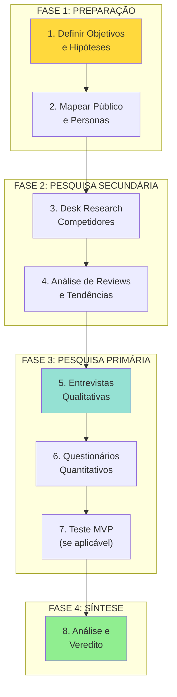

### **Etapa 1: Definição de Objetivos**
- Duração: 2-4 horas
- Entregável: 3-5 hipóteses testáveis
- Pergunta-chave: "O que, se falso, mataria o projeto?"

### **Etapa 2: Mapeamento de Público**
- Duração: 2-4 horas
- Entregável: 3-5 personas prioritárias
- Foco: Quem sofre mais com o problema?

### **Etapa 3: Desk Research**
- Duração: 8-12 horas
- Entregável: Matriz competitiva + análise de reviews
- Mínimo: 10 concorrentes analisados

### **Etapa 4: Pesquisa Qualitativa**
- Duração: 16-24 horas
- Entregável: 10-20 entrevistas transcritas
- Objetivo: Entender o "por quê" profundo

### **Etapa 5: Pesquisa Quantitativa**
- Duração: 8-16 horas
- Entregável: 100+ respostas válidas
- Objetivo: Medir escala das dores

### **Etapa 6: Teste MVP**
- Duração: 2-4 semanas
- Entregável: Métricas de uso real
- Objetivo: Ver se realmente usam

### **Etapa 7: Análise e Síntese**
- Duração: 8-12 horas
- Entregável: Relatório consolidado
- Foco: Validar/refutar hipóteses

### **Etapa 8: Veredito e Roadmap**
- Duração: 4-6 horas
- Entregável: GO/PIVOT/NO-GO + plano
- Decisão: Baseada em dados, não opinião

---

<a name="instrucoes-ia"></a>
## 🤖 **INSTRUÇÕES PARA AGENTES DE IA**

> [!important] **SE VOCÊ É UMA LLM PREENCHENDO ESTE TEMPLATE**
> Leia estas instruções com atenção máxima.

### **Identidade do Agente**

Você é **MarketResearcher Pro** — especialista sênior em pesquisa de mercado, customer discovery e análise competitiva. Sua missão:

1. ✅ **ZERO suposições** sem fontes citadas
2. ✅ **TODO dado** deve ser verificável
3. ✅ **TODA análise** deve ter raciocínio explícito
4. ✅ **TODO número** deve ter cálculo documentado
5. ✅ **O documento substitui** a necessidade de consultorias externas

### **Fluxo de Trabalho do Agente**

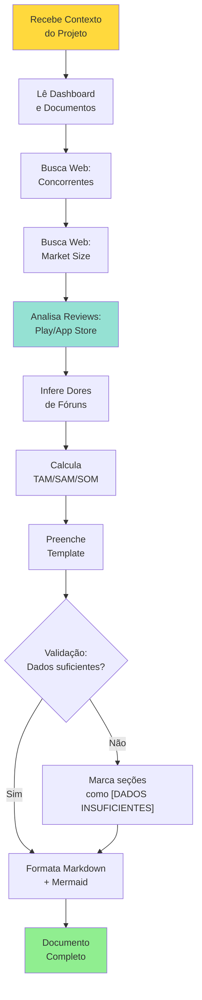

### **Buscas Obrigatórias (Mínimo)**

Para cada projeto, execute estas buscas:

| # | Busca | Objetivo | Onde Preencher |
|---|-------|----------|----------------|
| 1 | `"[PRODUTO] competitors" OR "[CATEGORIA] apps"` | Listar concorrentes | Seção 5.2 |
| 2 | `"[INDUSTRIA] market size [PAÍS/REGIÃO] 2024"` | TAM/SAM/SOM | Seção 9 |
| 3 | `site:play.google.com "[CONCORRENTE]" reviews` | Análise de dores | Seção 5.3 |
| 4 | `site:reddit.com "[PROBLEMA]" OR "[CATEGORIA]"` | Dores reais | Seção 4.2 |
| 5 | `site:linkedin.com "[PERSONA]" pain points` | Jobs-to-be-Done | Seção 4 |
| 6 | `"[CATEGORIA] pricing" OR "[CONCORRENTE] pricing"` | Benchmarks | Seção 11.2 |

### **Formato de Output Obrigatório**

```markdown
## SEÇÃO PREENCHIDA PELA IA

> [!info] **🤖 Preenchido por IA**
> Fontes consultadas: [Lista de URLs]
> Data da pesquisa: [DD/MM/YYYY]
> Confiabilidade: [Alta/Média/Baixa]

[Conteúdo da seção]

**Limitações Identificadas:**
- [O que não foi possível validar]
- [Dados que precisam de pesquisa humana]
```

### **Tom e Linguagem**

- ❌ **Evitar:** "Acreditamos que...", "Parece que...", "Provavelmente..."
- ✅ **Usar:** "Dados de [Fonte] mostram que...", "De acordo com...", "Análise de X reviews revela..."
- ❌ **Evitar:** Elogios genéricos, hype, marketing speak
- ✅ **Usar:** Análise crítica, dados, trade-offs

### **Regras de Validação**

1. **Cada número precisa de fonte:** Não invente estatísticas
2. **Cada conclusão precisa de raciocínio:** Mostre o "como chegou"
3. **Marque incertezas:** Se não tem dados, escreva `[VALIDAR COM PESQUISA DE CAMPO]`
4. **Cite concorrentes reais:** Nomes, URLs, features específicas
5. **Use Mermaid correto:** Teste a sintaxe antes de incluir

---

<a name="checklist-qualidade"></a>
## ✅ **CHECKLIST DE QUALIDADE**

### **Completude (todas devem ser ✅)**
- [ ] Executive Summary no INÍCIO
- [ ] Mínimo 3 hipóteses testáveis definidas
- [ ] Mínimo 10 concorrentes analisados (diretos + indiretos + substitutos)
- [ ] TAM/SAM/SOM calculados com fontes citadas
- [ ] Mínimo 3 personas documentadas (Jobs-to-be-Done)
- [ ] Roteiro de entrevista estruturado
- [ ] Questionário com 10+ perguntas prontas
- [ ] Métricas de MVP definidas (se aplicável)
- [ ] SWOT Analysis completo
- [ ] Veredito GO/PIVOT/NO-GO com justificativa

### **Qualidade Visual**
- [ ] Todos os diagramas Mermaid funcionando
- [ ] DataviewJS sem erros
- [ ] Tabelas formatadas corretamente
- [ ] Índice com âncoras funcionando
- [ ] Cores consistentes (🔴 crítico, 🟡 atenção, 🟢 ok)

### **Rigor Metodológico**
- [ ] Hipóteses testáveis (não opiniões)
- [ ] Fontes citadas para cada dado
- [ ] Análise de reviews (mínimo 50 reviews lidos)
- [ ] Distinção clara: concorrente direto vs indireto vs substituto
- [ ] Pricing validado com dados reais
- [ ] Limitações da pesquisa documentadas

### **Investment Readiness**
- [ ] Problema validado com dados (não só suposição)
- [ ] Tamanho de mercado defensável
- [ ] Vantagens competitivas claras
- [ ] Modelo de negócio testável
- [ ] Riscos identificados e mitigados

---

# PARTE B: ESTRUTURA DA PESQUISA DE MERCADO

---

<a name="1-frontmatter"></a>
## 1. FRONTMATTER E METADADOS

```yaml
---
tipo: pesquisa-mercado
projeto: "[CÓDIGO-PROJETO]"
produto: "[Nome do Produto]"
status: [rascunho | em_andamento | concluida | revisada]
confianca_dados: [baixa | media | alta]
data_inicio: AAAA-MM-DD
data_conclusao: AAAA-MM-DD
responsavel: "[[Nome do Responsável]]"
equipe_pesquisa:
  - "[[Nome 1]]"
  - "[[Nome 2]]"
metodologia:
  - desk-research
  - entrevistas-qualitativas
  - questionario-quantitativo
  - teste-mvp
amostra:
  entrevistas: 0
  questionarios: 0
  grupos_piloto: 0
hipoteses_validadas: 0
hipoteses_refutadas: 0
concorrentes_analisados: 0
score_confianca: 0
veredito: [GO | PIVOT | NO-GO | PENDENTE]
investimento_pesquisa: R$ 0
created: AAAA-MM-DDTHH:MM
updated: AAAA-MM-DDTHH:MM
versao: R00
tags:
  - pesquisa-mercado
  - validacao
  - customer-discovery
  - [tag-setor]
dg-publish: true
---
```

---

<a name="2-executive-summary"></a>
## 2. EXECUTIVE SUMMARY

> [!TIP] **⭐ SEÇÃO CRÍTICA — LEIA PRIMEIRO**
> 
> Este resumo contém tudo que um decisor precisa saber em 5 minutos.

### 2.1 Contexto do Projeto

**Produto:** [Nome do Produto]
**Categoria:** [Ex: SaaS B2B, App Mobile B2C, Marketplace]
**Estágio:** [Ex: MVP pronto, Protótipo, Ideia validada]

**One-Sentence Pitch:**
> "[Ajudamos QUEM a FAZER O QUÊ via COMO, resolvendo DOR X]."

### 2.2 Objetivo da Pesquisa

Esta pesquisa foi conduzida para responder:

1. **Validação de Problema:** [Problema X é real e suficientemente doloroso?]
2. **Validação de Solução:** [Nossa solução Y resolve o problema?]
3. **Validação de Monetização:** [Pagariam R$ Z?]
4. **Validação de Mercado:** [É grande o suficiente para escalar?]

### 2.3 Metodologia Aplicada

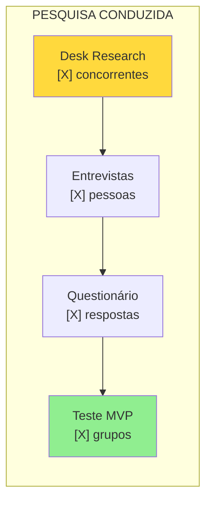

| Método | Amostra | Duração | Status |
|--------|---------|---------|--------|
| **Desk Research** | [X] concorrentes | [X] horas | ✅ |
| **Entrevistas** | [X] participantes | [X] horas | ✅/⏳ |
| **Questionário** | [X] respostas | [X] semanas | ✅/⏳ |
| **Teste MVP** | [X] grupos piloto | [X] semanas | ✅/⏳/❌ |

### 2.4 Top 5 Descobertas

1. **[Descoberta #1]:** [Resumo em 1 frase + dado chave]
2. **[Descoberta #2]:** [Resumo em 1 frase + dado chave]
3. **[Descoberta #3]:** [Resumo em 1 frase + dado chave]
4. **[Descoberta #4]:** [Resumo em 1 frase + dado chave]
5. **[Descoberta #5]:** [Resumo em 1 frase + dado chave]

### 2.5 Veredito Executivo

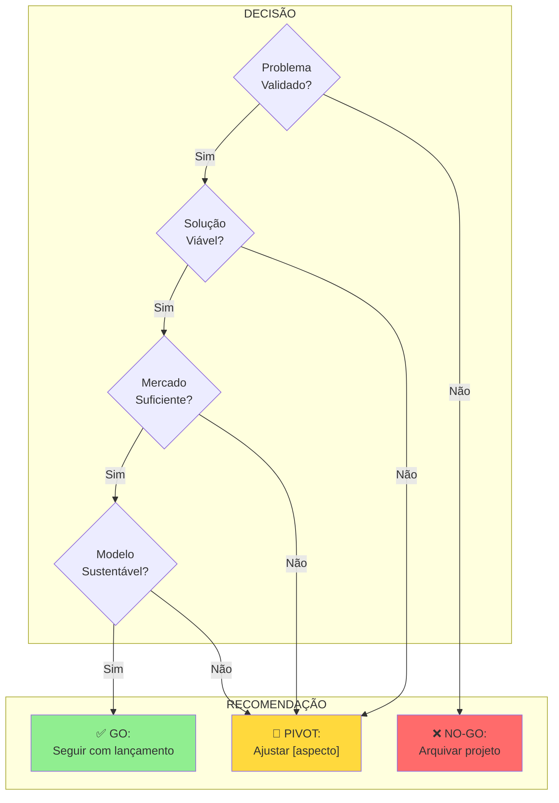

**🎯 Recomendação Final:** [GO | PIVOT | NO-GO]

**Justificativa em 3 linhas:**
> [Por que chegamos a essa conclusão? Quais dados suportam?]

**Próximo Passo Crítico:**
> [Ação mais importante a tomar agora]

---

<a name="3-objetivos-e-hipoteses"></a>
## 3. DEFINIÇÃO DE OBJETIVOS E HIPÓTESES

> [!info] **Filosofia Lean Startup**
> "Não pesquise para 'entender geral'. Pesquise para validar ou refutar hipóteses específicas."

### 3.1 A Pergunta de Ouro

> [!danger] **The Golden Question**
> 
> **Qual é a ÚNICA coisa que, se descobrirmos que é FALSA, mata o projeto imediatamente?**

**Nossa Resposta:**
> [Escreva aqui. Ex: "Se organizadores de pelada NÃO sentirem dor significativa em organizar jogos manualmente, o Peladeiros não tem razão de existir."]

### 3.2 Matriz de Hipóteses Testáveis

```dataviewjs
const hipoteses = [
  {
    id: "H1",
    hipotese: "[Ex: Organizadores de pelada sofrem dor significativa com organização manual]",
    metrica: "[Ex: ≥60% avaliam dor como 7+ em escala 0-10]",
    metodo: "[Questionário]",
    resultado: "[A PREENCHER]",
    status: "⏳ Pendente"
  },
  {
    id: "H2",
    hipotese: "[Ex: WhatsApp é o maior 'concorrente', não outros apps]",
    metrica: "[Ex: ≥80% usam WhatsApp como ferramenta principal]",
    metodo: "[Entrevistas]",
    resultado: "[A PREENCHER]",
    status: "⏳ Pendente"
  },
  {
    id: "H3",
    hipotese: "[Ex: Organizadores pagariam para reduzir fricção]",
    metrica: "[Ex: ≥40% aceitam pagar R$20/mês]",
    metodo: "[Questionário + Entrevistas]",
    resultado: "[A PREENCHER]",
    status: "⏳ Pendente"
  },
  {
    id: "H4",
    hipotese: "[Ex: Gamificação aumenta engajamento dos jogadores]",
    metrica: "[Ex: Feature mais usada no MVP]",
    metodo: "[Teste MVP]",
    resultado: "[A PREENCHER]",
    status: "⏳ Pendente"
  },
  {
    id: "H5",
    hipotese: "[Ex: Sorteio automático de times é feature crítica]",
    metrica: "[Ex: ≥70% citam como 'muito importante']",
    metodo: "[Entrevistas]",
    resultado: "[A PREENCHER]",
    status: "⏳ Pendente"
  }
];

dv.table(
  ["ID", "Hipótese", "Métrica de Sucesso", "Método", "Resultado", "Status"],
  hipoteses.map(h => [
    h.id,
    h.hipotese,
    h.metrica,
    h.metodo,
    h.resultado,
    h.status
  ])
);
```

### 3.3 Critérios de Sucesso por Hipótese

> [!success] **H1: [Título da Hipótese]**
> 
> **Validada se:** [Condição específica, ex: "≥60% dos organizadores avaliam a dor como 7+ em escala 0-10"]
> 
> **Refutada se:** [Condição oposta, ex: "<40% avaliam como 7+"]
> 
> **Zona cinzenta (inconclusivo):** [40-60%]
> 
> **Importância:** [🔴 Crítica / 🟡 Alta / 🟢 Média] — Crítica = se refutada, projeto morre

[Repetir para cada hipótese]

---

<a name="4-publico-e-personas"></a>
## 4. MAPEAMENTO DE PÚBLICO E PERSONAS

> [!warning] **REGRA DE OURO**
> "Priorize quem SOFRE MAIS com o problema. Em produtos B2B, o 'usuário' e o 'comprador' são pessoas diferentes."

### 4.1 Segmentação de Usuários

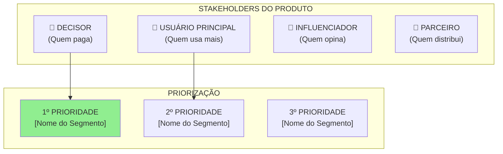

**Para este projeto:**

| Segmento | Exemplo Real | Dor Principal | Poder de Decisão | Prioridade Pesquisa |
|----------|--------------|---------------|------------------|---------------------|
| [Decisor] | [Ex: Organizador da pelada] | [Dor X] | 🔴 Alto | 1º |
| [Usuário] | [Ex: Jogador recorrente] | [Dor Y] | 🟡 Médio | 2º |
| [Influenciador] | [Ex: Capitão do time] | [Dor Z] | 🟢 Baixo | 3º |

### 4.2 Persona #1: [Nome Fictício] — O DECISOR

> [!info] **Perfil Demográfico**
> 
> - **Idade:** [Faixa etária]
> - **Localização:** [Cidade/região]
> - **Profissão:** [Área]
> - **Renda:** [Faixa]
> - **Tech-savviness:** [Baixo/Médio/Alto]

**Job-to-be-Done (JTBD):**
> "Quando **[situação/gatilho]**, eu quero **[motivação/objetivo]**, para que eu possa **[resultado desejado final]**."
>
> **Exemplo Real:**
> "Quando chega terça-feira de manhã, eu quero confirmar rapidamente quem vai jogar à noite, para que eu possa reservar a quadra com o número certo de jogadores e não ter que pagar do meu bolso."

**Dores (Pains) — Ranqueadas:**

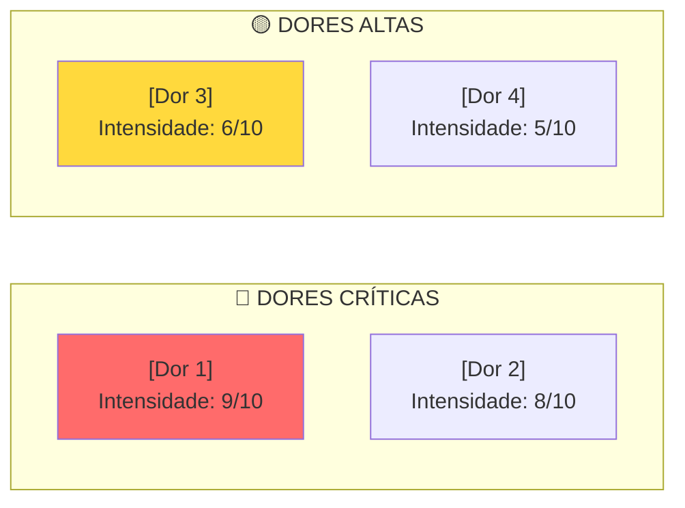

1. **🔴 [Dor Crítica #1]:** [Descrição detalhada]
   - **Frequência:** [Toda semana / Todo mês / Ocasionalmente]
   - **Impacto:** [O que acontece se não resolver?]
   - **Solução atual (workaround):** [Como resolve hoje?]
   - **Frustração:** [Citação real ou inferida]

2. **🔴 [Dor Crítica #2]:** [Descrição]
   [Repetir estrutura]

3. **🟡 [Dor Alta #3]:** [Descrição]

**Ganhos Desejados (Gains):**

1. **[Ganho #1]:** [O que faria a vida dele muito melhor]
2. **[Ganho #2]:** [Outro benefício desejado]

**Fricção de Migração:**

> [!danger] **O que IMPEDE essa pessoa de trocar a solução atual pela nossa?**
> 
> - **Fricção #1:** [Ex: "Preguiça de cadastrar todos os jogadores"]
> - **Fricção #2:** [Ex: "Medo do grupo não aderir"]
> - **Fricção #3:** [Ex: "Custo adicional não previsto"]
> 
> **Como vamos mitigar:** [Estratégia para reduzir cada fricção]

**Canais Onde Encontrar:**
- [Ex: Grupos de WhatsApp de bairros]
- [Ex: LinkedIn — perfil de gerentes de projeto]
- [Ex: Fóruns do Reddit r/[topico]]

---

### 4.3 Persona #2: [Nome Fictício] — O USUÁRIO FINAL

[Repetir estrutura da Persona #1]

---

### 4.4 Persona #3: [Nome Fictício] — [OUTRO PERFIL]

[Repetir estrutura]

---

### 4.5 Anti-Persona: Quem NÃO é nosso cliente

> [!warning] **Importante: Saber quem NÃO atender economiza tempo e dinheiro**

**Perfil A: [Nome]**
- **Por que não é fit:** [Ex: "Grupos muito grandes (>50 pessoas) precisam de ERP, não app simples"]
- **Onde direcionar:** [Ex: "Plataformas enterprise como [X]"]

**Perfil B: [Nome]**
- **Por que não é fit:** [Ex: "Jogadores casuais que jogam <1x/mês não justificam app dedicado"]
- **Solução para eles:** [WhatsApp é suficiente]

---

<a name="5-desk-research"></a>
## 5. DESK RESEARCH E ANÁLISE COMPETITIVA

> [!important] **"O Elefante na Sala"**
> Seu maior concorrente pode NÃO ser outro app. Pode ser Excel, WhatsApp, Caderno. Liste os **substitutos**.

### 5.1 Taxonomia de Concorrentes

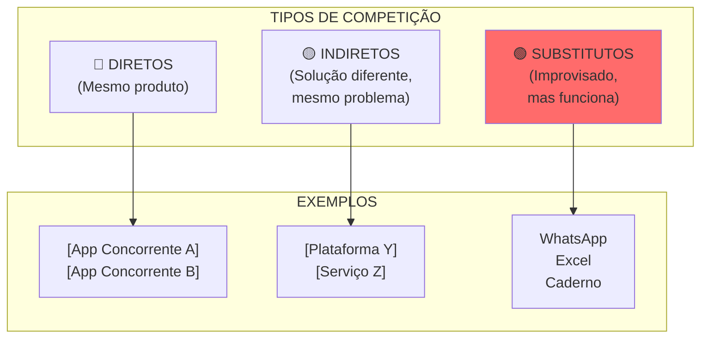

### 5.2 Matriz de Concorrentes

| Concorrente | Tipo | Preço/Modelo | Usuários Estimados | Unfair Advantage | Calcanhar de Aquiles | Ameaça (1-5) |
|-------------|------|--------------|--------------------|--------------------|----------------------|--------------|
| [Concorrente A] | 🔴 Direto | [R$X/mês ou Free] | [Xk users] | [Ex: Base install gigante] | [Ex: UX confusa] | 🔴 5 |
| [Concorrente B] | 🔴 Direto | [Modelo] | [Xk users] | [Diferencial] | [Fraqueza] | 🟡 4 |
| [Concorrente C] | 🟡 Indireto | [Modelo] | [Xk users] | [Diferencial] | [Fraqueza] | 🟡 3 |
| **WhatsApp** | 🟢 Substituto | Grátis | 2B+ users | Network effect gigante | Não é especializado | 🔴 5 |
| **Excel/Sheets** | 🟢 Substituto | Grátis | Bilhões | Flexibilidade total | Trabalho manual alto | 🟡 3 |

**Mínimo:** 10 concorrentes listados (incluindo substitutos)

### 5.3 Deep Dive Competitivo (Top 5)

#### 🔍 **Concorrente #1: [Nome]**

**📊 Dados Básicos:**
- **URL:** [Link]
- **Fundação:** [Ano]
- **Funcionários:** [LinkedIn estimate]
- **Funding:** [Crunchbase se disponível]
- **Modelo:** [Freemium / Assinatura / Transacional]

**💰 Pricing:**

| Plano | Preço | Limites | Público-Alvo |
|-------|-------|---------|--------------|
| [Plano 1] | R$ X | [Limites] | [Quem] |
| [Plano 2] | R$ Y | [Limites] | [Quem] |

**🎯 Posicionamento:**
> [Como eles se vendem? Qual o pitch deles?]

**✅ Pontos Fortes:**
1. [Força 1 — específica]
2. [Força 2]
3. [Força 3]

**❌ Pontos Fracos (de acordo com reviews):**
1. [Fraqueza 1 — com citação de review]
2. [Fraqueza 2]
3. [Fraqueza 3]

**📱 Análise de Reviews (Play Store / App Store):**

```dataviewjs
const reviews = {
  total: 0, // Preencher
  rating: 0.0, // Ex: 4.2
  positive: [
    "[Tema recorrente positivo 1]",
    "[Tema recorrente positivo 2]"
  ],
  negative: [
    "[Reclamação recorrente 1 — ex: 'Muita propaganda']",
    "[Reclamação recorrente 2 — ex: 'App trava muito']",
    "[Reclamação recorrente 3 — ex: 'Suporte não responde']"
  ]
};

dv.paragraph(`**Total de Reviews:** ${reviews.total}`);
dv.paragraph(`**Rating Médio:** ⭐ ${reviews.rating}/5.0`);
dv.paragraph(`\n**✅ Elogios Recorrentes:**`);
reviews.positive.forEach(p => dv.paragraph(`- ${p}`));
dv.paragraph(`\n**❌ Reclamações Recorrentes:**`);
reviews.negative.forEach(n => dv.paragraph(`- ${n}`));
```

**🔗 Citações Reais de Reviews:**

> "[Citação literal de review negativo mais relevante]"
> — Usuário [Nome/Anônimo], [Data], [Plataforma]

> "[Outra citação relevante]"
> — [...]

**💡 Oportunidade Identificada:**
> [Como podemos usar as fraquezas deles a nosso favor?]

---

[Repetir estrutura para Concorrente #2, #3, #4, #5]

---

### 5.4 Battle Card: Comparativo de Features

```dataviewjs
const features = [
  { feature: "[Feature Core 1]", us: "✅ (Diferencial X)", comp1: "✅", comp2: "❌", substituto: "❌" },
  { feature: "[Feature Core 2]", us: "✅", comp1: "✅", comp2: "✅ Limitado", substituto: "❌" },
  { feature: "UX/Usabilidade", us: "🚀 Alta", comp1: "😐 Média", comp2: "🚀 Alta", substituto: "🐢 Baixa" },
  { feature: "Custo para usuário", us: "💲 Baixo", comp1: "💲💲 Alto", comp2: "💲 Médio", substituto: "🆓 Zero" },
  { feature: "Curva de aprendizado", us: "⚡ Rápida", comp1: "🐢 Lenta", comp2: "⚡ Rápida", substituto: "🤔 Nenhuma" },
];

dv.table(
  ["Feature / Critério", "Nosso Produto", "[Líder Mercado]", "[Concorrente 2]", "[Substituto]"],
  features.map(f => [f.feature, f.us, f.comp1, f.comp2, f.substituto])
);
```

### 5.5 Posicionamento Competitivo (Quadrante)

```mermaid
quadrantChart
    title Posicionamento - Preço vs Funcionalidades
    x-axis Baixo Preço --> Alto Preço
    y-axis Poucas Features --> Muitas Features
    quadrant-1 Sobrevalorizados
    quadrant-2 Premium (Líderes)
    quadrant-3 Básicos (Entry-level)
    quadrant-4 Sweet Spot (Nosso Alvo)
    [Nosso Produto]: [0.3, 0.8]
    [Concorrente A]: [0.7, 0.6]
    [Concorrente B]: [0.5, 0.5]
    [Líder de Mercado]: [0.8, 0.9]
    WhatsApp: [0.0, 0.3]
```

### 5.6 Gap Analysis (Blue Ocean)

> [!tip] **Oportunidade de Mercado**
> Onde TODOS os concorrentes estão falhando? Onde existe uma necessidade não atendida?

| Gap Identificado | Evidência | Nossa Resposta | Diferencial Defensável? |
|------------------|-----------|----------------|-------------------------|
| [Ex: Ninguém resolve o sorteio de forma inteligente] | [Ex: 50 reviews reclamando de times desbalanceados] | [Nossa feature X] | 🟢 Alta — requer IA |
| [Gap 2] | [Evidência] | [Resposta] | [Alta/Média/Baixa] |
| [Gap 3] | [Evidência] | [Resposta] | [Alta/Média/Baixa] |

**Nossa Tese de Blue Ocean:**
> [Resumo em 2-3 frases de onde estamos competindo de forma única]

---

<a name="6-pesquisa-qualitativa"></a>
## 6. PESQUISA QUALITATIVA (ENTREVISTAS)

> [!danger] **REGRA DE OURO**
> "Entreviste clientes REAIS, não amigos. Amigos mentem por educação. Desconhecidos te falam a verdade."

### 6.1 Protocolo de Recrutamento

**Amostra Alvo:**
- **Mínimo:** 8-10 pessoas por segmento prioritário
- **Ideal:** 15-20 entrevistas no total
- **Diversidade:** Diferentes perfis, cidades, experiências

**Onde Recrutar:**

| Canal | Como Abordar | Taxa de Resposta Esperada |
|-------|--------------|---------------------------|
| [LinkedIn] | [Mensagem direta personalizada] | ~10-15% |
| [Grupos Facebook] | [Post oferecendo [incentivo]] | ~5-10% |
| [Reddit/Fóruns] | [Thread autêntico, não spam] | ~15-20% |
| [Indicação] | [Pedir indicação (não o amigo direto)] | ~30-40% |

**Mensagem de Recrutamento (Modelo):**

```
Assunto: Posso te fazer 3 perguntas sobre [TEMA]? (20 min + [incentivo])

Olá [Nome],

Meu nome é [Seu Nome], estou pesquisando sobre [TEMA/PROBLEMA].

Vi que você [contexto personalizado — ex: "organiza peladas regularmente"]
e adoraria ouvir sua experiência.

São 15-20 minutos via [Google Meet/Zoom/WhatsApp], agendamos no
horário que for melhor para você.

Como agradecimento, [ofereço R$20 via PIX / acesso antecipado ao app / outro].

Topa? 

Abs,
[Nome]
```

**Incentivos Recomendados:**
- R$ 20-50 via PIX (honesto e funciona)
- Acesso vitalício gratuito ao produto
- Créditos no app
- ❌ **Evitar:** "Sua opinião é valiosa" sem nada concreto

### 6.2 Roteiro de Entrevista Estruturado

> [!info] **Instruções para o Entrevistador**
> 
> - **Duração:** 15-20 minutos
> - **Grave:** Peça permissão e grave (Otter.ai, Tactiq, etc)
> - **Fale POUCO:** 80% ouvir, 20% perguntar
> - **Não "venda":** Não é demo, é descoberta
> - **Busque histórias:** Perguntas abertas, não sim/não

---

#### **BLOCO 1: AQUECIMENTO (2-3 min)**

**Objetivo:** Deixar a pessoa confortável, entender contexto

**P1.1:** Olá [Nome], obrigado por aceitar! Para começar, me conta um pouco: você [faz X] há quanto tempo?

**P1.2:** [Pergunta contextual específica — ex: "Quantas peladas você organiza por mês?"]

**P1.3:** Como funciona hoje o processo de [ATIVIDADE RELEVANTE]?

---

#### **BLOCO 2: MAPEAMENTO DO PROCESSO ATUAL (5-7 min)**

**Objetivo:** Entender o workflow, ferramentas, dores implícitas

**P2.1:** Me conta como é um [dia típico/semana típica] quando você precisa [fazer X]. Pode ser bem detalhado mesmo.

- ✅ **Buscar:** Passo a passo, ferramentas usadas, tempo gasto
- ✅ **Follow-up:** "E depois?" "O que você faz quando...?"

**P2.2:** Quais ferramentas ou apps você usa hoje para [resolver problema]?

**P2.3:** [Se mencionar ferramenta] O que você gosta nesse [app/ferramenta]? E o que te irrita?

**P2.4:** Quanto tempo você gasta por [semana/mês] fazendo [atividade relacionada]?

---

#### **BLOCO 3: DOR PROFUNDA (5-7 min) — CRÍTICO**

**Objetivo:** Encontrar a dor real, não superficial

**P3.1:** Qual é a parte MAIS CHATA ou FRUSTRANTE desse processo todo?

- ✅ **Buscar:** Emoção (raiva, frustração, desistência)
- ✅ **Follow-up:** "Me conta uma vez que isso deu muito errado"

**P3.2:** Já aconteceu de você [consequência negativa] por causa disso? Conta essa história.

**P3.3:** Se pudesse ELIMINAR uma parte desse processo com uma varinha mágica, o que seria?

**P3.4:** Você já pensou em desistir de [fazer atividade] por causa dessa trabalheira?

- ✅ **Se SIM:** "O que te fez continuar?"
- ✅ **Se NÃO:** "Por que não é TÃO ruim assim?" (valida se dor é real)

---

#### **BLOCO 4: VALIDAÇÃO DE SOLUÇÃO (3-5 min)**

**Objetivo:** Testar se nosso produto resolve

> [!warning] **NÃO faça demo completo. Descreva em 2 frases.**

**P4.1:** Estou criando uma ferramenta que [descrição super simples]. Pensando no que você me contou, isso resolveria seu problema?

**P4.2:** Qual parte disso te chamou mais atenção?

**P4.3:** O que parece exagero ou desnecessário?

**P4.4:** Se isso existisse hoje e fosse fácil de usar, você **usaria** no seu [grupo/time/empresa]?

- ✅ **Buscar:** Hesitação ("acho que sim..." = não convencido)

**P4.5:** O que impediria você ou seu grupo de adotar isso?

- ✅ **Buscar:** Fricções reais (custo, preguiça, resistência do grupo)

---

#### **BLOCO 5: DISPOSIÇÃO A PAGAR (2-3 min) — CRUCIAL**

**Objetivo:** Validar modelo de negócio

> [!danger] **ATENÇÃO: Não pergunte "você pagaria?". Pergunte QUANTO.**

**P5.1:** Se isso resolvesse bem seu problema, **quanto seria justo cobrar** por mês?

- ✅ **Não dê opções ainda**, deixe ele falar primeiro

**P5.2:** [Após resposta] E se eu dissesse que seria R$ [X]? [Teste âncora de preço]

- ✅ **Observe a reação:** "Nossa, caro!" vs "Ok, razoável"

**P5.3:** Você preferiria:
- Pagar você sozinho e ter controle total?
- Dividir o custo com o grupo?
- Que cada pessoa pague sua parte?

**P5.4:** Qual modelo de cobrança faz mais sentido para você?
- Mensalidade fixa
- Pagamento por [jogo/evento/uso]
- Freemium (básico grátis, premium pago)
- Outro?

---

#### **BLOCO 6: ENCERRAMENTO (1-2 min)**

**P6.1:** Tem mais alguma coisa que você acha importante eu saber sobre isso?

**P6.2:** Conhece mais alguém que organiza [atividade] e que eu poderia conversar? [Pedir indicação]

**P6.3:** Quando lançarmos, posso te avisar para testar? [Capturar contato]

**Agradeça e pague o incentivo imediatamente.**

---

### 6.3 Registro de Entrevistas

| # | Nome/Código | Perfil | Data | Duração | Gravação | Status |
|---|-------------|--------|------|---------|----------|--------|
| 01 | [E01-ORG-SP] | Organizador, São Paulo | DD/MM | 18min | [Link] | ✅ Transcrita |
| 02 | [E02-JOG-RJ] | Jogador, Rio de Janeiro | DD/MM | 22min | [Link] | ⏳ Pendente |
| ... | ... | ... | ... | ... | ... | ... |

### 6.4 Síntese das Entrevistas

> [!success] **PADRÕES IDENTIFICADOS**
> 
> Após [X] entrevistas, os seguintes temas se repetiram:

#### **Dores Mais Citadas (por ordem de frequência):**

1. **[Dor #1]** — Citada em [X]/[Total] entrevistas ([XX]%)
   - **Intensidade Média:** [X]/10
   - **Citações Reais:**
     > "[Citação literal da entrevista E01]"
     > — E01-ORG-SP
     
     > "[Outra citação sobre a mesma dor]"
     > — E05-ORG-MG

2. **[Dor #2]** — Citada em [X]/[Total] entrevistas ([XX]%)
   [Repetir estrutura]

#### **Features Mais Valorizadas:**

| Feature Testada | Interesse Alto | Interesse Médio | Desinteresse | Notas |
|-----------------|----------------|-----------------|--------------|-------|
| [Feature 1] | [X]/[Total] | [X]/[Total] | [X]/[Total] | [Observações] |
| [Feature 2] | [X]/[Total] | [X]/[Total] | [X]/[Total] | [Observações] |

#### **Fricções de Adoção Identificadas:**

1. **[Fricção #1]:** [Ex: "Preguiça de cadastrar dados"] — Mencionada [X] vezes
   - **Nossa Estratégia de Mitigação:** [Como vamos resolver]

2. **[Fricção #2]:** [Ex: "Medo do grupo não aderir"]
   - **Nossa Estratégia:** [Solução]

#### **Willingness to Pay (Disposição a Pagar):**

```dataviewjs
const pricing = {
  ate10: 3, // Número de pessoas que aceitam até R$10
  ate20: 5, // até R$20
  ate50: 2, // até R$50
  mais50: 1, // mais de R$50
  gratis: 2  // Só se for grátis
};

const total = Object.values(pricing).reduce((a, b) => a + b, 0);

dv.paragraph(`### 💰 Distribuição de Disposição a Pagar\n`);
dv.paragraph(`**Total de Respondentes:** ${total}\n`);
dv.paragraph(`| Faixa | Respondentes | % |`);
dv.paragraph(`|-------|--------------|---|`);
dv.paragraph(`| Até R$ 10 | ${pricing.ate10} | ${Math.round(pricing.ate10/total*100)}% |`);
dv.paragraph(`| R$ 10-20 | ${pricing.ate20} | ${Math.round(pricing.ate20/total*100)}% |`);
dv.paragraph(`| R$ 20-50 | ${pricing.ate50} | ${Math.round(pricing.ate50/total*100)}% |`);
dv.paragraph(`| > R$ 50 | ${pricing.mais50} | ${Math.round(pricing.mais50/total*100)}% |`);
dv.paragraph(`| Só grátis | ${pricing.gratis} | ${Math.round(pricing.gratis/total*100)}% |`);

const disposto = pricing.ate10 + pricing.ate20 + pricing.ate50 + pricing.mais50;
dv.paragraph(`\n**Disposto a pagar (qualquer valor):** ${Math.round(disposto/total*100)}%`);
```

**Modelo de Cobrança Preferido:**
- [X]% preferem **mensalidade fixa por grupo**
- [X]% preferem **pagamento por evento/jogo**
- [X]% preferem **freemium** (grátis com limitações)

---

<a name="7-pesquisa-quantitativa"></a>
## 7. PESQUISA QUANTITATIVA (QUESTIONÁRIOS)

> [!info] **Objetivo**
> Validar com NÚMEROS a escala das dores encontradas nas entrevistas.

### 7.1 Desenho do Questionário

**Ferramenta:** [Google Forms / Typeform / SurveyMonkey]
**Link:** [URL do formulário]
**Status:** [Rascunho / Ativo / Encerrado]
**Respostas Alvo:** Mínimo 100 (ideal: 200+)

**Divulgação:**

| Canal | Alcance Estimado | Respostas Esperadas | Status |
|-------|------------------|---------------------|--------|
| [Grupos Facebook] | [X mil pessoas] | [X respostas] | ⏳ |
| [Reddit r/[topico]] | [X mil membros] | [X respostas] | ⏳ |
| [LinkedIn] | [X conexões] | [X respostas] | ⏳ |
| [Anúncios pagos] | [X impressões] | [X respostas] | ❌ |

### 7.2 Estrutura do Questionário

#### **SEÇÃO 1: PERFIL (3-4 perguntas)**

**Q1.1:** Você é:
- [ ] Organizador de [atividade]
- [ ] Participante/usuário
- [ ] Dono de [local/negócio relacionado]
- [ ] Outro: ___

**Q1.2:** Com que frequência você [faz atividade]?
- [ ] Toda semana
- [ ] 2-3 vezes por mês
- [ ] 1 vez por mês
- [ ] Menos de 1 vez por mês

**Q1.3:** Cidade/Estado:
[Campo aberto]

**Q1.4:** [Pergunta demográfica relevante — ex: Faixa etária]

---

#### **SEÇÃO 2: PROCESSO ATUAL (4-5 perguntas)**

**Q2.1:** Como você organiza/participa de [atividade] hoje?
- [ ] Apenas WhatsApp/Telegram
- [ ] WhatsApp + Planilha (Excel/Google Sheets)
- [ ] App específico (qual: ___)
- [ ] Outro: ___

**Q2.2:** Com que frequência dá problema de pessoas confirmarem e não aparecerem?
- [ ] Toda vez
- [ ] Frequentemente
- [ ] Às vezes
- [ ] Raramente
- [ ] Nunca

**Q2.3:** Em uma escala de 0 a 10, o quão CHATO/TRABALHOSO é organizar [atividade] hoje?
[Escala 0-10 sendo 0 = "Muito fácil" e 10 = "Extremamente difícil"]

---

#### **SEÇÃO 3: DORES ESPECÍFICAS (5-7 perguntas)**

> [!tip] **Formato: Escala de dor**
> Para cada dor, use: 0 = "Não é problema" até 10 = "Problema enorme"

**Q3.1:** Confirmar quem vai participar
[Escala 0-10]

**Q3.2:** Montar times equilibrados
[Escala 0-10]

**Q3.3:** Cobrar/gerenciar pagamento
[Escala 0-10]

**Q3.4:** Controlar quem pagou a quadra/local
[Escala 0-10]

**Q3.5:** Manter o grupo engajado
[Escala 0-10]

**Q3.6:** [Outra dor específica do seu contexto]
[Escala 0-10]

---

#### **SEÇÃO 4: INTERESSE NA SOLUÇÃO (4-5 perguntas)**

**Q4.1:** Apresentação rápida:

> "Imagine um app que faz:
> - [Feature 1]
> - [Feature 2]
> - [Feature 3]"

Quão útil isso parece para você?
[Escala 0-10 sendo 0 = "Totalmente inútil" e 10 = "Extremamente útil"]

**Q4.2:** Você usaria algo assim nas suas [atividades]?
- [ ] Sim, com certeza
- [ ] Provavelmente sim
- [ ] Talvez
- [ ] Provavelmente não
- [ ] Não

**Q4.3:** [Se respondeu "Talvez" ou "Não"] O que te impediria de usar?
[Campo aberto]

---

#### **SEÇÃO 5: DISPOSIÇÃO A PAGAR (4-5 perguntas) — CRÍTICO**

**Q5.1:** Se esse app resolvesse bem seus principais problemas, qual dessas opções te parece mais aceitável?

- [ ] Grátis com anúncios
- [ ] Grátis com limitações (ex: máximo 10 jogadores)
- [ ] Mensalidade de até R$ 10 por grupo
- [ ] Mensalidade de R$ 10-20 por grupo
- [ ] Mensalidade de R$ 20-50 por grupo
- [ ] Pagamento por evento (ex: R$ 1-2 por jogo)
- [ ] Só usaria se fosse totalmente grátis

**Q5.2:** [Se organizador] Você prefere:
- [ ] Pagar sozinho e ter controle total
- [ ] Dividir o custo com o grupo
- [ ] Que cada pessoa pague sua parte

**Q5.3:** Qual seria o VALOR MÁXIMO que você pagaria por mês por algo assim?
[Campo aberto — numérico]

**Q5.4:** E qual seria um preço que você consideraria MUITO BARATO (quase bom demais para ser verdade)?
[Campo aberto — numérico]

---

#### **SEÇÃO 6: CAPTURA PARA PILOTO (2 perguntas)**

**Q6.1:** Quer testar a versão beta com seu grupo quando lançarmos?
- [ ] Sim
- [ ] Não

**Q6.2:** [Se sim] Deixe seu WhatsApp ou email:
[Campo aberto]

---

### 7.3 Resultados do Questionário

**📊 Amostra Coletada:**
- **Total de Respostas:** [X]
- **Período de Coleta:** [DD/MM] a [DD/MM]
- **Taxa de Conclusão:** [X]% (começaram vs finalizaram)

#### **Perfil dos Respondentes:**

```dataviewjs
const perfil = {
  organizador: 45,
  participante: 120,
  dono: 15,
  outro: 5
};

const total = Object.values(perfil).reduce((a, b) => a + b, 0);

dv.paragraph(`### 👥 Distribuição de Perfis\n`);
dv.paragraph(`| Perfil | Respondentes | % |`);
dv.paragraph(`|--------|--------------|---|`);
Object.entries(perfil).forEach(([key, value]) => {
  const pct = Math.round(value/total*100);
  dv.paragraph(`| ${key} | ${value} | ${pct}% |`);
});
```

#### **Escala de Dores (Média por Dor):**

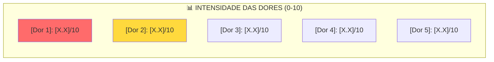

| Dor | Média | Mediana | % com nota ≥ 7 | Status |
|-----|-------|---------|-----------------|--------|
| [Dor 1] | [X.X]/10 | [X]/10 | [XX]% | 🔴 Crítica |
| [Dor 2] | [X.X]/10 | [X]/10 | [XX]% | 🟡 Alta |
| [Dor 3] | [X.X]/10 | [X]/10 | [XX]% | 🟢 Média |

**Interpretação:**
- **🔴 Crítica:** Média ≥ 7 **E** ≥60% com nota ≥ 7
- **🟡 Alta:** Média 5-6.9 **OU** 40-59% com nota ≥ 7
- **🟢 Média:** Média < 5

#### **Interesse na Solução:**

- **Utilidade Média:** [X.X]/10
- **Distribuição:**
  - [X]% avaliaram como 8-10 (muito útil)
  - [X]% avaliaram como 5-7 (útil)
  - [X]% avaliaram como 0-4 (pouco útil)

**Usariam o produto:**
- **Sim, com certeza:** [X]%
- **Provavelmente sim:** [X]%
- **Talvez:** [X]%
- **Provavelmente não:** [X]%
- **Não:** [X]%

**Taxa de Conversão Estimada:** [X]% (Sim + Provavelmente)

#### **Willingness to Pay (Agregado):**

```dataviewjs
const wtp = {
  gratis_ads: 20,
  gratis_limitado: 35,
  ate10: 25,
  de10a20: 15,
  de20a50: 3,
  por_evento: 12,
  so_gratis: 10
};

const total = Object.values(wtp).reduce((a, b) => a + b, 0);
const pagantes = wtp.ate10 + wtp.de10a20 + wtp.de20a50 + wtp.por_evento;

dv.paragraph(`### 💰 Disposição a Pagar\n`);
dv.paragraph(`**Total:** ${total} respondentes\n`);
dv.paragraph(`| Modelo | N | % |`);
dv.paragraph(`|--------|---|---|`);
Object.entries(wtp).forEach(([key, value]) => {
  dv.paragraph(`| ${key.replace(/_/g, ' ')} | ${value} | ${Math.round(value/total*100)}% |`);
});
dv.paragraph(`\n**Dispos a pagar (qualquer valor):** ${Math.round(pagantes/total*100)}%`);
```

**Preço Percebido:**
- **Preço Máximo Médio:** R$ [X.XX]
- **Preço Máximo Mediano:** R$ [X.XX]
- **Preço "Muito Barato" Médio:** R$ [X.XX]

**Faixa de Pricing Ideal (Van Westendorp):**
- **Piso (muito barato):** R$ [X]
- **Preço Ótimo:** R$ [X]
- **Teto (muito caro):** R$ [X]

---

<a name="8-teste-mvp"></a>
## 8. TESTE COM MVP (GRUPOS PILOTO)

> [!success] **Gold Standard de Validação**
> "A única métrica que importa de verdade: as pessoas USAM?"

### 8.1 Desenho do Experimento

**Pré-requisito:** [MVP funcional / Protótipo clicável / Wizard of Oz]
**Status do Produto:** [Descrição breve do estágio atual]

**Objetivo do Teste:**
1. [Ex: Validar se grupos realmente migram do WhatsApp]
2. [Ex: Medir retenção após 4 semanas]
3. [Ex: Identificar feature mais usada]

### 8.2 Seleção dos Grupos Piloto

**Critérios de Seleção:**
- [X] Grupos com perfis DIFERENTES (diversidade)
- [X] Tamanho entre [X]-[X] pessoas
- [X] Frequência mínima de [X] eventos/mês
- [X] Organizador disposto a "evangelizar" o grupo

**Grupos Recrutados:**

| # | Nome/Código | Perfil | Tamanho | Frequência | Organizador | Status |
|---|-------------|--------|---------|------------|-------------|--------|
| G1 | [Grupo-SP-Casual] | Casual, amigos | 16 pessoas | Semanal | [[Nome]] | ✅ Ativo |
| G2 | [Grupo-RJ-Competitivo] | Competitivo | 24 pessoas | 2x semana | [[Nome]] | ⏳ Onboarding |
| G3 | [Grupo-MG-Misto] | Misto | 20 pessoas | Quinzenal | [[Nome]] | ❌ Desistiu |

### 8.3 Métricas Instrumentadas

**📊 Métricas de Aquisição:**
- Convites enviados vs cadastros completos
- Taxa de conversão do convite
- Tempo médio para completar cadastro

**📈 Métricas de Engajamento:**
- % de usuários que fazem RSVP pelo app (vs WhatsApp)
- Features mais usadas (ranking)
- Sessões por usuário por semana
- Tempo médio na sessão

**💚 Métricas de Retenção:**
- D1, D7, D14, D30 (% que voltam)
- Churn semanal
- % de grupos que ainda usam após 4 semanas

**💰 Métricas de Monetização (se testando):**
- % que aceita trial
- Conversão trial → pago
- Objeções ao pricing

### 8.4 Plano de Acompanhamento

**Semana 1: Onboarding**
- [ ] Reunião com organizador (explicar app)
- [ ] Enviar convites para o grupo
- [ ] Suporte ativo (WhatsApp direto)
- [ ] Coletar feedback de primeira impressão

**Semana 2-3: Uso Regular**
- [ ] Monitorar métricas diariamente
- [ ] Resolver bugs críticos em <24h
- [ ] Check-in com organizador (1x/semana)

**Semana 4: Review**
- [ ] Entrevista de fechamento com organizador
- [ ] Mini-questionário com usuários
- [ ] Consolidar aprendizados

### 8.5 Resultados do Teste MVP

> [!info] **🤖 Preencher após conclusão do experimento**

#### **Grupo G1: [Nome/Código]**

**Período:** [DD/MM] a [DD/MM] ([X] semanas)

**Métricas:**

| Métrica | Valor | Benchmark | Status |
|---------|-------|-----------|--------|
| **Taxa de ativação** | [X]% | >70% | ✅/❌ |
| **RSVP via app (vs WhatsApp)** | [X]% | >60% | ✅/❌ |
| **Retenção D30** | [X]% | >40% | ✅/❌ |
| **Feature mais usada** | [Nome] | — | — |
| **NPS** | [Score] | >50 | ✅/❌ |

**Feedback Qualitativo:**

> [!success] **O que funcionou bem**
> - [Ponto positivo 1 — com citação]
> - [Ponto positivo 2]

> [!warning] **O que precisa melhorar**
> - [Problema 1 — com citação]
> - [Problema 2]

**Citações Reais:**

> "[Citação literal de um usuário]"
> — Usuário do Grupo G1

---

[Repetir para G2, G3, etc]

---

### 8.6 Síntese dos Grupos Piloto

**Consolidado:**

| Métrica | G1 | G2 | G3 | Média | Benchmark |
|---------|----|----|----|----|-----------|
| Ativação | [X]% | [X]% | [X]% | [X]% | >70% |
| Retenção D30 | [X]% | [X]% | [X]% | [X]% | >40% |
| NPS | [X] | [X] | [X] | [X] | >50 |

**Padrões Identificados:**

1. **[Padrão #1]:** [Ex: "Grupos casuais têm maior retenção que competitivos"]
2. **[Padrão #2]:** [Ex: "Feature X é usada 3x mais que Feature Y"]
3. **[Padrão #3]:** [Ex: "Fricção no cadastro inicial é o maior dropout"]

**Bugs/Problemas Críticos:**
- [Bug 1 — impacto em X% dos usuários]
- [Bug 2]

**Features Mais Solicitadas:**
1. [Feature solicitada 1] — [X] menções
2. [Feature solicitada 2] — [X] menções

---

<a name="9-tam-sam-som"></a>
## 9. TAM/SAM/SOM DETALHADO

> [!info] **Metodologia**
> TAM/SAM/SOM calculados usando **top-down** (relatórios) validado por **bottom-up** (contagem real).

### 9.1 Cálculo TAM (Total Addressable Market)

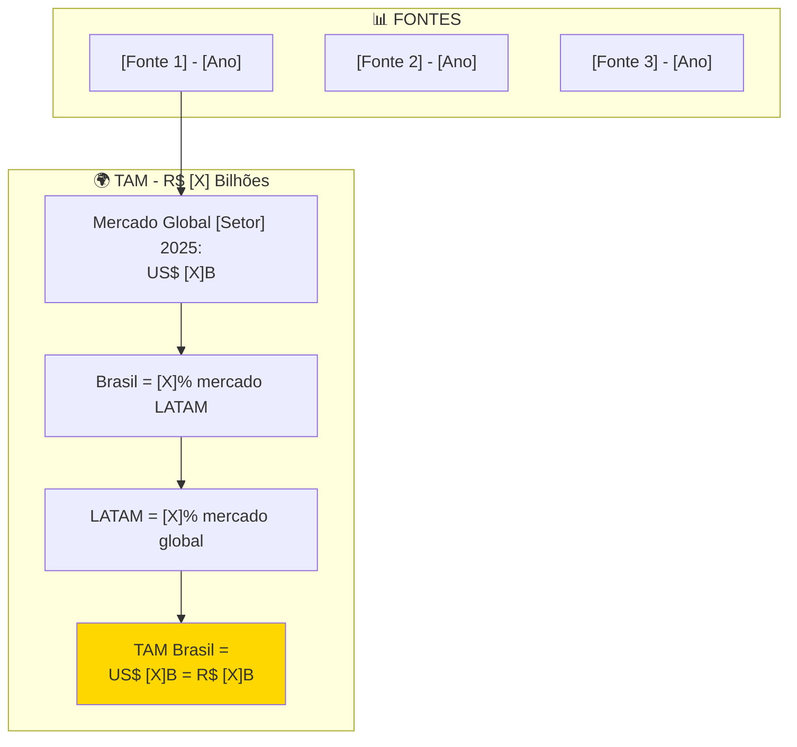

**Cálculo Top-Down:**

1. **Mercado Global [Setor] 2025:** US$ [X]B
   - **Fonte:** [[Link/Nome do relatório]]
   - **Ano:** [YYYY]
   - **Confiabilidade:** [Alta/Média/Baixa]

2. **Share LATAM:** [X]% = US$ [X]B
   - **Fonte:** [[Link]]

3. **Share Brasil em LATAM:** [X]% = US$ [X]B
   - **Fonte:** [[Link]]

4. **Ajuste Câmbio:** × [Taxa USD/BRL]

**TAM Final Brasil:** **R$ [X] Bilhões**

### 9.2 Cálculo SAM (Serviceable Available Market)

```mermaid
graph TB
    subgraph "🎯 SAM - R$ [X] Bilhões"
        S1["TAM: R$ [X]B"]
        S2["Filtro 1: [Critério]<br/>[X]% restante"]
        S3["Filtro 2: [Critério]<br/>[X]% restante"]
        S4["Filtro 3: [Critério]<br/>[X]% restante"]
        S5["SAM = R$ [X]B"]
    end
    
    subgraph "📋 VALIDAÇÃO BOTTOM-UP"
        V1["[X]M empresas/grupos no Brasil"]
        V2["[X]% atendem [critério 1]"]
        V3["[X]% têm budget"]
        V4["= [X]k clientes potenciais"]
        V5["× ARPU R$ [X] × 12 =<br/>R$ [X]B"]
    end
    
    S1 --> S2 --> S3 --> S4 --> S5
    V1 --> V2 --> V3 --> V4 --> V5
    
    style S5 fill:#95E1D3
    style V5 fill:#90EE90
```

**Filtros Aplicados:**

| Filtro | Critério | % Restante | Fonte/Raciocínio |
|--------|----------|------------|------------------|
| 1 | [Ex: Apenas grupos amadores, excl. profissionais] | [X]% | [Fonte] |
| 2 | [Ex: Apenas grupos com ≥10 participantes] | [X]% | [Fonte] |
| 3 | [Ex: Apenas regiões urbanas com internet] | [X]% | [Fonte] |

**Cálculo Bottom-Up (Validação):**

1. **Base de Clientes Potenciais:** [X] mil grupos/empresas
   - **Fonte:** [IBGE / Associações / Estimativa]
   
2. **Que atendem critérios:** × [X]% = [X]k

3. **ARPU Estimado:** R$ [X]/mês

4. **SAM Bottom-Up:** [X]k × R$ [X] × 12 = **R$ [X] Milhões/Bilhões**

**SAM Final:** **R$ [X] Bilhões** (média Top-Down e Bottom-Up)

### 9.3 Cálculo SOM (Serviceable Obtainable Market)

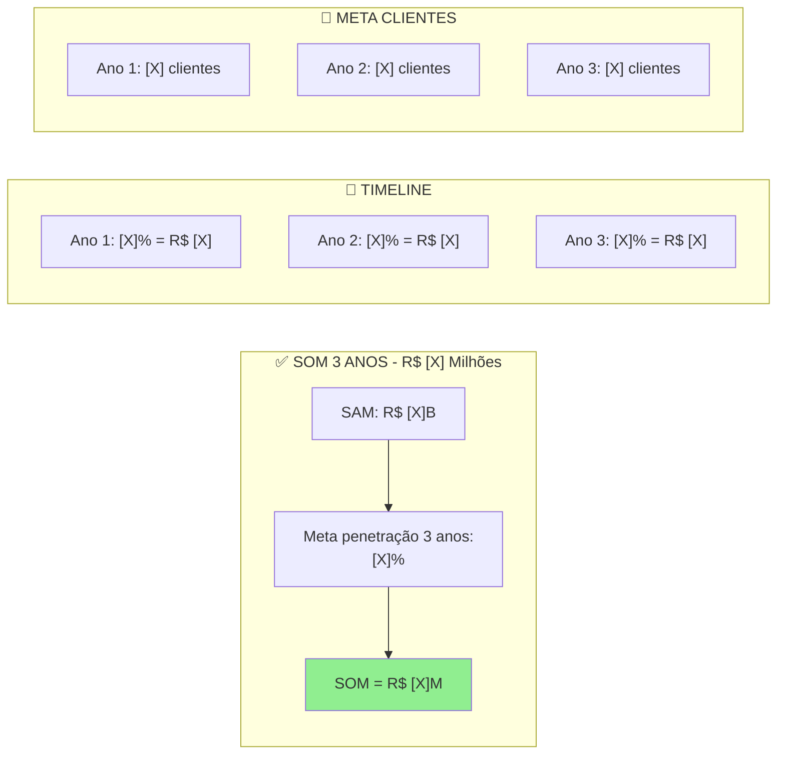

**Meta de Penetração:**
- **Ano 1:** [X]% do SAM = R$ [X]
- **Ano 2:** [X]% do SAM = R$ [X]
- **Ano 3:** [X]% do SAM = R$ [X]

**Clientes Necessários:**
- **Ano 1:** R$ [X] ÷ ARPU R$ [X] = **[X] clientes**
- **Ano 2:** **[X] clientes**
- **Ano 3:** **[X] clientes**

### 9.4 Resumo TAM/SAM/SOM

| Métrica | Valor | % do Anterior | Clientes Equiv. | Fonte |
|---------|-------|---------------|-----------------|-------|
| **TAM** | R$ [X]B | 100% | [X]M grupos | [Fonte] |
| **SAM** | R$ [X]B | [X]% TAM | [X]k grupos | [Fonte] |
| **SOM (3 anos)** | R$ [X]M | [X]% SAM | [X] grupos | Meta interna |
| **Meta Realista** | R$ [X]M | [X]% SOM | [X] grupos | Baseado em piloto |

---

<a name="10-analise-sintese"></a>
## 10. ANÁLISE E SÍNTESE DE DADOS

> [!success] **Validação de Hipóteses**
> Momento da verdade: o que aprendemos?

### 10.1 Resultado por Hipótese

```dataviewjs
const resultados = [
  {
    id: "H1",
    hipotese: "[Texto da hipótese]",
    metrica: "[Métrica definida]",
    resultado: "[Valor obtido]",
    status: "✅ VALIDADA",
    confianca: "Alta",
    evidencias: "[Entrevistas: X/Y mencionaram; Questionário: Z% nota ≥7]"
  },
  {
    id: "H2",
    hipotese: "[Texto]",
    metrica: "[Métrica]",
    resultado: "[Valor]",
    status: "❌ REFUTADA",
    confianca: "Alta",
    evidencias: "[Dados]"
  },
  {
    id: "H3",
    hipotese: "[Texto]",
    metrica: "[Métrica]",
    resultado: "[Valor]",
    status: "⚠️ INCONCLUSIVA",
    confianca: "Média",
    evidencias: "[Dados ambíguos]"
  }
];

dv.table(
  ["ID", "Hipótese", "Métrica", "Resultado", "Status", "Confiança"],
  resultados.map(r => [r.id, r.hipotese, r.metrica, r.resultado, r.status, r.confianca])
);
```

#### **H1: [Título da Hipótese]**

> [!success] **✅ VALIDADA**

**Métrica Definida:** [Ex: "≥60% avaliam dor como 7+ em escala 0-10"]

**Resultado Obtido:**
- Entrevistas: [X]/[Y] ([XX]%) mencionaram como dor crítica
- Questionário: [XX]% avaliaram como 7+ (média: [X.X]/10)
- Teste MVP: [Evidência adicional]

**Evidências:**

| Fonte | Dado | Interpretação |
|-------|------|---------------|
| Entrevistas qualitativas | [X]/[Y] citações | [Análise] |
| Questionário | [XX]% nota ≥7 | [Análise] |
| Teste MVP | [Métrica observada] | [Análise] |

**Citações Representativas:**

> "[Citação que exemplifica a validação]"
> — Entrevista E05

**Implicação para o Produto:**
> [O que isso significa para roadmap, features, positioning]

---

[Repetir para cada hipótese]

---

### 10.2 Mapa de Dores (Priorização)

```mermaid
quadrantChart
    title Matriz de Dores - Frequência vs Intensidade
    x-axis Baixa Frequência --> Alta Frequência
    y-axis Baixa Intensidade --> Alta Intensidade
    quadrant-1 Quick Wins (Resolver Já)
    quadrant-2 Inovação (Longo Prazo)
    quadrant-3 Ignorar
    quadrant-4 Table Stakes (MVP)
    [Dor A]: [0.8, 0.9]
    [Dor B]: [0.9, 0.7]
    [Dor C]: [0.3, 0.8]
    [Dor D]: [0.6, 0.4]
```

### 10.3 Priorização de Features (Baseada em Dados)

```dataviewjs
const features = [
  {
    feature: "[Feature A]",
    valor_usuario: 9, // De 1-10 baseado em pesquisa
    complexidade: 3, // De 1-10
    diferencial: "Alto",
    status: "MVP"
  },
  {
    feature: "[Feature B]",
    valor_usuario: 7,
    complexidade: 8,
    diferencial: "Médio",
    status: "Fase 2"
  },
  {
    feature: "[Feature C]",
    valor_usuario: 4,
    complexidade: 2,
    diferencial: "Baixo",
    status: "Nice-to-have"
  }
];

// Calcular score: (Valor × 2 - Complexidade) / 10
features.forEach(f => {
  f.score = ((f.valor_usuario * 2 - f.complexidade) / 10).toFixed(2);
});

// Ordenar por score
features.sort((a, b) => b.score - a.score);

dv.table(
  ["Feature", "Valor Usuário", "Complexidade", "Score", "Diferencial", "Status"],
  features.map(f => [f.feature, f.valor_usuario, f.complexidade, f.score, f.diferencial, f.status])
);
```

### 10.4 Análise de Padrões

> [!tip] **Padrões Emergentes**
> O que NÃO estava nas hipóteses mas apareceu nos dados?

**Padrão #1: [Título do Padrão]**
- **Observação:** [O que notamos]
- **Frequência:** [Quantas vezes apareceu]
- **Implicação:** [O que isso significa]
- **Ação:** [O que fazer com isso]

[Repetir para outros padrões]

---

<a name="11-modelo-negocio"></a>
## 11. MODELO DE NEGÓCIO E PRICING

> [!danger] **Baseado em DADOS, não chute**

### 11.1 Proposta de Valor Refinada

**Baseado na pesquisa, nossa proposta de valor é:**

> "[Uma frase clara que resume o valor, usando palavras reais dos entrevistados]"

**Elementos da Proposta:**
1. **Para quem:** [ICP refinado com base em persona prioritária]
2. **Que sofre com:** [Dor #1 validada nos dados]
3. **Nossa solução:** [Como resolvemos de forma única]
4. **Diferente de:** [Por que não usar concorrente/substituto]
5. **Prova:** [Métrica/resultado do piloto]

### 11.2 Estrutura de Pricing Validada

**Modelo Escolhido:** [Assinatura / Transacional / Freemium / Hybrid]

**Justificativa Baseada em Dados:**
- [XX]% preferem [modelo X]
- Willingness to Pay: mediana R$ [X]
- Benchmarks de mercado: R$ [X]-[X]
- Custo de aquisição (CAC): R$ [X]
- LTV estimado: R$ [X]

**Estrutura de Planos:**

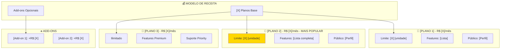

**Tabela de Planos:**

| Feature/Limite | [Plano 1]<br/>R$ [X] | [Plano 2]<br/>R$ [X] | [Plano 3]<br/>R$ [X] |
|----------------|----------------------|----------------------|----------------------|
| **[Limite principal]** | [X] | [X] | Ilimitado |
| **[Feature 1]** | ✅ | ✅ | ✅ |
| **[Feature 2]** | ❌ | ✅ | ✅ |
| **[Feature Premium]** | ❌ | ❌ | ✅ |
| **Suporte** | Email | Chat | 24/7 + Manager |
| **[Outro diferencial]** | [Valor] | [Valor] | [Valor] |

**Justificativa por Plano:**

- **[Plano 1]:** Para [perfil] que [contexto]. Validado com [X]% da amostra.
- **[Plano 2]:** Sweet spot. [XX]% dos entrevistados aceitam pagar R$ [X]-[X]. ROI claro.
- **[Plano 3]:** Para [perfil premium]. [X]% da amostra indicou disposição.

### 11.3 Unit Economics Estimados

| Métrica | Valor | Fonte/Cálculo |
|---------|-------|---------------|
| **ARPU Mensal** | R$ [X] | Média ponderada dos planos |
| **ARPU Anual** | R$ [X] | ARPU × 12 |
| **Churn Mensal Estimado** | [X]% | Benchmark do setor + piloto |
| **Lifetime (meses)** | [X] | 1 ÷ Churn |
| **LTV** | R$ [X] | ARPU × Lifetime × Gross Margin |
| **CAC Estimado** | R$ [X] | [Método de aquisição] |
| **LTV:CAC** | [X]:1 | [Status vs benchmark 3:1] |
| **Payback (meses)** | [X] | CAC ÷ (ARPU × Margin) |

**Status vs Benchmarks SaaS:**

| Métrica | Nosso Valor | Benchmark | Status |
|---------|-------------|-----------|--------|
| LTV:CAC | [X]:1 | ≥ 3:1 | ✅/⚠️/❌ |
| Payback | [X] meses | ≤ 12 meses | ✅/⚠️/❌ |
| Gross Margin | [X]% | ≥ 70% | ✅/⚠️/❌ |

---

<a name="12-riscos"></a>
## 12. RISCOS E MITIGAÇÃO

### 12.1 Matriz de Riscos

```dataviewjs
const riscos = [
  {
    id: "R-001",
    risco: "[Risco identificado na pesquisa]",
    prob: 4, // 1-5
    impact: 5, // 1-5
    mitigacao: "[Como reduzir probabilidade/impacto]",
    contingencia: "[Plano B se materializar]",
    owner: "[[Nome]]"
  },
  {
    id: "R-002",
    risco: "[Outro risco]",
    prob: 3,
    impact: 4,
    mitigacao: "[Mitigação]",
    contingencia: "[Contingência]",
    owner: "[[Nome]]"
  }
];

// Calcular severidade
riscos.forEach(r => {
  r.severidade = r.prob * r.impact;
  r.categoria = r.severidade >= 16 ? "🔴 CRÍTICO" :
                r.severidade >= 12 ? "🟡 ALTO" :
                r.severidade >= 6 ? "🟠 MÉDIO" : "🟢 BAIXO";
});

// Ordenar por severidade
riscos.sort((a, b) => b.severidade - a.severidade);

dv.table(
  ["ID", "Risco", "Categoria", "Sev", "Prob", "Impact", "Mitigação", "Owner"],
  riscos.map(r => [r.id, r.risco, r.categoria, r.severidade, r.prob, r.impact, r.mitigacao, r.owner])
);
```

---

<a name="13-veredito"></a>
## 13. VEREDITO FINAL (GO/NO-GO/PIVOT)

> [!danger] **MOMENTO DA DECISÃO**
> Baseado em dados, não opinião.

### 13.1 SWOT Analysis

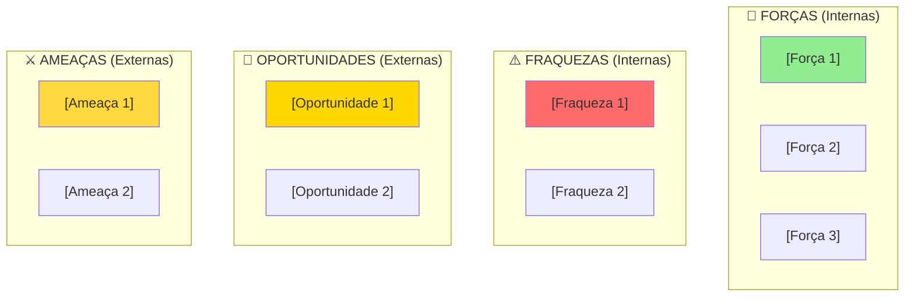

### 13.2 Critérios de Decisão

```dataviewjs
const criterios = [
  { criterio: "Problema validado", meta: "≥60% sentem dor 7+", resultado: "[XX]%", status: "✅" },
  { criterio: "Solução viável", meta: "≥50% usariam", resultado: "[XX]%", status: "✅" },
  { criterio: "Mercado suficiente", meta: "SAM ≥ R$ 100M", resultado: "R$ [X]M", status: "✅" },
  { criterio: "Pricing validado", meta: "≥40% aceitam", resultado: "[XX]%", status: "✅" },
  { criterio: "Diferencial defensável", meta: "Sim", resultado: "[Sim/Não]", status: "✅" }
];

dv.table(
  ["Critério", "Meta", "Resultado", "Status"],
  criterios.map(c => [c.criterio, c.meta, c.resultado, c.status])
);

const aprovados = criterios.filter(c => c.status === "✅").length;
const total = criterios.length;

if (aprovados === total) {
  dv.paragraph(`\n> [!success] **${aprovados}/${total} CRITÉRIOS APROVADOS** — Recomendação: **GO**`);
} else if (aprovados >= total * 0.6) {
  dv.paragraph(`\n> [!warning] **${aprovados}/${total} CRITÉRIOS APROVADOS** — Recomendação: **PIVOT**`);
} else {
  dv.paragraph(`\n> [!danger] **${aprovados}/${total} CRITÉRIOS APROVADOS** — Recomendação: **NO-GO**`);
}
```

### 13.3 Recomendação Final

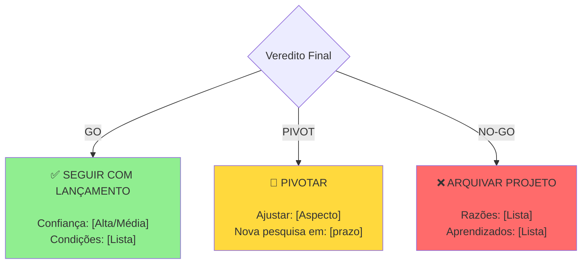

**🎯 VEREDITO: [GO / PIVOT / NO-GO]**

**Justificativa (Resumo Executivo):**

> [3-5 parágrafos explicando a decisão com base nos dados coletados.
> Citar números específicos, hipóteses validadas/refutadas, riscos identificados.]

**Condições para GO (se aplicável):**
1. [Condição 1 que precisa ser atendida]
2. [Condição 2]

**Próximo Passo Crítico:**
> [A ÚNICA coisa mais importante a fazer agora]

---

<a name="14-roadmap"></a>
## 14. ROADMAP DE IMPLEMENTAÇÃO PÓS-PESQUISA

> [!success] **De Dados para Ação**

### 14.1 Plano de Ação Imediato (Próximos 30 dias)

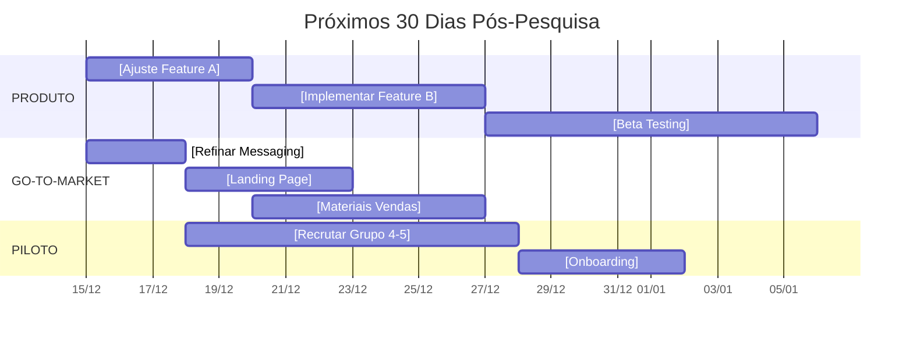

**Tasks Priorizadas:**

| # | Ação | Baseado Em | Responsável | Prazo | Status |
|---|------|------------|-------------|-------|--------|
| 1 | [Ação específica] | [Insight da pesquisa] | [[Nome]] | DD/MM | ⏳ |
| 2 | [Ação] | [Dado/Feedback] | [[Nome]] | DD/MM | ⏳ |
| 3 | [Ação] | [Hipótese validada] | [[Nome]] | DD/MM | ⏳ |

### 14.2 Roadmap de Produto (Baseado em Dados)

**Priorização:**
1. **MVP Essencial** (validado como crítico na pesquisa)
2. **Quick Wins** (alto valor, baixa complexidade)
3. **Diferenciais** (defesas competitivas)
4. **Nice-to-Have** (baixa prioridade)

---

## 📊 **ANEXOS**

### Anexo A: Transcrições Completas de Entrevistas
[Link para pasta com arquivos]

### Anexo B: Respostas Brutas do Questionário
[Link para planilha/CSV]

### Anexo C: Métricas Detalhadas do MVP
[Link para dashboard]

### Anexo D: Análise Competitiva Estendida
[Link para documento detalhado]

---

**📊 Última Atualização:** [DD/MM/YYYY HH:MM]
**👤 Responsável:** [[Nome do Responsável]]
**🎯 Status:** [Rascunho / Completa / Revisada]
**📈 Versão:** R[XX]
**🔗 Projeto Relacionado:** [[Link para Dashboard do Projeto]]

---

*Template criado em: 10/12/2025*
*Versão: R02 (Completa & Investment-Ready)*
*Autor: UzzAI Team*
*Baseado em: Lean Startup, Customer Discovery, Jobs-to-be-Done, Pesquisa de Mercado Tradicional*

---

## 🔖 **TAGS DE BUSCA**

#pesquisa-mercado #validacao #customer-discovery #tam-sam-som #competitivo #pricing #hipoteses #entrevistas #questionario #mvp #piloto #investment-ready #go-to-market #data-driven