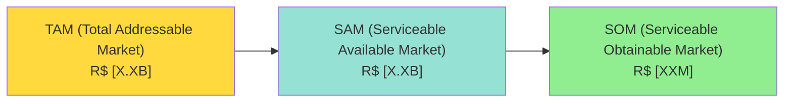
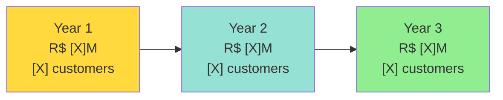
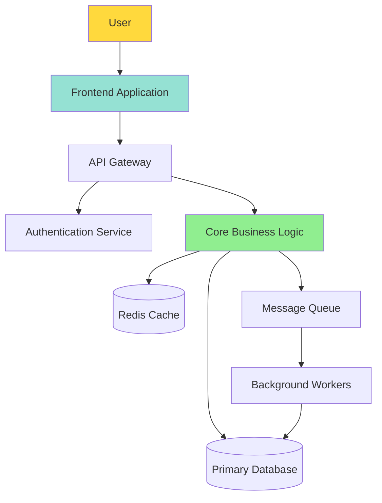
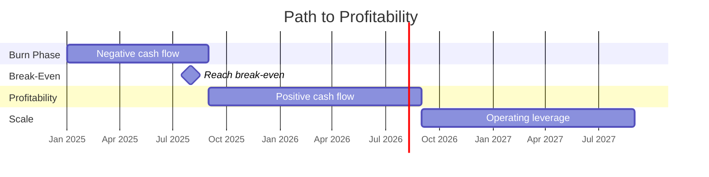
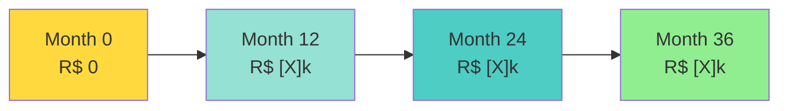
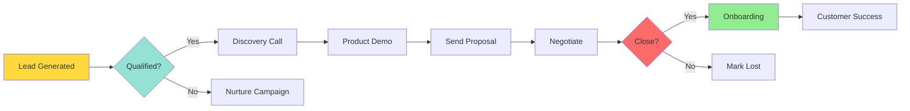
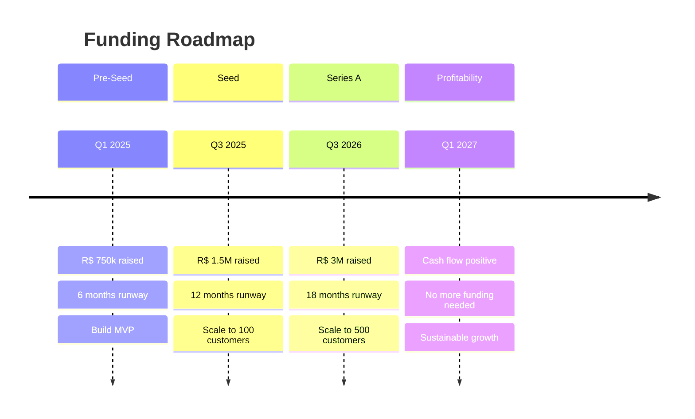

# 🚀 FUNCTIONAL BUSINESS PLAN TEMPLATE

> **Purpose:** This template provides a comprehensive framework for creating investment-ready business plans based on analysis of successful examples and industry best practices.
>
> **Usage:** Fill in each section thoroughly. Sections marked with ⭐ are critical for investment readiness. Aim for 80-120 pages total.

---

## 📋 DOCUMENT METADATA

```yaml
company_name: [Your Company Name]
project_name: [Project/Product Name]
version: [e.g., R01, R02]
date: [YYYY-MM-DD]
prepared_by: [Name and Role]
status: [Draft / Review / Final]
confidentiality: [Public / Confidential / Highly Confidential]
```

---

## 📑 TABLE OF CONTENTS

1. [Executive Summary](#1-executive-summary)
2. [Market Analysis](#2-market-analysis)
3. [Product/Service Description](#3-productservice-description)
4. [Business Model](#4-business-model)
5. [Financial Projections](#5-financial-projections)
6. [Marketing & Sales Strategy](#6-marketing--sales-strategy)
7. [Operations Plan](#7-operations-plan)
8. [Team & Organization](#8-team--organization)
9. [Risk Management](#9-risk-management)
10. [Funding Requirements](#10-funding-requirements)
11. [Appendices](#11-appendices)

---

# 1. EXECUTIVE SUMMARY

> ⭐ **CRITICAL SECTION** - Write this LAST after completing all other sections. This is what investors read first.
>
> **Target Length:** 2-3 pages
> **Audience:** Busy executives and investors
> **Tone:** Compelling, concise, confident

## 1.1 The Opportunity

### Problem Statement
**What problem are you solving?**

```
[Describe the pain point in 3-5 sentences]
- Who has this problem?
- How big is the problem?
- What are current solutions and why are they inadequate?
- What does this problem cost customers/market?
```

### Solution Overview
**How does your product/service solve this problem?**

```
[Describe your solution in 3-5 sentences]
- What is your product/service?
- How does it work (high-level)?
- Why is it better than alternatives?
- What makes it unique?
```

### Value Proposition
**Why should customers choose you?**

```
[Quantify the value in 2-3 bullet points]
- Cost savings: [X% reduction vs current solution]
- Time savings: [X hours/days saved]
- Revenue increase: [X% potential growth]
- Other measurable benefits: [Specify]
```

## 1.2 Market Opportunity

### Market Size


**TAM:** R$ [Amount] - [Definition of total market]
**SAM:** R$ [Amount] - [Your addressable segment]
**SOM:** R$ [Amount] - [Realistic 3-year capture]

### Target Customer
- **Primary Segment:** [Description]
- **Annual Revenue:** R$ [Range]
- **Company Size:** [Employee range]
- **Geographic Focus:** [Region/Country]
- **Decision Maker:** [Role/Title]

## 1.3 Business Model Summary

### Revenue Model
**Primary Revenue Streams:**

1. **[Stream Name]** - [% of revenue]
   - Pricing: R$ [Amount]/[unit]
   - Target: [Number] customers/units

2. **[Stream Name]** - [% of revenue]
   - Pricing: R$ [Amount]/[unit]
   - Target: [Number] customers/units

3. **[Stream Name]** - [% of revenue]
   - Pricing: R$ [Amount]/[unit]
   - Target: [Number] customers/units

### Unit Economics (Monthly)
| Metric | Value | Industry Benchmark |
|--------|-------|-------------------|
| **ARPU** | R$ [Amount] | R$ [Range] |
| **Gross Margin** | [X]% | [X-Y]% |
| **CAC** | R$ [Amount] | R$ [Range] |
| **LTV** | R$ [Amount] | R$ [Range] |
| **LTV:CAC** | [X]:1 | 3:1 minimum |
| **CAC Payback** | [X] months | 6-12 months |

## 1.4 Competitive Advantage

**Our Unique Differentiators:**

1. **[Differentiator 1]** - [How this creates value]
2. **[Differentiator 2]** - [How this creates value]
3. **[Differentiator 3]** - [How this creates value]

**Defensibility (Moat):**
- [ ] Technology/IP: [Describe]
- [ ] Network Effects: [Describe]
- [ ] Brand: [Describe]
- [ ] Cost Advantage: [Describe]
- [ ] Switching Costs: [Describe]

## 1.5 Financial Highlights

### 36-Month Revenue Projection


| Milestone | Year 1 | Year 2 | Year 3 |
|-----------|--------|--------|--------|
| **Revenue** | R$ [X]M | R$ [X]M | R$ [X]M |
| **Gross Profit** | R$ [X]M | R$ [X]M | R$ [X]M |
| **EBITDA** | R$ [X]M | R$ [X]M | R$ [X]M |
| **Customers** | [X] | [X] | [X] |
| **Headcount** | [X] | [X] | [X] |

### Key Assumptions
- Monthly growth rate: [X]%
- Customer churn: [X]%
- Average revenue per user: R$ [Amount]
- Customer acquisition cost: R$ [Amount]

## 1.6 Funding Requirements

### Capital Needed
**Total Funding Required:** R$ [Amount]

### Use of Proceeds
1. **Product Development** - R$ [Amount] ([X]%)
   - [Specific uses]

2. **Sales & Marketing** - R$ [Amount] ([X]%)
   - [Specific uses]

3. **Operations** - R$ [Amount] ([X]%)
   - [Specific uses]

4. **Working Capital** - R$ [Amount] ([X]%)
   - [Specific uses]

### Funding Timeline
- **Pre-seed/Seed:** R$ [Amount] by [Date] - [Milestones to achieve]
- **Series A:** R$ [Amount] by [Date] - [Milestones to achieve]
- **Series B:** R$ [Amount] by [Date] - [Milestones to achieve]

## 1.7 Team Overview

### Founding Team
**[Founder Name]** - [Title]
- Background: [1-2 sentences]
- Relevant experience: [Key achievements]

**[Founder Name]** - [Title]
- Background: [1-2 sentences]
- Relevant experience: [Key achievements]

### Key Hires Planned
- [Role]: Month [X]
- [Role]: Month [X]
- [Role]: Month [X]

### Advisory Board
- **[Advisor Name]** - [Expertise/Company]
- **[Advisor Name]** - [Expertise/Company]

## 1.8 Milestones & Traction

### Achieved to Date
- ✅ [Milestone] - [Date]
- ✅ [Milestone] - [Date]
- ✅ [Milestone] - [Date]

### Next 12 Months
- 🎯 [Milestone] - [Target Date]
- 🎯 [Milestone] - [Target Date]
- 🎯 [Milestone] - [Target Date]

---

# 2. MARKET ANALYSIS

> ⭐ **CRITICAL SECTION** - Demonstrates market opportunity and your understanding of the landscape.
>
> **Target Length:** 15-20 pages
> **Research Required:** 4-6 weeks
> **Sources:** Industry reports, competitor analysis, customer interviews

## 2.1 Industry Overview

### Industry Definition
**Industry:** [Name of industry]
**Description:** [2-3 sentences defining the industry]

### Market Size & Growth
**Current Market Size (2025):**
- Global: US$ [X]B
- Regional: R$ [X]B
- Segment: R$ [X]B

**Historical Growth (2020-2025):**
- CAGR: [X]%
- Key drivers: [List 3-5]

**Projected Growth (2025-2030):**
- CAGR: [X]%
- Expected market size 2030: R$ [X]B

### Industry Trends

**Trend 1: [Name]**
- Description: [2-3 sentences]
- Impact on your business: [Positive/Negative/Neutral]
- Timeline: [Short-term/Medium-term/Long-term]

**Trend 2: [Name]**
- Description: [2-3 sentences]
- Impact on your business: [Positive/Negative/Neutral]
- Timeline: [Short-term/Medium-term/Long-term]

**Trend 3: [Name]**
- Description: [2-3 sentences]
- Impact on your business: [Positive/Negative/Neutral]
- Timeline: [Short-term/Medium-term/Long-term]

### Market Drivers
1. **[Driver Name]** - [Impact and explanation]
2. **[Driver Name]** - [Impact and explanation]
3. **[Driver Name]** - [Impact and explanation]

### Market Challenges
1. **[Challenge Name]** - [Impact and mitigation]
2. **[Challenge Name]** - [Impact and mitigation]
3. **[Challenge Name]** - [Impact and mitigation]

## 2.2 Target Market Definition

### TAM/SAM/SOM Calculation

**Total Addressable Market (TAM):** R$ [Amount]
```
Calculation methodology:
- Universe: [Total number] of [unit type]
- × Average revenue: R$ [Amount] per [unit]
- = TAM: R$ [Amount]

Validation:
- Source 1: [Industry report] estimates [Amount]
- Source 2: [Research firm] estimates [Amount]
- Our estimate: [Amount] (conservative/middle/aggressive)
```

**Serviceable Available Market (SAM):** R$ [Amount]
```
TAM filtered by:
- Geographic focus: [Region] = [X]% of TAM
- Customer segment: [Segment] = [X]% of geographic market
- = SAM: R$ [Amount]

Validation:
- Number of potential customers: [X]
- × Average revenue potential: R$ [Amount]
- = SAM: R$ [Amount]
```

**Serviceable Obtainable Market (SOM):** R$ [Amount]
```
Realistic market share achievable in 3 years:
- SAM: R$ [Amount]
- × Realistic penetration: [X]%
- = SOM: R$ [Amount]

Supporting factors:
- Number of customers achievable: [X]
- × ARPU: R$ [Amount]
- = SOM: R$ [Amount]

Market share: [X]% of SAM
```

### Geographic Market Focus

**Primary Markets (Year 1):**
- **[Region/City]** - [% of TAM] - [Entry Date]
  - Market size: R$ [Amount]
  - Rationale: [Why this market first]

**Secondary Markets (Year 2):**
- **[Region/City]** - [% of TAM] - [Entry Date]
  - Market size: R$ [Amount]
  - Rationale: [Why this market second]

**Future Expansion (Year 3+):**
- **[Region/Country]** - [% of TAM] - [Entry Date]
  - Market size: R$ [Amount]
  - Rationale: [Why this market later]

## 2.3 Customer Segmentation

### Primary Customer Segment (1)

**Segment Name:** [Name]
**% of Revenue:** [X]%

#### Demographics
- Company size: [X-X] employees
- Annual revenue: R$ [X-X]
- Industry: [Specific industries]
- Geographic location: [Regions]
- Age of company: [X-X] years

#### Firmographics
- Decision maker: [Role/Title]
- Budget authority: [Who controls budget]
- Buying process: [How they purchase]
- Average deal size: R$ [Amount]
- Sales cycle: [X] days/months

#### Psychographics
- Pain points:
  1. [Pain point 1]
  2. [Pain point 2]
  3. [Pain point 3]

- Goals and motivations:
  1. [Goal 1]
  2. [Goal 2]
  3. [Goal 3]

- Buying triggers:
  1. [Trigger 1]
  2. [Trigger 2]
  3. [Trigger 3]

#### Persona Example: [Name]
- **Role:** [Job title]
- **Age:** [Range]
- **Background:** [1-2 sentences]
- **Daily challenges:** [List 3-5]
- **Success metrics:** [What they're measured on]
- **Quote:** "[A representative quote about their pain]"

#### Market Size for This Segment
- Total addressable: [X] companies
- Reachable: [X] companies
- Target acquisition: [X] companies in Year 1
- Potential revenue: R$ [Amount]

---

### Secondary Customer Segment (2)

**Segment Name:** [Name]
**% of Revenue:** [X]%

[Repeat structure from Primary Segment]

---

### Additional Segments (3-5)

[Repeat structure for each additional segment]

---

## 2.4 Competitive Analysis

> **Goal:** Analyze minimum 20 competitors across different categories. Best-in-class plans analyze 50+.

### Competitive Landscape Overview

**Total Competitors Analyzed:** [Number]

**Competitive Categories:**
1. **Direct Competitors** - [X] companies - [Same problem, same solution]
2. **Indirect Competitors** - [X] companies - [Same problem, different solution]
3. **Potential Competitors** - [X] companies - [Could enter market]
4. **Substitute Products** - [X] companies - [Different approach to problem]

### Competitive Positioning Matrix

```mermaid
quadrantChart
    title Market Positioning - Price vs Features
    x-axis Low Price --> High Price
    y-axis Few Features --> Many Features
    quadrant-1 Over-Serving
    quadrant-2 Premium
    quadrant-3 Basic/Budget
    quadrant-4 Sweet Spot
    Your Company: [0.X, 0.X]
    Competitor A: [0.X, 0.X]
    Competitor B: [0.X, 0.X]
    Competitor C: [0.X, 0.X]
    Competitor D: [0.X, 0.X]
```

### Top Competitors Deep Dive

#### Competitor 1: [Name]

**Overview:**
- Founded: [Year]
- Headquarters: [Location]
- Funding: [Amount raised]
- Employees: [Number]
- Customers: [Estimated number]
- Revenue: [Estimated amount]

**Product/Service:**
- Description: [2-3 sentences]
- Key features: [List 5-7]
- Technology: [Tech stack/approach]
- Integrations: [Key integrations]

**Pricing:**
- Entry tier: R$ [Amount]/[period]
- Mid tier: R$ [Amount]/[period]
- Enterprise: [Contact/Custom]
- Average deal: R$ [Amount]

**Go-to-Market:**
- Primary channels: [List]
- Sales model: [Self-serve/Inside/Field]
- Marketing strategy: [Approach]
- Geographic focus: [Regions]

**Strengths:**
1. [Strength 1]
2. [Strength 2]
3. [Strength 3]

**Weaknesses:**
1. [Weakness 1]
2. [Weakness 2]
3. [Weakness 3]

**Market Share:** [Estimated %]

**Our Advantage vs. This Competitor:**
1. [Specific advantage 1]
2. [Specific advantage 2]
3. [Specific advantage 3]

---

#### Competitor 2-10: [Repeat structure]

[Complete detailed analysis for top 10 competitors]

---

### Competitive Comparison Matrix

| Feature/Attribute | Your Company | Comp A | Comp B | Comp C | Comp D |
|------------------|--------------|--------|--------|--------|--------|
| **Pricing (Entry)** | R$ [X] | R$ [X] | R$ [X] | R$ [X] | R$ [X] |
| **Feature 1** | ✅ | ✅ | ❌ | ✅ | ❌ |
| **Feature 2** | ✅ | ❌ | ✅ | ✅ | ✅ |
| **Feature 3** | ✅ | ❌ | ❌ | ✅ | ❌ |
| **Implementation Time** | [X] days | [X] days | [X] days | [X] days | [X] days |
| **Customer Support** | [Level] | [Level] | [Level] | [Level] | [Level] |
| **Market Share** | [X]% | [X]% | [X]% | [X]% | [X]% |
| **Overall Rating** | ⭐⭐⭐⭐⭐ | ⭐⭐⭐⭐ | ⭐⭐⭐ | ⭐⭐⭐⭐ | ⭐⭐⭐ |

### Competitive Advantages Summary

**Price Advantage:**
- We are [X]% cheaper than [Competitor]
- We are [X]% more expensive than [Competitor] but offer [value]
- Sweet spot pricing: [Positioning]

**Product Advantage:**
- Unique features: [List]
- Better user experience: [How]
- Superior technology: [Specific advantages]

**Market Advantage:**
- Better market fit: [Segment-specific advantages]
- Geographic advantage: [Local presence, language, etc.]
- Faster implementation: [X]x faster

**Brand Advantage:**
- [If applicable - customer testimonials, awards, recognition]

## 2.5 SWOT Analysis

### Strengths (Internal, Positive)
1. **[Strength 1]**
   - Impact: [High/Medium/Low]
   - Sustainability: [How long this advantage lasts]

2. **[Strength 2]**
   - Impact: [High/Medium/Low]
   - Sustainability: [How long this advantage lasts]

3. **[Strength 3]**
   - Impact: [High/Medium/Low]
   - Sustainability: [How long this advantage lasts]

### Weaknesses (Internal, Negative)
1. **[Weakness 1]**
   - Impact: [High/Medium/Low]
   - Mitigation plan: [How you'll address]
   - Timeline: [When you'll fix]

2. **[Weakness 2]**
   - Impact: [High/Medium/Low]
   - Mitigation plan: [How you'll address]
   - Timeline: [When you'll fix]

3. **[Weakness 3]**
   - Impact: [High/Medium/Low]
   - Mitigation plan: [How you'll address]
   - Timeline: [When you'll fix]

### Opportunities (External, Positive)
1. **[Opportunity 1]**
   - Probability: [High/Medium/Low]
   - Timeframe: [When this opportunity emerges]
   - Strategy: [How you'll capitalize]

2. **[Opportunity 2]**
   - Probability: [High/Medium/Low]
   - Timeframe: [When this opportunity emerges]
   - Strategy: [How you'll capitalize]

3. **[Opportunity 3]**
   - Probability: [High/Medium/Low]
   - Timeframe: [When this opportunity emerges]
   - Strategy: [How you'll capitalize]

### Threats (External, Negative)
1. **[Threat 1]**
   - Probability: [High/Medium/Low]
   - Impact: [High/Medium/Low]
   - Mitigation: [How you'll defend]

2. **[Threat 2]**
   - Probability: [High/Medium/Low]
   - Impact: [High/Medium/Low]
   - Mitigation: [How you'll defend]

3. **[Threat 3]**
   - Probability: [High/Medium/Low]
   - Impact: [High/Medium/Low]
   - Mitigation: [How you'll defend]

---

# 3. PRODUCT/SERVICE DESCRIPTION

> **Target Length:** 10-15 pages
> **Focus:** What you're building, how it works, why it's better

## 3.1 Product Overview

### Product Vision
**Vision Statement:**
> [One compelling sentence describing your long-term vision]

**Mission Statement:**
> [One sentence describing what you do today to realize that vision]

### Value Proposition

**For:** [Target customer]
**Who:** [Customer pain point]
**Our product is:** [Product category]
**That:** [Key benefit]
**Unlike:** [Primary alternative]
**Our product:** [Key differentiator]

### Product Description
[3-5 paragraphs describing your product/service in detail]

- What it is
- How it works (high-level)
- Who it's for
- What problems it solves
- What outcomes it delivers

## 3.2 Key Features & Benefits

### Feature 1: [Name]

**Description:** [What this feature does - 2-3 sentences]

**User Benefit:** [How this helps the customer]

**Competitive Advantage:** [Why this is better than alternatives]

**Technical Implementation:** [High-level technical approach]

**Development Status:**
- [ ] Planned
- [ ] In Development
- [ ] Beta
- [ ] Generally Available

**Priority:** [Critical / High / Medium / Low]

---

### Feature 2-10: [Repeat structure]

[List and describe all major features - aim for 10-15 key features]

---

## 3.3 Product Roadmap

### Current Version (v[X.X])
**Release Date:** [Date]
**Features:**
- ✅ [Feature 1]
- ✅ [Feature 2]
- ✅ [Feature 3]

### Next Release (v[X.X])
**Target Date:** [Date]
**Features:**
- 🔄 [Feature 1] - [Status %]
- 🔄 [Feature 2] - [Status %]
- 🔄 [Feature 3] - [Status %]

### 6-Month Roadmap
**Quarter [X] 20XX:**
- [ ] [Feature/Initiative 1]
- [ ] [Feature/Initiative 2]
- [ ] [Feature/Initiative 3]

**Quarter [X] 20XX:**
- [ ] [Feature/Initiative 1]
- [ ] [Feature/Initiative 2]
- [ ] [Feature/Initiative 3]

### 12-Month Vision
**Year-End Goals:**
1. [Major milestone 1]
2. [Major milestone 2]
3. [Major milestone 3]

### Long-Term Vision (2-3 Years)
**Future Capabilities:**
1. [Future feature/capability 1]
2. [Future feature/capability 2]
3. [Future feature/capability 3]

## 3.4 Technology Architecture

### Technology Stack

**Frontend:**
- Framework: [e.g., React, Vue, Angular]
- Language: [e.g., TypeScript]
- State Management: [e.g., Redux, Zustand]
- UI Library: [e.g., Material-UI, Tailwind]

**Backend:**
- Framework: [e.g., Node.js, Django, Rails]
- Language: [e.g., Python, JavaScript]
- API Style: [REST, GraphQL, gRPC]
- Authentication: [JWT, OAuth, etc.]

**Database:**
- Primary: [PostgreSQL, MongoDB, etc.]
- Cache: [Redis, Memcached]
- Search: [Elasticsearch, Algolia]

**Infrastructure:**
- Hosting: [AWS, Google Cloud, Azure]
- CI/CD: [GitHub Actions, CircleCI]
- Monitoring: [Datadog, New Relic]
- CDN: [Cloudflare, AWS CloudFront]

**Third-Party Services:**
- [Service 1]: [Purpose]
- [Service 2]: [Purpose]
- [Service 3]: [Purpose]

### Architecture Diagram



### Scalability Strategy

**Current Capacity:**
- Users supported: [X]
- Requests/second: [X]
- Data storage: [X] GB/TB
- Uptime: [X]%

**Scaling Approach:**
- **Horizontal scaling:** [How you scale out]
- **Vertical scaling:** [How you scale up]
- **Database scaling:** [Sharding, replication strategy]
- **Caching strategy:** [What you cache, invalidation]

**Projected Capacity (Year 3):**
- Users supported: [X]
- Requests/second: [X]
- Data storage: [X] TB
- Target uptime: 99.9%+

## 3.5 Intellectual Property

### Patents
- [ ] Filed: [Number] patents
  - [Patent 1]: [Title] - [Status]
  - [Patent 2]: [Title] - [Status]

- [ ] Planned: [Number] patent applications
  - [Area 1]: [Description]
  - [Area 2]: [Description]

### Trademarks
- [ ] Registered: [Trademark names]
- [ ] Pending: [Trademark names]

### Trade Secrets
- Proprietary algorithms: [Description without revealing secrets]
- Unique processes: [Description]
- Data/insights: [Description]

### Open Source
- Components used: [List with licenses]
- Contributions made: [If any]
- Strategy: [How you manage open source]

## 3.6 Product Development

### Development Methodology
**Approach:** [Agile/Scrum/Kanban/etc.]

**Sprint Cycle:** [X] weeks

**Team Structure:**
- Product Manager: [Name/To hire]
- Tech Lead: [Name/To hire]
- Developers: [Number]
- Designers: [Number]
- QA: [Number]

### Quality Assurance

**Testing Strategy:**
- Unit tests: [Coverage target: X%]
- Integration tests: [Coverage target: X%]
- E2E tests: [Coverage target: X%]
- Manual QA: [Process]

**Performance Benchmarks:**
- Page load: < [X] seconds
- API response: < [X] ms
- Uptime SLA: [X]%

**Security Measures:**
- Penetration testing: [Frequency]
- Code review: [Process]
- Dependency scanning: [Tool]
- Compliance: [Standards followed]

### Development Metrics

**Current Status:**
- Code commits/month: [X]
- Features shipped/quarter: [X]
- Bug resolution time: [X] days
- Technical debt ratio: [X]%

**Targets:**
- Velocity increase: [X]% per quarter
- Bug density: < [X] per 1000 lines
- Code coverage: > [X]%

---

# 4. BUSINESS MODEL

> ⭐ **CRITICAL SECTION** - How you make money and create value.
>
> **Target Length:** 8-12 pages
> **Focus:** Revenue streams, pricing, unit economics

## 4.1 Business Model Canvas

### Key Partners
**Who are your key partners?**
1. [Partner Type 1]
   - Partners: [List specific partners or categories]
   - Value: [What they provide]
   - Criticality: [High/Medium/Low]

2. [Partner Type 2]
   - Partners: [List specific partners or categories]
   - Value: [What they provide]
   - Criticality: [High/Medium/Low]

### Key Activities
**What key activities does your value proposition require?**
1. [Activity 1] - [Description]
2. [Activity 2] - [Description]
3. [Activity 3] - [Description]

### Key Resources
**What key resources does your value proposition require?**
1. **Physical:** [Data centers, offices, equipment]
2. **Intellectual:** [Patents, code, brand]
3. **Human:** [Expert team members]
4. **Financial:** [Capital requirements]

### Value Propositions
**What value do you deliver to customers?**
1. [Value Prop 1] - [Target segment]
2. [Value Prop 2] - [Target segment]
3. [Value Prop 3] - [Target segment]

### Customer Relationships
**How do you get, keep, and grow customers?**
- **Acquisition:** [How you acquire]
- **Retention:** [How you retain]
- **Expansion:** [How you grow accounts]

### Channels
**How do you reach and deliver to customers?**
1. [Channel 1]: [Direct/Indirect] - [% of customers]
2. [Channel 2]: [Direct/Indirect] - [% of customers]
3. [Channel 3]: [Direct/Indirect] - [% of customers]

### Customer Segments
**Who are your most important customers?**
1. [Segment 1] - [% of revenue]
2. [Segment 2] - [% of revenue]
3. [Segment 3] - [% of revenue]

### Cost Structure
**What are your most important costs?**
1. [Cost Category 1]: R$ [Amount]/month ([X]% of revenue)
2. [Cost Category 2]: R$ [Amount]/month ([X]% of revenue)
3. [Cost Category 3]: R$ [Amount]/month ([X]% of revenue)

### Revenue Streams
**What do customers pay for?**
1. [Revenue Stream 1]: R$ [Amount]/month ([X]% of total)
2. [Revenue Stream 2]: R$ [Amount]/month ([X]% of total)
3. [Revenue Stream 3]: R$ [Amount]/month ([X]% of total)

## 4.2 Revenue Model

### Revenue Stream 1: [Name]

**Description:** [What customers are paying for]

**Pricing Model:** [Subscription / Usage-based / Transaction / License / etc.]

**Pricing Tiers:**

#### Tier 1: [Name] - R$ [Amount]/[period]
**Target Customer:** [Description]

**Features Included:**
- [ ] [Feature 1]
- [ ] [Feature 2]
- [ ] [Feature 3]
- [ ] [Feature 4]
- [ ] [Feature 5]

**Usage Limits:**
- [Limit 1]: [Amount]
- [Limit 2]: [Amount]
- [Limit 3]: [Amount]

**Target Customers:** [X] customers
**Projected Revenue:** R$ [Amount]/month

---

#### Tier 2: [Name] - R$ [Amount]/[period]
[Repeat structure]

#### Tier 3: [Name] - R$ [Amount]/[period]
[Repeat structure]

---

**Overage/Add-ons:**
- [Add-on 1]: R$ [Amount] per [unit]
- [Add-on 2]: R$ [Amount] per [unit]
- [Add-on 3]: R$ [Amount] per [unit]

**Annual Discount:** [X]% for annual prepayment

**Revenue Projection:**
- Year 1: R$ [Amount] ([X]% of total revenue)
- Year 2: R$ [Amount] ([X]% of total revenue)
- Year 3: R$ [Amount] ([X]% of total revenue)

---

### Revenue Stream 2-6: [Repeat structure]

[Detail each revenue stream]

---

## 4.3 Pricing Strategy

### Pricing Philosophy
[Explain your pricing approach - value-based, cost-plus, competitive, etc.]

### Pricing Factors
1. **Customer Value:** [How you quantify value delivered]
2. **Competitive Position:** [How you price vs competitors]
3. **Cost Structure:** [How costs influence pricing]
4. **Market Willingness to Pay:** [What market research shows]

### Pricing Elasticity
**Price Sensitivity:**
- [Segment 1]: [High/Medium/Low] - [Can adjust ±X%]
- [Segment 2]: [High/Medium/Low] - [Can adjust ±X%]
- [Segment 3]: [High/Medium/Low] - [Can adjust ±X%]

### Discounting Strategy
**When We Discount:**
- Annual prepayment: [X]% discount
- Volume purchases: [X]% at [threshold]
- Early customers: [X]% for first [number]
- Strategic partnerships: [X]% for [type]

**When We Don't Discount:**
- [Situation 1]
- [Situation 2]
- [Situation 3]

### Future Pricing Evolution
**Year 1:** [Current pricing strategy]
**Year 2:** [Planned adjustments]
**Year 3:** [Long-term pricing vision]

## 4.4 Unit Economics

### Customer Acquisition Cost (CAC)

**By Channel:**

| Channel | Cost/Month | Customers Acquired | CAC |
|---------|-----------|-------------------|-----|
| **SEO/Content** | R$ [X] | [X] | R$ [X] |
| **Paid Search** | R$ [X] | [X] | R$ [X] |
| **Social Media** | R$ [X] | [X] | R$ [X] |
| **Partnerships** | R$ [X] | [X] | R$ [X] |
| **Direct Sales** | R$ [X] | [X] | R$ [X] |
| **Events** | R$ [X] | [X] | R$ [X] |
| **Referrals** | R$ [X] | [X] | R$ [X] |
| **BLENDED** | **R$ [X]** | **[X]** | **R$ [X]** |

**CAC Breakdown:**
- Sales & marketing expenses: R$ [X]/month
- Sales team salaries: R$ [X]/month
- Marketing team salaries: R$ [X]/month
- Tools and software: R$ [X]/month
- **Total S&M:** R$ [X]/month
- **New customers:** [X]/month
- **Blended CAC:** R$ [X]

### Lifetime Value (LTV)

**Calculation:**

| Component | Value |
|-----------|-------|
| **ARPU (Monthly)** | R$ [X] |
| **Gross Margin** | [X]% |
| **Monthly Churn** | [X]% |
| **Average Lifetime** | [X] months |
| **LTV** | R$ [X] |

**Formula:** LTV = ARPU × Gross Margin ÷ Churn Rate

**Example:**
- ARPU: R$ 400/month
- Gross Margin: 80%
- Monthly Churn: 5%
- LTV = R$ 400 × 0.80 ÷ 0.05 = R$ 6,400

### Key Metrics Summary

| Metric | Current | Year 1 Target | Year 3 Target | Industry Benchmark |
|--------|---------|---------------|---------------|-------------------|
| **ARPU** | R$ [X] | R$ [X] | R$ [X] | R$ [X-X] |
| **Gross Margin** | [X]% | [X]% | [X]% | [X-X]% |
| **CAC** | R$ [X] | R$ [X] | R$ [X] | R$ [X-X] |
| **LTV** | R$ [X] | R$ [X] | R$ [X] | R$ [X-X] |
| **LTV:CAC** | [X]:1 | [X]:1 | [X]:1 | 3:1+ |
| **CAC Payback** | [X] mo | [X] mo | [X] mo | 6-12 mo |
| **Monthly Churn** | [X]% | [X]% | [X]% | [X-X]% |
| **Net Revenue Retention** | [X]% | [X]% | [X]% | 100%+ |

### Sensitivity Analysis

**Impact of 10% Change in Key Variables:**

| Variable | Impact on LTV | Impact on Profitability |
|----------|--------------|------------------------|
| **ARPU +10%** | +[X]% | +[X]% |
| **Churn -10%** | +[X]% | +[X]% |
| **Gross Margin +10%** | +[X]% | +[X]% |
| **CAC -10%** | No change | +[X]% |

## 4.5 Path to Profitability

### Break-Even Analysis

**Monthly Break-Even:**
- Fixed costs: R$ [X]/month
- Variable cost per customer: R$ [X]
- Revenue per customer: R$ [X]
- Contribution margin per customer: R$ [X]
- **Break-even customers:** [X] customers

**Timeline to Break-Even:**
- Current monthly burn: R$ [X]
- Customers today: [X]
- Monthly customer adds: [X]
- **Projected break-even: Month [X]**

### Profitability Timeline



---

# 5. FINANCIAL PROJECTIONS

> ⭐ **CRITICAL SECTION** - Your financial model is the foundation of your plan.
>
> **Target Length:** 15-20 pages
> **Time Horizon:** 36 months minimum
> **Detail Level:** Monthly for Year 1, Quarterly for Years 2-3

## 5.1 Financial Model Overview

### Key Assumptions

**Revenue Assumptions:**
- Initial customers: [X]
- Monthly growth rate:
  - Months 1-12: [X]%
  - Months 13-24: [X]%
  - Months 25-36: [X]%
- Average revenue per user (ARPU): R$ [X]/month
- Plan distribution:
  - [Plan 1]: [X]% of customers
  - [Plan 2]: [X]% of customers
  - [Plan 3]: [X]% of customers
- Churn rate: [X]% per month

**Cost Assumptions:**
- Gross margin: [X]%
- CAC: R$ [X] per customer
- Customer success cost: R$ [X] per customer/year
- Infrastructure cost per customer: R$ [X]/month
- Headcount growth: [Plan by quarter]

**Capital Assumptions:**
- Initial funding: R$ [X]
- Future funding rounds:
  - Round 1: R$ [X] in Month [X]
  - Round 2: R$ [X] in Month [X]
- Cash reserve target: [X] months of runway

## 5.2 Revenue Projections

### 36-Month Revenue Model

#### Year 1 (Monthly Detail)

| Month | New Customers | Total Customers | Churn | MRR | ARR |
|-------|--------------|----------------|-------|-----|-----|
| **1** | [X] | [X] | [X] | R$ [X] | R$ [X] |
| **2** | [X] | [X] | [X] | R$ [X] | R$ [X] |
| **3** | [X] | [X] | [X] | R$ [X] | R$ [X] |
| **4** | [X] | [X] | [X] | R$ [X] | R$ [X] |
| **5** | [X] | [X] | [X] | R$ [X] | R$ [X] |
| **6** | [X] | [X] | [X] | R$ [X] | R$ [X] |
| **7** | [X] | [X] | [X] | R$ [X] | R$ [X] |
| **8** | [X] | [X] | [X] | R$ [X] | R$ [X] |
| **9** | [X] | [X] | [X] | R$ [X] | R$ [X] |
| **10** | [X] | [X] | [X] | R$ [X] | R$ [X] |
| **11** | [X] | [X] | [X] | R$ [X] | R$ [X] |
| **12** | [X] | [X] | [X] | R$ [X] | R$ [X] |
| **Total Y1** | **[X]** | **[X]** | **[X]** | **R$ [X]** | **R$ [X]** |

#### Year 2-3 (Quarterly Detail)

| Quarter | New Customers | Total Customers | MRR | Cumulative ARR |
|---------|--------------|----------------|-----|----------------|
| **Q1 Y2** | [X] | [X] | R$ [X] | R$ [X] |
| **Q2 Y2** | [X] | [X] | R$ [X] | R$ [X] |
| **Q3 Y2** | [X] | [X] | R$ [X] | R$ [X] |
| **Q4 Y2** | [X] | [X] | R$ [X] | R$ [X] |
| **Q1 Y3** | [X] | [X] | R$ [X] | R$ [X] |
| **Q2 Y3** | [X] | [X] | R$ [X] | R$ [X] |
| **Q3 Y3** | [X] | [X] | R$ [X] | R$ [X] |
| **Q4 Y3** | [X] | [X] | R$ [X] | R$ [X] |

### Revenue Growth Visualization



## 5.3 Income Statement (P&L)

### Year 1 - Quarterly

| Line Item | Q1 | Q2 | Q3 | Q4 | Total Y1 |
|-----------|----|----|----|----|----------|
| **REVENUE** |  |  |  |  |  |
| Subscription Revenue | R$ [X] | R$ [X] | R$ [X] | R$ [X] | R$ [X] |
| Professional Services | R$ [X] | R$ [X] | R$ [X] | R$ [X] | R$ [X] |
| Other Revenue | R$ [X] | R$ [X] | R$ [X] | R$ [X] | R$ [X] |
| **TOTAL REVENUE** | **R$ [X]** | **R$ [X]** | **R$ [X]** | **R$ [X]** | **R$ [X]** |
|  |  |  |  |  |  |
| **COST OF REVENUE** |  |  |  |  |  |
| Infrastructure | R$ [X] | R$ [X] | R$ [X] | R$ [X] | R$ [X] |
| Third-party Services | R$ [X] | R$ [X] | R$ [X] | R$ [X] | R$ [X] |
| Customer Success | R$ [X] | R$ [X] | R$ [X] | R$ [X] | R$ [X] |
| **TOTAL COR** | **R$ [X]** | **R$ [X]** | **R$ [X]** | **R$ [X]** | **R$ [X]** |
|  |  |  |  |  |  |
| **GROSS PROFIT** | **R$ [X]** | **R$ [X]** | **R$ [X]** | **R$ [X]** | **R$ [X]** |
| **Gross Margin %** | **[X]%** | **[X]%** | **[X]%** | **[X]%** | **[X]%** |
|  |  |  |  |  |  |
| **OPERATING EXPENSES** |  |  |  |  |  |
| Sales & Marketing | R$ [X] | R$ [X] | R$ [X] | R$ [X] | R$ [X] |
| Research & Development | R$ [X] | R$ [X] | R$ [X] | R$ [X] | R$ [X] |
| General & Administrative | R$ [X] | R$ [X] | R$ [X] | R$ [X] | R$ [X] |
| **TOTAL OPEX** | **R$ [X]** | **R$ [X]** | **R$ [X]** | **R$ [X]** | **R$ [X]** |
|  |  |  |  |  |  |
| **EBITDA** | **R$ [X]** | **R$ [X]** | **R$ [X]** | **R$ [X]** | **R$ [X]** |
| **EBITDA Margin %** | **[X]%** | **[X]%** | **[X]%** | **[X]%** | **[X]%** |

### Year 2-3 Summary

| Line Item | Year 2 | Year 3 |
|-----------|--------|--------|
| **Total Revenue** | R$ [X]M | R$ [X]M |
| **Gross Profit** | R$ [X]M | R$ [X]M |
| **Gross Margin %** | [X]% | [X]% |
| **EBITDA** | R$ [X]M | R$ [X]M |
| **EBITDA Margin %** | [X]% | [X]% |

## 5.4 Cash Flow Statement

### Year 1 - Quarterly

| Line Item | Q1 | Q2 | Q3 | Q4 | Total Y1 |
|-----------|----|----|----|----|----------|
| **OPERATING ACTIVITIES** |  |  |  |  |  |
| Net Income | R$ [X] | R$ [X] | R$ [X] | R$ [X] | R$ [X] |
| Adjustments |  |  |  |  |  |
| Depreciation | R$ [X] | R$ [X] | R$ [X] | R$ [X] | R$ [X] |
| Changes in Working Capital | R$ [X] | R$ [X] | R$ [X] | R$ [X] | R$ [X] |
| **Cash from Operations** | **R$ [X]** | **R$ [X]** | **R$ [X]** | **R$ [X]** | **R$ [X]** |
|  |  |  |  |  |  |
| **INVESTING ACTIVITIES** |  |  |  |  |  |
| CapEx | R$ [X] | R$ [X] | R$ [X] | R$ [X] | R$ [X] |
| **Cash from Investing** | **R$ [X]** | **R$ [X]** | **R$ [X]** | **R$ [X]** | **R$ [X]** |
|  |  |  |  |  |  |
| **FINANCING ACTIVITIES** |  |  |  |  |  |
| Equity Raised | R$ [X] | R$ [X] | R$ [X] | R$ [X] | R$ [X] |
| Debt Issued | R$ [X] | R$ [X] | R$ [X] | R$ [X] | R$ [X] |
| **Cash from Financing** | **R$ [X]** | **R$ [X]** | **R$ [X]** | **R$ [X]** | **R$ [X]** |
|  |  |  |  |  |  |
| **NET CHANGE IN CASH** | **R$ [X]** | **R$ [X]** | **R$ [X]** | **R$ [X]** | **R$ [X]** |
| **Beginning Cash** | **R$ [X]** | **R$ [X]** | **R$ [X]** | **R$ [X]** | **R$ [X]** |
| **Ending Cash** | **R$ [X]** | **R$ [X]** | **R$ [X]** | **R$ [X]** | **R$ [X]** |
|  |  |  |  |  |  |
| **Runway (Months)** | **[X]** | **[X]** | **[X]** | **[X]** | **[X]** |

## 5.5 Scenario Analysis

### Three Scenarios

#### Best Case Scenario (+20% Growth)

**Key Assumptions:**
- Monthly growth: [X+4]%
- Churn: [X-2]%
- ARPU: R$ [X × 1.1]
- CAC: R$ [X × 0.9]

**Outcomes:**
- Month 12 MRR: R$ [X × 1.5]
- Month 24 MRR: R$ [X × 2.0]
- Month 36 MRR: R$ [X × 2.5]
- Break-even: Month [X-2]

#### Base Case Scenario (Current Plan)

**Key Assumptions:**
- Monthly growth: [X]%
- Churn: [X]%
- ARPU: R$ [X]
- CAC: R$ [X]

**Outcomes:**
- Month 12 MRR: R$ [X]
- Month 24 MRR: R$ [X]
- Month 36 MRR: R$ [X]
- Break-even: Month [X]

#### Worst Case Scenario (-20% Growth)

**Key Assumptions:**
- Monthly growth: [X-4]%
- Churn: [X+2]%
- ARPU: R$ [X × 0.9]
- CAC: R$ [X × 1.1]

**Outcomes:**
- Month 12 MRR: R$ [X × 0.6]
- Month 24 MRR: R$ [X × 0.5]
- Month 36 MRR: R$ [X × 0.4]
- Break-even: Month [X+6]

### Scenario Comparison

| Metric | Best Case | Base Case | Worst Case |
|--------|-----------|-----------|------------|
| **Month 12 MRR** | R$ [X] | R$ [X] | R$ [X] |
| **Month 36 MRR** | R$ [X] | R$ [X] | R$ [X] |
| **Break-Even Month** | [X] | [X] | [X] |
| **Total Funding Needed** | R$ [X] | R$ [X] | R$ [X] |
| **3-Year Revenue** | R$ [X]M | R$ [X]M | R$ [X]M |

---

# 6. MARKETING & SALES STRATEGY

> **Target Length:** 12-15 pages
> **Focus:** How you acquire, retain, and grow customers

## 6.1 Go-to-Market Strategy

### Market Entry Approach

**Phase 1: Initial Market Entry (Months 1-6)**
- **Focus:** [Specific niche/segment]
- **Strategy:** [Land and expand / Direct sales / Product-led / etc.]
- **Target:** [X] customers
- **Investment:** R$ [X]

**Phase 2: Market Expansion (Months 7-12)**
- **Focus:** [Broader segment]
- **Strategy:** [Approach]
- **Target:** [X] total customers
- **Investment:** R$ [X]

**Phase 3: Scale (Months 13-24)**
- **Focus:** [Multiple segments]
- **Strategy:** [Approach]
- **Target:** [X] total customers
- **Investment:** R$ [X]

### Customer Acquisition Channels

#### Channel 1: [Name] - [X]% of customers

**Description:** [What this channel is]

**Target Audience:** [Who you reach]

**Tactics:**
1. [Specific tactic 1]
2. [Specific tactic 2]
3. [Specific tactic 3]

**Investment:** R$ [Amount]/month

**Expected Results:**
- Monthly visitors/leads: [X]
- Conversion rate: [X]%
- Monthly customers: [X]
- CAC: R$ [X]
- Payback period: [X] months

**Timeline:**
- Setup: Months [X-X]
- Ramp: Months [X-X]
- Optimize: Months [X-X]
- Scale: Months [X+]

**Success Metrics:**
- [Metric 1]: [Target]
- [Metric 2]: [Target]
- [Metric 3]: [Target]

---

#### Channel 2-7: [Repeat structure]

[Complete for each acquisition channel]

---

### Channel Mix Evolution

| Channel | Months 1-6 | Months 7-12 | Months 13-24 | Months 25-36 |
|---------|------------|-------------|--------------|--------------|
| **SEO/Content** | [X]% | [X]% | [X]% | [X]% |
| **Paid Search** | [X]% | [X]% | [X]% | [X]% |
| **Social Media** | [X]% | [X]% | [X]% | [X]% |
| **Partnerships** | [X]% | [X]% | [X]% | [X]% |
| **Direct Sales** | [X]% | [X]% | [X]% | [X]% |
| **Events** | [X]% | [X]% | [X]% | [X]% |
| **Referrals** | [X]% | [X]% | [X]% | [X]% |

## 6.2 Sales Strategy

### Sales Process



### Sales Methodology

**Qualification Framework: BANT**
- **Budget:** [Minimum budget: R$ [X]/month]
- **Authority:** [Decision maker or strong influencer]
- **Need:** [Specific pain point we solve]
- **Timeline:** [Looking to implement within [X] months]

**Scoring:**
- 4/4: Priority High - Demo within 24h
- 3/4: Priority Medium - Demo within week
- 2/4: Nurture for 30 days
- 1/4: Disqualify

### Sales Team Structure

**Year 1:**
- Sales reps: [X]
- Sales engineers: [X]
- Sales ops: [X]
- Quota per rep: R$ [X]/month

**Year 2:**
- Sales reps: [X]
- Sales engineers: [X]
- Sales ops: [X]
- Quota per rep: R$ [X]/month

**Year 3:**
- Sales reps: [X]
- Sales engineers: [X]
- Sales ops: [X]
- Sales leadership: [X]
- Quota per rep: R$ [X]/month

### Sales Compensation

**Sales Rep:**
- Base salary: R$ [X]/month
- Commission: [X]% of bookings
- OTE (On-target earnings): R$ [X]/month
- Accelerators: [X]% above quota

**Sales Engineer:**
- Base salary: R$ [X]/month
- Bonus: [X]% on team quota achievement

### Sales Metrics

| Metric | Target | Current |
|--------|--------|---------|
| **Lead Response Time** | < 5 min | [X] min |
| **Demo-to-Opp Rate** | [X]% | [X]% |
| **Opp-to-Close Rate** | [X]% | [X]% |
| **Average Deal Size** | R$ [X] | R$ [X] |
| **Sales Cycle** | [X] days | [X] days |
| **Quota Attainment** | [X]% | [X]% |

## 6.3 Marketing Strategy

### Marketing Mix

**Content Marketing ([X]% of budget)**
- Blog posts: [X] per week
- Case studies: [X] per month
- Whitepapers: [X] per quarter
- Webinars: [X] per month

**Paid Advertising ([X]% of budget)**
- Google Ads: R$ [X]/month
- LinkedIn Ads: R$ [X]/month
- Facebook/Instagram: R$ [X]/month
- Retargeting: R$ [X]/month

**Social Media ([X]% of budget)**
- LinkedIn (organic): [X] posts/week
- Twitter/X: [X] posts/week
- YouTube: [X] videos/month

**Email Marketing ([X]% of budget)**
- Newsletter: [X] sends/month
- Drip campaigns: [X] active sequences
- Event invitations: [X] per quarter

**Events ([X]% of budget)**
- Industry conferences: [X] per year
- Hosted webinars: [X] per month
- Virtual events: [X] per quarter
- Trade shows: [X] per year

### Marketing Budget

| Category | Year 1 | Year 2 | Year 3 |
|----------|--------|--------|--------|
| **Content Creation** | R$ [X] | R$ [X] | R$ [X] |
| **Paid Advertising** | R$ [X] | R$ [X] | R$ [X] |
| **Events** | R$ [X] | R$ [X] | R$ [X] |
| **Tools & Software** | R$ [X] | R$ [X] | R$ [X] |
| **Team Salaries** | R$ [X] | R$ [X] | R$ [X] |
| **TOTAL** | **R$ [X]** | **R$ [X]** | **R$ [X]** |
| **% of Revenue** | **[X]%** | **[X]%** | **[X]%** |

### Marketing Team

**Year 1:**
- Marketing manager: [X]
- Content marketer: [X]
- Paid ads specialist: [X]
- Designer: [X]

**Year 2-3:**
[Planned hires]

## 6.4 Customer Success

### Onboarding Process

**Days 1-7: First Week**
- Day 1: Welcome email + account setup
- Day 2: Onboarding call scheduled
- Day 3: Kickoff call (30 min)
- Day 5: First value achieved
- Day 7: Check-in call

**Days 8-30: First Month**
- Weekly check-ins
- Training sessions
- Feature enablement
- Success plan created

**Days 31-90: Adoption Phase**
- Bi-weekly check-ins
- Usage monitoring
- Best practices shared
- Quarterly business review scheduled

### Customer Success Metrics

| Metric | Target |
|--------|--------|
| **Time to First Value** | < [X] days |
| **Onboarding Completion** | [X]% |
| **Feature Adoption** | [X]% of features used |
| **Customer Health Score** | > [X]/100 |
| **NPS** | > [X] |
| **Churn Rate** | < [X]% |
| **Net Revenue Retention** | > [X]% |

### Customer Success Team

**Year 1:**
- CS Manager: [X]
- CS Reps: [X]
- Ratio: 1 CSM per [X] customers

**Year 2-3:**
[Scale plan]

---

# 7. OPERATIONS PLAN

> **Target Length:** 10-12 pages
> **Focus:** How you run the business day-to-day

## 7.1 Organizational Structure

### Current Organization Chart

```mermaid
graph TB
    CEO[CEO/Founder]
    CTO[CTO/Co-Founder]

    CEO --> VP_Sales[VP Sales]
    CEO --> VP_Marketing[VP Marketing]
    CEO --> CFO[CFO - Fractional]

    CTO --> VP_Eng[VP Engineering]
    CTO --> VP_Prod[VP Product]

    VP_Sales --> Sales_Team[Sales Team<br/>[X] reps]
    VP_Marketing --> Marketing_Team[Marketing Team<br/>[X] people]
    VP_Eng --> Dev_Team[Development Team<br/>[X] engineers]
    VP_Prod --> PM_Team[Product Team<br/>[X] PMs]

    CEO --> CS_Lead[CS Lead]
    CS_Lead --> CS_Team[CS Team<br/>[X] CSMs]

    style CEO fill:#FFD700
    style CTO fill:#FFD700
```

### Organization Evolution

**Months 1-6 ([X] people):**
- Founders: [X]
- Engineers: [X]
- Customer Success: [X]

**Months 7-12 ([X] people):**
- Add: Marketing Manager
- Add: [X] Engineers
- Add: [X] CS Reps
- Add: Sales Rep

**Year 2 ([X] people):**
[Detailed plan]

**Year 3 ([X] people):**
[Detailed plan]

## 7.2 Hiring Plan

### Key Hires by Quarter

#### Q1 Year 1
**Role: [Title]**
- **Start Date:** Month [X]
- **Department:** [Department]
- **Reports To:** [Role]
- **Salary:** R$ [X]/month
- **Equity:** [X]%
- **Key Responsibilities:**
  1. [Responsibility 1]
  2. [Responsibility 2]
  3. [Responsibility 3]
- **Must-Have Skills:**
  - [Skill 1]
  - [Skill 2]
  - [Skill 3]
- **Nice-to-Have:**
  - [Skill 1]
  - [Skill 2]

---

[Repeat for each key hire across all quarters]

---

### Hiring Budget

| Quarter | Headcount | New Hires | Payroll | Recruiting Costs | Total |
|---------|-----------|-----------|---------|-----------------|-------|
| **Q1 Y1** | [X] | [X] | R$ [X] | R$ [X] | R$ [X] |
| **Q2 Y1** | [X] | [X] | R$ [X] | R$ [X] | R$ [X] |
| **Q3 Y1** | [X] | [X] | R$ [X] | R$ [X] | R$ [X] |
| **Q4 Y1** | [X] | [X] | R$ [X] | R$ [X] | R$ [X] |

## 7.3 Key Processes

### Product Development Process

**Sprint Cycle:** [X] weeks

**Workflow:**
1. Product planning (quarterly)
2. Sprint planning (bi-weekly)
3. Development (2 weeks)
4. QA and testing (3 days)
5. Deploy to production (Friday)
6. Retrospective (Monday)

**Tools:**
- Project management: [Tool name]
- Code repository: [Tool name]
- CI/CD: [Tool name]
- Communication: [Tool name]

### Customer Onboarding Process

[Detailed step-by-step process]

### Support Process

**Support Tiers:**
- Tier 1: [Response time] - [Handles what]
- Tier 2: [Response time] - [Handles what]
- Tier 3: [Response time] - [Handles what]

**Support Channels:**
- Email: [support@company.com]
- Chat: [Hours of operation]
- Phone: [For enterprise customers]

**SLA Commitments:**
- Starter: Response within [X] hours
- Professional: Response within [X] hours
- Enterprise: Response within [X] hour, [X]% uptime

## 7.4 Technology & Infrastructure

### Current Infrastructure

**Hosting:**
- Provider: [AWS/GCP/Azure]
- Regions: [List]
- Environment strategy: [Dev/Staging/Production]

**Key Services:**
- Compute: [Service name]
- Database: [Service name]
- Storage: [Service name]
- CDN: [Service name]
- Monitoring: [Service name]

**Cost Structure:**
- Current monthly cost: R$ [X]
- Cost per customer: R$ [X]
- Projected cost at [X] customers: R$ [X]

### Security & Compliance

**Security Measures:**
- [ ] Data encryption at rest
- [ ] Data encryption in transit
- [ ] Regular security audits
- [ ] Penetration testing ([Frequency])
- [ ] Bug bounty program
- [ ] SOC 2 Type II compliance
- [ ] ISO 27001 certification

**Data Protection:**
- LGPD compliance: [Status]
- Data residency: [Where data is stored]
- Backup strategy: [Frequency and retention]
- Disaster recovery: [RTO and RPO]

### Scalability Plan

**Current Capacity:**
- Users: [X]
- Transactions/second: [X]
- Data storage: [X] TB
- Uptime: [X]%

**Scaling Triggers:**
- Scale at [X]% capacity
- Add infrastructure when [metric] reaches [threshold]

**Cost Projections:**
- 1K customers: R$ [X]/month
- 10K customers: R$ [X]/month
- 100K customers: R$ [X]/month

## 7.5 Vendor & Partner Management

### Key Vendors

| Vendor | Service | Monthly Cost | Contract Terms | Criticality |
|--------|---------|--------------|----------------|-------------|
| [Vendor 1] | [Service] | R$ [X] | [Terms] | [High/Med/Low] |
| [Vendor 2] | [Service] | R$ [X] | [Terms] | [High/Med/Low] |
| [Vendor 3] | [Service] | R$ [X] | [Terms] | [High/Med/Low] |

### Strategic Partners

**Partner 1: [Name]**
- **Type:** [Technology/Channel/Strategic]
- **Agreement:** [Description]
- **Value:** [What they provide]
- **Revenue Impact:** [Expected contribution]

---

# 8. TEAM & ORGANIZATION

> **Target Length:** 6-8 pages
> **Focus:** Why your team can execute this plan

## 8.1 Founding Team

### Founder 1: [Name]

**Title:** [CEO/CTO/etc.]

**Background:**
[2-3 paragraphs about education, work history, relevant experience]

**Relevant Achievements:**
- [Achievement 1]
- [Achievement 2]
- [Achievement 3]

**Why This Venture:**
[Personal motivation for starting this company]

**Equity:** [X]%
**Vesting:** [4 years, 1-year cliff, etc.]

---

### Founder 2-N: [Repeat structure]

---

## 8.2 Key Team Members

[For any non-founder key hires already made]

**[Name] - [Title]**
- Background: [Brief bio]
- Key skills: [List]
- Responsibilities: [List]

## 8.3 Advisory Board

### Advisor 1: [Name]

**Expertise:** [Area of expertise]

**Background:**
- Current role: [Company and position]
- Previous: [Relevant experience]
- Notable: [Major achievements]

**Value to Company:**
[What specific value they bring - connections, expertise, credibility]

**Compensation:** [X]% equity / [Advisory fee]

---

### Advisor 2-4: [Repeat structure]

---

## 8.4 Board of Directors

**Current Board:**
1. [Founder Name] - [Role]
2. [Investor Name] - [Firm]
3. [Independent Director] - [Background]

**Board Meeting Frequency:** [Monthly/Quarterly]

**Board Committees:**
- Audit Committee: [Members]
- Compensation Committee: [Members]

## 8.5 Company Culture

### Core Values

1. **[Value 1]**
   - What it means: [Description]
   - How we live it: [Examples]

2. **[Value 2]**
   - What it means: [Description]
   - How we live it: [Examples]

3. **[Value 3]**
   - What it means: [Description]
   - How we live it: [Examples]

### Work Environment

**Office Policy:** [Remote-first/Hybrid/Office-based]

**Benefits:**
- Health insurance: [Coverage details]
- Equity compensation: [Option pool details]
- Learning budget: R$ [X]/year
- Equipment: [What's provided]
- Time off: [Vacation policy]

**Professional Development:**
- Conference budget: R$ [X]/year
- Training programs: [What's offered]
- Career growth: [Promotion framework]

---

# 9. RISK MANAGEMENT

> ⭐ **CRITICAL SECTION** - Investors want to see you've thought through what could go wrong.
>
> **Target Length:** 8-10 pages
> **Focus:** Identify, assess, and mitigate risks

## 9.1 Risk Assessment Framework

### Risk Scoring

**Probability Scale:**
1. Rare (< 10%)
2. Unlikely (10-30%)
3. Possible (30-50%)
4. Likely (50-70%)
5. Almost Certain (> 70%)

**Impact Scale:**
1. Negligible
2. Minor
3. Moderate
4. Major
5. Catastrophic

**Risk Severity:** Probability × Impact

**Priority:**
- CRITICAL: Severity ≥ 20
- HIGH: Severity 12-19
- MEDIUM: Severity 6-11
- LOW: Severity < 6

## 9.2 Risk Register

### CRITICAL RISKS (Severity ≥ 20)

#### Risk 001: [Risk Name]

**Category:** [Market/Technology/Financial/Operational/Legal]

**Description:**
[Detailed description of the risk - what could go wrong]

**Probability:** [1-5]
**Impact:** [1-5]
**Severity:** [X]

**Potential Consequences:**
1. [Consequence 1]
2. [Consequence 2]
3. [Consequence 3]

**Mitigation Strategy:**
1. **Prevention:** [How you'll prevent this risk]
2. **Detection:** [How you'll know if it's happening]
3. **Response:** [What you'll do if it happens]

**Contingency Plan:**
[Detailed backup plan if risk materializes]

**Owner:** [Role responsible]

**Review Frequency:** [Weekly/Monthly/Quarterly]

**Status:** [Active monitoring/Mitigated/Closed]

---

[Repeat for each critical risk - aim for 5-10 critical risks]

---

### HIGH RISKS (Severity 12-19)

[Same structure, list 10-15 high risks]

### MEDIUM RISKS (Severity 6-11)

[Same structure, list as needed]

## 9.3 Risk Categories

### Market Risks

1. **Market Size Smaller Than Expected**
   - Risk: TAM is [X]% smaller
   - Impact: Revenue [X]% lower
   - Mitigation: [Strategy]

2. **Longer Sales Cycles**
   - Risk: [X] months vs [X] expected
   - Impact: Revenue delayed [X] months
   - Mitigation: [Strategy]

3. **Price Sensitivity**
   - Risk: Market willing to pay [X]% less
   - Impact: Revenue [X]% lower OR market share loss
   - Mitigation: [Strategy]

### Competitive Risks

1. **Major Competitor Price Cut**
   - Risk: [Competitor] cuts price [X]%
   - Impact: [X]% customer loss
   - Mitigation: [Strategy]

2. **New Well-Funded Entrant**
   - Risk: [Competitor] raises [Amount] and enters market
   - Impact: [Impact on market share]
   - Mitigation: [Strategy]

3. **Feature Parity**
   - Risk: Competitors copy key features
   - Impact: Differentiation weakened
   - Mitigation: [Strategy]

### Technology Risks

1. **Platform Dependency**
   - Risk: [Platform] changes API/pricing/terms
   - Impact: Business model threatened
   - Mitigation: [Strategy]

2. **Security Breach**
   - Risk: Customer data compromised
   - Impact: [Financial and reputational damage]
   - Mitigation: [Strategy]

3. **Technical Debt**
   - Risk: Code quality degrades
   - Impact: Development velocity [X]% slower
   - Mitigation: [Strategy]

### Financial Risks

1. **Unable to Raise Next Round**
   - Risk: Cannot secure Series [X]
   - Impact: Runway expires
   - Mitigation: [Strategy - revenue focus, bridge round, etc.]

2. **Customer Churn Higher Than Expected**
   - Risk: Churn [X]% vs [X]% expected
   - Impact: LTV [X]% lower, need more capital
   - Mitigation: [Strategy]

3. **CAC Higher Than Expected**
   - Risk: CAC R$ [X] vs R$ [X] expected
   - Impact: Unit economics break, need more capital
   - Mitigation: [Strategy]

### Operational Risks

1. **Key Person Loss**
   - Risk: Founder/key employee leaves
   - Impact: [Specific impact]
   - Mitigation: [Vesting, documentation, succession]

2. **Cannot Hire Fast Enough**
   - Risk: [X] month delay in hiring
   - Impact: Product/revenue delayed
   - Mitigation: [Strategy]

3. **Vendor Failure**
   - Risk: Critical vendor goes down/out of business
   - Impact: [Service disruption]
   - Mitigation: [Redundancy, backup vendors]

### Legal & Regulatory Risks

1. **Regulatory Change**
   - Risk: [New regulation] impacts business
   - Impact: [Compliance costs, model change]
   - Mitigation: [Monitoring, lobbying, adaptation]

2. **IP Infringement**
   - Risk: Accused of patent infringement
   - Impact: Legal costs, potential damages
   - Mitigation: [IP audit, insurance, design-around]

3. **LGPD Non-Compliance**
   - Risk: Violation of data protection laws
   - Impact: Fines up to 2% of revenue, reputation
   - Mitigation: [Compliance program, DPO, audits]

## 9.4 Business Continuity Plan

### Disaster Recovery

**Critical Systems:**
1. [System 1]: RTO [X] hours, RPO [X] hours
2. [System 2]: RTO [X] hours, RPO [X] hours
3. [System 3]: RTO [X] hours, RPO [X] hours

**Backup Strategy:**
- Frequency: [Hourly/Daily/Weekly]
- Retention: [X] days
- Location: [Geographic redundancy]
- Testing: [Monthly/Quarterly]

**Incident Response:**
1. Detection: [How incidents are detected]
2. Notification: [Who's notified, how quickly]
3. Response: [Team activated, procedures followed]
4. Recovery: [Steps to restore service]
5. Post-mortem: [Learning and improvement]

### Key Person Risk

**Mitigation:**
- Documentation: All critical knowledge documented
- Cross-training: Multiple people can perform critical tasks
- Succession planning: Backup identified for key roles
- Insurance: Key person life insurance on founders

### Financial Reserves

**Cash Reserve Policy:**
- Minimum runway: [X] months
- Current runway: [X] months
- Trigger for cost reduction: [X] months remaining

**Cost Reduction Plan:**
If runway < [X] months:
1. [Action 1]
2. [Action 2]
3. [Action 3]

---

# 10. FUNDING REQUIREMENTS

> ⭐ **CRITICAL SECTION** - Tell investors exactly what you need and why.
>
> **Target Length:** 5-8 pages
> **Focus:** Capital needs, use of proceeds, return projections

## 10.1 Current Funding Round

### Round Details

**Round Type:** [Pre-seed/Seed/Series A/etc.]

**Amount Raising:** R$ [X] - R$ [X]

**Pre-Money Valuation:** R$ [X]

**Dilution:** [X]% of company

**Minimum Investment:** R$ [X]

**Investor Type:** [Angel/VC/Strategic/etc.]

**Timeline:** [Start date] - [Target close date]

**Lead Investor:** [Name if committed, or "seeking"]

### Use of Proceeds

**Total Funding:** R$ [Amount]


#### Product Development - R$ [Amount] ([X]%)

**Engineering Team:**
- [X] Senior Engineers @ R$ [X]/mo × [X] months = R$ [X]
- [X] Junior Engineers @ R$ [X]/mo × [X] months = R$ [X]
- [X] Product Managers @ R$ [X]/mo × [X] months = R$ [X]
- **Subtotal:** R$ [X]

**Infrastructure:**
- Cloud hosting @ R$ [X]/mo × [X] months = R$ [X]
- Development tools: R$ [X]
- **Subtotal:** R$ [X]

**TOTAL PRODUCT:** R$ [X]

---

#### Sales & Marketing - R$ [Amount] ([X]%)

**Team:**
- [X] Sales reps @ R$ [X]/mo × [X] months = R$ [X]
- [X] Marketing managers @ R$ [X]/mo × [X] months = R$ [X]
- [X] Customer success @ R$ [X]/mo × [X] months = R$ [X]
- **Subtotal:** R$ [X]

**Marketing Programs:**
- Paid advertising: R$ [X]
- Content creation: R$ [X]
- Events: R$ [X]
- Tools & software: R$ [X]
- **Subtotal:** R$ [X]

**TOTAL SALES & MARKETING:** R$ [X]

---

#### Operations & Admin - R$ [Amount] ([X]%)

- Legal & compliance: R$ [X]
- Accounting: R$ [X]
- HR: R$ [X]
- Office/facilities: R$ [X]
- Insurance: R$ [X]
- **TOTAL OPERATIONS:** R$ [X]

---

#### Working Capital - R$ [Amount] ([X]%)

- Cash reserve: [X] months burn
- **TOTAL WORKING CAPITAL:** R$ [X]

---

## 10.2 Capital Roadmap

### Funding Timeline



### Funding History & Projections

| Round | Date | Amount | Valuation | Use | Status |
|-------|------|--------|-----------|-----|--------|
| **Founders** | [Date] | R$ [X] | R$ [X] | Initial development | Complete |
| **Pre-seed** | [Date] | R$ [X] | R$ [X] | MVP + first customers | [In progress] |
| **Seed** | [Date] | R$ [X] | R$ [X] | Scale to $1M ARR | Planned |
| **Series A** | [Date] | R$ [X] | R$ [X] | Scale to $5M ARR | Planned |

### Cumulative Dilution

| Round | Amount Raised | Dilution | Founders' Ownership |
|-------|--------------|----------|-------------------|
| **Start** | R$ 0 | 0% | 100% |
| **Pre-seed** | R$ [X] | [X]% | [X]% |
| **Seed** | R$ [X] | [X]% | [X]% |
| **Series A** | R$ [X] | [X]% | [X]% |
| **Total** | **R$ [X]** | **[X]%** | **[X]%** |

## 10.3 Investor Return Projections

### Exit Scenarios

#### Base Case Exit

**Timing:** Year 5
**Exit Multiple:** [X]x revenue
**Projected Revenue:** R$ [X]M
**Exit Valuation:** R$ [X]M

**Investor Returns:**

| Round | Investment | Ownership | Exit Value | Multiple |
|-------|-----------|-----------|------------|----------|
| **Pre-seed** | R$ [X] | [X]% | R$ [X] | [X]x |
| **Seed** | R$ [X] | [X]% | R$ [X] | [X]x |
| **Series A** | R$ [X] | [X]% | R$ [X] | [X]x |

**IRR (Internal Rate of Return):**
- Pre-seed: [X]%
- Seed: [X]%
- Series A: [X]%

#### Best Case Exit

[Same structure with optimistic assumptions]

#### IPO Scenario

[If applicable - projections for public offering]

### Comparable Exits

**Recent Exits in Our Space:**

| Company | Exit Year | Exit Type | Revenue | Valuation | Multiple |
|---------|-----------|-----------|---------|-----------|----------|
| [Company 1] | [Year] | [Acquisition/IPO] | $[X]M | $[X]M | [X]x |
| [Company 2] | [Year] | [Acquisition/IPO] | $[X]M | $[X]M | [X]x |
| [Company 3] | [Year] | [Acquisition/IPO] | $[X]M | $[X]M | [X]x |

**Industry Average Exit Multiple:** [X]x revenue

## 10.4 Current Investors

[If you have existing investors]

**[Investor Name]** - [Firm]
- Investment: R$ [X]
- Round: [Pre-seed/Seed]
- Board seat: [Yes/No]

---

# 11. APPENDICES

> **Target Length:** Variable
> **Purpose:** Supporting documents and detailed data

## 11.1 Appendix A: Detailed Financial Model

[Link to Excel file or include detailed spreadsheets]

**Includes:**
- Monthly P&L for 36 months
- Monthly cash flow for 36 months
- Balance sheet projections
- Detailed hiring plan with salaries
- Marketing budget by channel
- Customer cohort analysis
- Unit economics calculator

## 11.2 Appendix B: Market Research Data

**Industry Reports:**
- [Report name] - [Source] - [Date]
- [Report name] - [Source] - [Date]

**Customer Interviews:**
- Summary of [X] customer interviews
- Key pain points identified
- Willingness to pay data

**Competitor Research:**
- Detailed profiles of [X] competitors
- Pricing comparison matrix
- Feature comparison matrix

## 11.3 Appendix C: Product Screenshots & Demos

[Include or link to:]
- Product screenshots
- Demo videos
- User flow diagrams
- Technical architecture diagrams

## 11.4 Appendix D: Customer Testimonials

[If available - quotes from beta customers, LOIs, etc.]

## 11.5 Appendix E: Team Bios

[Detailed resumes of key team members]

## 11.6 Appendix F: Legal Documents

- Articles of incorporation
- Shareholder agreement
- Patent applications (if any)
- Key vendor contracts

## 11.7 Appendix G: Press & Recognition

- Media coverage
- Awards
- Speaking engagements
- Industry recognition

---

# DOCUMENT CHECKLIST

Before finalizing your business plan, ensure you have:

## Completeness

- [ ] All sections filled in (no "[TBD]" or placeholders)
- [ ] All financial models complete and validated
- [ ] All assumptions documented and justified
- [ ] All charts and graphs properly labeled
- [ ] All sources cited where appropriate

## Quality

- [ ] Executive summary compelling and concise (2-3 pages)
- [ ] Market size validated through multiple sources
- [ ] Competitive analysis includes 20+ competitors
- [ ] Financial projections cover 36 months
- [ ] Scenario analysis completed (best/base/worst)
- [ ] Unit economics clearly explained
- [ ] All major risks identified and mitigated
- [ ] Professional formatting throughout

## Investment Readiness

- [ ] Clear value proposition
- [ ] Defensible competitive advantages
- [ ] Realistic financial projections
- [ ] Strong team credentials
- [ ] Comprehensive risk management
- [ ] Clear funding ask with use of proceeds
- [ ] Investor return projections included

## Supporting Materials

- [ ] Pitch deck created (15-20 slides)
- [ ] Executive summary (1-2 pages)
- [ ] Financial model (Excel)
- [ ] Product demo ready
- [ ] Customer testimonials/LOIs (if available)

---

**Document Prepared By:** [Name]
**Date:** [YYYY-MM-DD]
**Version:** [X.X]
**Next Review:** [Date]

---

> **Remember:** A business plan is a living document. Review and update quarterly as you learn more about your market and refine your strategy.
