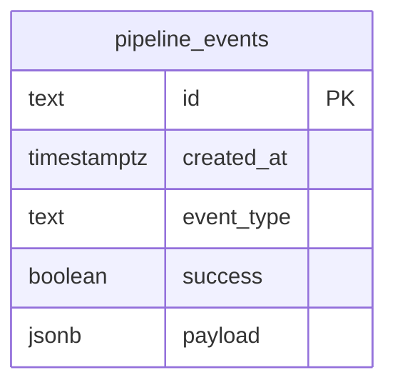

# 08 — Schema do Banco de Dados

**Checkpoint:** 2026-04-13
**Projeto:** Transcritor (Uzz.Ai — Ferramentas)
**Banco:** Neon PostgreSQL (serverless)
**ORM:** Drizzle ORM 0.38.3

---

## Evidências

- **Schema:** `web/db/schema.ts`
- **Configuração Drizzle:** `web/drizzle.config.ts`
- **Conexão:** `web/lib/db.ts`

---

## Configuração da Conexão

**Evidência:** `web/lib/db.ts`

```typescript
import { neon } from "@neondatabase/serverless";
import { drizzle } from "drizzle-orm/neon-http";

const sql = neon(process.env.DATABASE_URL!);
export const db = drizzle(sql);
```

- **Adapter:** HTTP (não WebSocket) — adequado para serverless/edge
- **Sem pool de conexões** — cada request cria nova conexão HTTP ao Neon
- **DATABASE_URL:** Variável de ambiente obrigatória

---

## Tabelas

### Tabela: `pipeline_events`

**Evidência:** `web/db/schema.ts`

```typescript
import { pgTable, text, timestamp, boolean, jsonb } from "drizzle-orm/pg-core";

export const pipelineEvents = pgTable("pipeline_events", {
  id: text("id").primaryKey(),
  createdAt: timestamp("created_at", { withTimezone: true }).defaultNow().notNull(),
  eventType: text("event_type").notNull(),
  success: boolean("success"),
  payload: jsonb("payload").$type<Record<string, unknown>>(),
});
```

**Colunas:**

| Coluna | Tipo SQL | Nullable | Default | Constraint | Descrição |
|--------|----------|----------|---------|------------|-----------|
| `id` | `TEXT` | NO | — | PRIMARY KEY | ID do evento (string, provavelmente UUID ou hash) |
| `created_at` | `TIMESTAMPTZ` | NO | `NOW()` | NOT NULL | Timestamp com timezone |
| `event_type` | `TEXT` | NO | — | NOT NULL | Tipo do evento (ex: `nova_reuniao`, `email_audio`) |
| `success` | `BOOLEAN` | YES | NULL | — | Se o pipeline foi bem-sucedido |
| `payload` | `JSONB` | YES | NULL | — | Dados arbitrários do evento (PipelineState, etc.) |

**Índices:**
- PRIMARY KEY: `id`
- **Sem índices adicionais** — NÃO ENCONTRADO nenhum índice definido

**Foreign Keys:**
- Nenhuma

**Constraints adicionais:**
- Nenhuma além de NOT NULL em `id`, `created_at`, `event_type`

---

## Diagrama ERD



---

## Análise do JSONB `payload`

O campo `payload` é tipado como `Record<string, unknown>` no Drizzle, o que significa que não há schema enforcement no banco para ele.

Com base nos contratos Python (`ata_agent/contracts.py` e `ata_multiagent_pipeline/contracts.py`), o payload esperado provavelmente contém:

```json
{
  "tipo_evento": "email_audio | nova_reuniao",
  "arquivo_fonte": "path/to/audio.mp3",
  "projeto": "Nome do Projeto",
  "sprint": "Sprint-2025-W10",
  "participantes": ["Nome1", "Nome2"],
  "decisoes": ["Decisão 1", "Decisão 2"],
  "acoes": ["Ação 1"],
  "kaizens": ["Melhoria 1"],
  "riscos": ["Risco 1"],
  "status_validacao": "ok | failed:razao | skipped_duplicate",
  "transcricao_bruta": "...",
  "ata_markdown_final": "...",
  "ata_resumo_executivo": "...",
  "destinatarios": ["email@example.com"],
  "delivery_success": true,
  "delivery_error": ""
}
```

> **INFERÊNCIA** — estrutura baseada em `ata_agent/contracts.py:PipelineState`. O payload real pode variar.

---

## Configuração Drizzle

**Evidência:** `web/drizzle.config.ts`

```typescript
export default {
  dialect: "postgresql",
  schema: "./db/schema.ts",
  // migrations dir: padrão (drizzle/)
  dbCredentials: {
    url: process.env.DATABASE_URL!,
  },
};
```

---

## Análise de Riscos do Schema

| Risco | Severidade | Descrição |
|-------|-----------|-----------|
| Sem índice em `created_at` | Médio | Consultas por data ficarão lentas com volume |
| Sem índice em `event_type` | Médio | Filtros por tipo não usam índice |
| `id` como TEXT (não UUID nativo) | Baixo | Funciona, mas UUID nativo seria mais eficiente |
| Sem paginação na query de `page.tsx` | Alto | `SELECT * FROM pipeline_events` sem LIMIT |
| `payload` sem schema enforcement | Baixo | Flexível mas sem garantia de estrutura |
| Sem partitioning por data | Baixo (agora) | Pode ser necessário no futuro com volume |

---

## Migrations Existentes

**Status:** NÃO ENCONTRADA pasta `drizzle/migrations/` no repositório.

Isso indica que o schema foi criado via `npm run db:push` (push direto sem migration files) ou que as migrations não foram commitadas.

> **Recomendação:** Usar `npm run db:generate` para criar migration files versionados antes do próximo `db:push`.

---

## Perguntas em Aberto

1. **INSERT ausente:** Nenhum módulo Python tem referência ao `DATABASE_URL`. Como os dados chegam ao `pipeline_events`? Implementação pendente?
2. **`id` do evento:** Qual é o formato do `id`? UUID gerado pelo Python? Hash do message_id do IMAP?
3. **Migrations não versionadas:** O schema foi aplicado via `db:push` sem histórico? Isso é intencional para este estágio?
4. **Índices necessários:** Com crescimento, considerar `idx_pipeline_events_created_at` e `idx_pipeline_events_event_type`.
