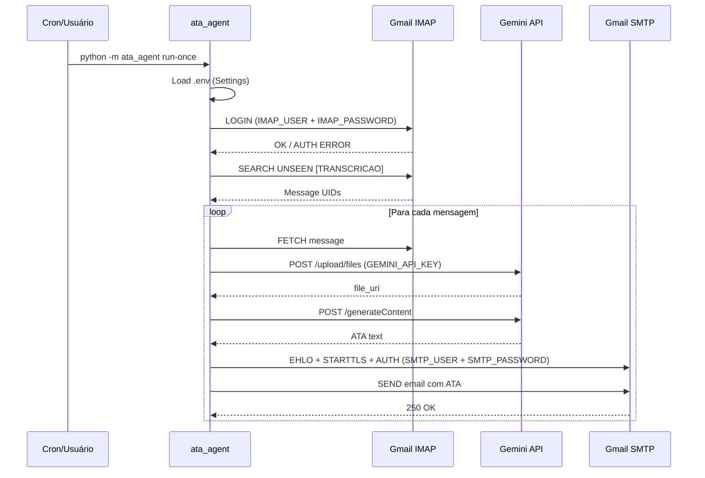

# 09 — Autenticação e Autorização

**Checkpoint:** 2026-04-13
**Projeto:** Transcritor (Uzz.Ai — Ferramentas)

---

## Status Geral

| Módulo | Autenticação | Autorização | Observação |
|--------|-------------|-------------|------------|
| `web/` (Next.js) | ❌ Nenhuma | ❌ Nenhuma | Dashboard público (v1 sem auth) |
| `gemini-whisper/` (Electron) | Via API Keys locais | N/A (app local) | Chaves salvas em localStorage |
| `ata_agent/` (Python) | App Password Gmail | N/A (CLI local) | Acesso restrito por credenciais IMAP/SMTP |
| `ata_multiagent_pipeline/` (Python) | API Keys + App Password | N/A (CLI local) | Acesso restrito por configuração |

---

## A. Web Dashboard (`web/`)

### Autenticação

**NÃO IMPLEMENTADA.**

**Evidência:** `web/app/layout.tsx` — sem middleware de auth, sem provider de sessão.

O dashboard Next.js é completamente público. Qualquer pessoa com a URL pode acessar.

**Planejado (do PLANO_AGENTE_ATAS.md):**
> "Auth e RBAC estão planejados para v2"

### Autorização

**NÃO IMPLEMENTADA.**

---

## B. App Electron (`gemini-whisper/`)

### Autenticação de APIs Externas

O app é executado localmente. "Autenticação" aqui significa configurar as chaves para acessar serviços externos.

#### Gemini API Key
- **Armazenamento:** `localStorage` (no processo renderer do Electron)
- **Uso:** `transcriptionService.ts` lê do localStorage antes de cada chamada
- **Segurança:** localStorage é persistido em disco pelo Electron em texto claro
  - **Risco:** Exposição se o perfil do usuário for comprometido

#### OpenAI API Key
- **Armazenamento:** `localStorage`
- **Uso:** `transcriptionService.ts` (se provider = OpenAI)
- **Mesmo risco do Gemini**

#### Configuração via SettingsModal
- **Evidência:** `gemini-whisper/components/SettingsModal.tsx`
- Usuário insere chaves manualmente na UI → salvas via `localStorage.setItem`

### Segurança do Electron IPC

**NÃO VERIFICADO** se `contextIsolation: true` e `nodeIntegration: false` estão configurados no `electron/main.cjs`.

> ⚠️ **Risco:** Se `nodeIntegration: true`, código no renderer (React) tem acesso direto ao Node.js — vulnerabilidade XSS grave.

---

## C. Backend Python — Gmail Auth

### IMAP (leitura)
- **Método:** Usuário + senha no `.env`
- **Tipo de senha:** App Password Gmail (não a senha da conta)
- **Protocolo:** IMAP SSL (porta 993)
- **Evidência:** `.env.example` → `IMAP_USER`, `IMAP_PASSWORD`

### SMTP (envio)
- **Método:** Usuário + senha no `.env`
- **Tipo de senha:** App Password Gmail
- **Protocolo:** SMTP STARTTLS (porta 587)
- **Evidência:** `.env.example` → `SMTP_USER`, `SMTP_PASSWORD`

### Gemini API (Python)
- **Método:** API Key no `.env`
- **Evidência:** `.env.example` → `GEMINI_API_KEY`
- **Uso:** Header `x-goog-api-key` nas chamadas HTTP

---

## D. Fluxo de Autenticação (ata_agent)

---

## E. Controle de Acesso ao Pipeline

Não há RBAC ou ACL. O controle de acesso é por:

1. **Quem pode executar o CLI:** Acesso ao servidor/máquina + arquivo `.env`
2. **Quem pode enviar e-mails que disparam o pipeline:** Qualquer pessoa que mande e-mail para `IMAP_USER` com assunto contendo `[TRANSCRICAO]`

> ⚠️ **Risco:** O trigger de pipeline é o assunto do e-mail. Qualquer pessoa que saiba o endereço de e-mail e o trigger pode disparar o pipeline.

---

## F. Segredos e Variáveis Sensíveis

| Segredo | Onde está | Risco de Exposição |
|---------|-----------|-------------------|
| `GEMINI_API_KEY` | `.env` (gitignore'd) + localStorage Electron | Médio |
| `OPENAI_API_KEY` | `.env` (gitignore'd) + localStorage Electron | Médio |
| `IMAP_PASSWORD` | `.env` (gitignore'd) | Baixo (apenas no servidor) |
| `SMTP_PASSWORD` | `.env` (gitignore'd) | Baixo (apenas no servidor) |
| `DATABASE_URL` | `.env.local` (gitignore'd) | Baixo (apenas no servidor) |

**Verificação .gitignore:** `.env` e `.env.local` devem estar no `.gitignore`.
**Evidência:** `.env.example` presente no repositório (correto — apenas o template).

---

## Plano de Auth v2 (do PLANO_AGENTE_ATAS.md)

A partir da documentação existente:
- Auth planejada para o dashboard `web/`
- Candidatos mencionados (INFERÊNCIA): NextAuth.js ou Clerk
- Nenhuma implementação iniciada

---

## Perguntas em Aberto

1. **Electron `nodeIntegration`:** `contextIsolation` está habilitado no `electron/main.cjs`? Não verificado.
2. **Trigger público:** Qualquer pessoa com o e-mail da conta pode disparar o pipeline enviando `[TRANSCRICAO]`. Isso é intencional?
3. **Auth v2:** Qual provedor de auth está planejado para o `web/`? NextAuth? Clerk? Supabase Auth?
4. **API Keys no localStorage:** Considerou usar `electron-store` ou keychain do OS para armazenar chaves com mais segurança?
