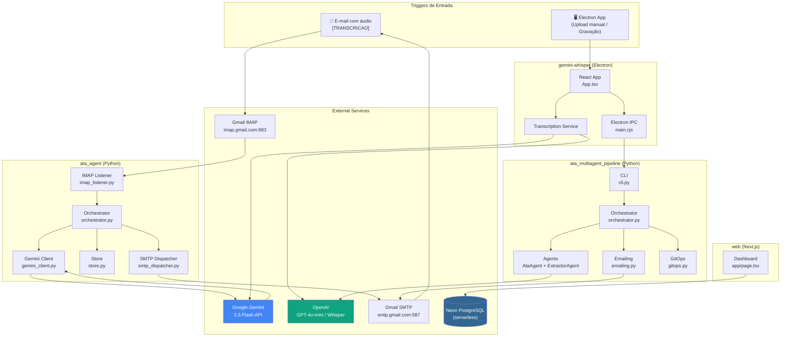
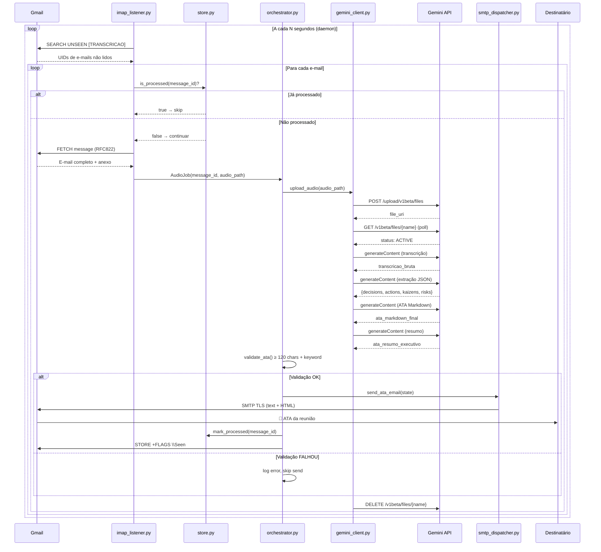
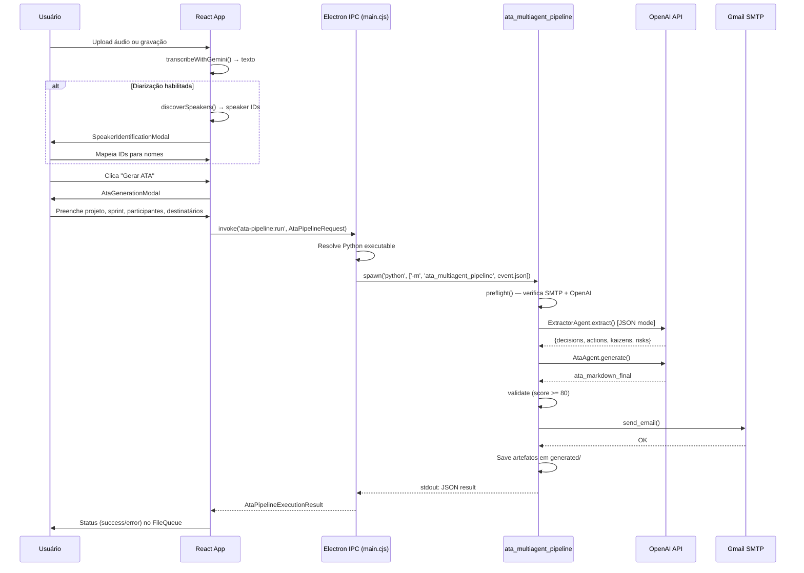
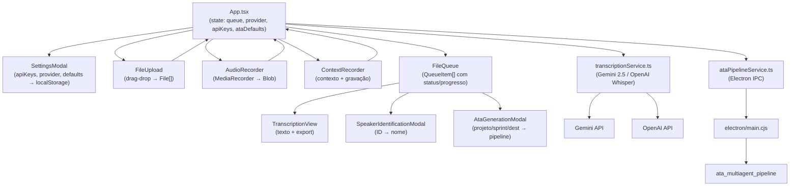
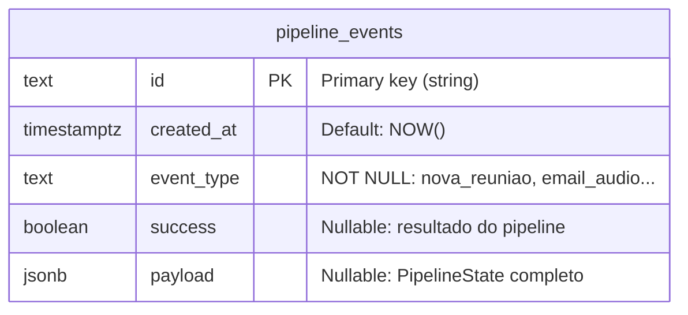
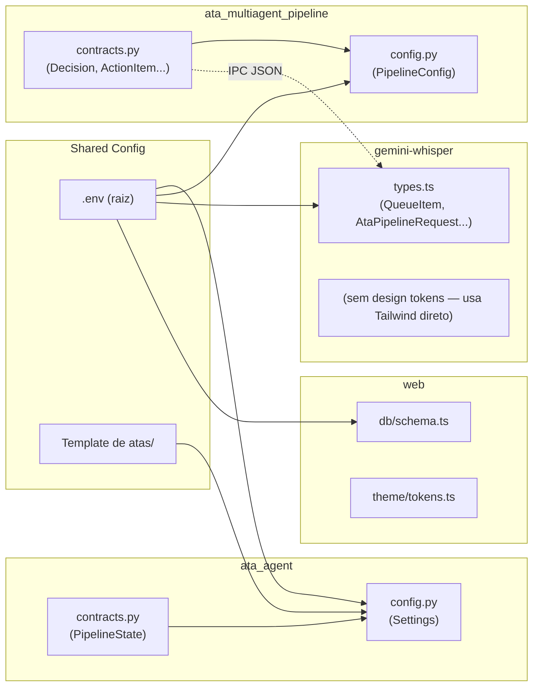
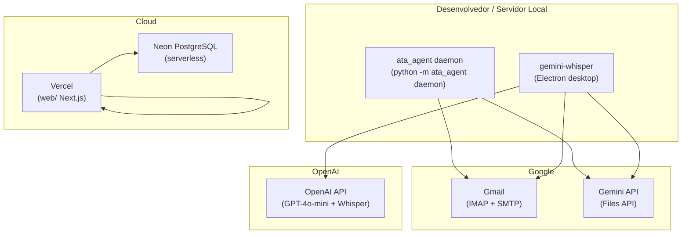

# 14 — Diagramas de Arquitetura

**Checkpoint:** 2026-04-13
**Projeto:** Transcritor (Uzz.Ai — Ferramentas)

---

## 1. Arquitetura Geral do Sistema

---

## 2. Fluxo de Processamento — Pipeline Email (ata_agent)

---

## 3. Fluxo de Processamento — Pipeline Electron (ata_multiagent)

---

## 4. Diagrama de Componentes React (gemini-whisper)

---

## 5. ERD — Banco de Dados (Neon PostgreSQL)

---

## 6. Estrutura de Módulos e Dependências

---

## 7. Deploy e Runtime

---

## Perguntas em Aberto

1. **Lacuna no diagrama de deploy:** O `ata_agent/` popula o Neon? Não há ligação entre o Python e o Neon nos diagramas — essa conexão falta no código.
2. **`ata_multiagent_pipeline` standalone:** Pode ser executado sem o Electron? Sim — via `python -m ata_multiagent_pipeline event.json`. O Electron é apenas uma UI opcional.
3. **Comunicação web ↔ Python:** O dashboard `web/` e o `ata_agent/` são totalmente desacoplados (sem API entre eles). Como o dashboard vai mostrar eventos em tempo real na v2?
